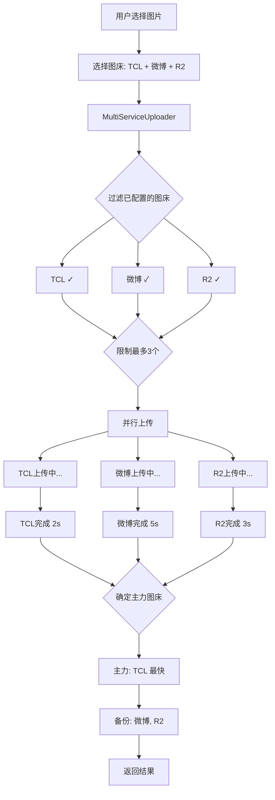

# 架构总览

> 理解 WeiboDR-Uploader v3.0 的整体架构设计

---

## 📋 学习目标

完成本节学习后，你将能够：

- ✅ 理解项目的三层架构设计
- ✅ 掌握前端的插件化上传器架构
- ✅ 了解 Rust 后端的命令系统
- ✅ 理解前后端通信机制
- ✅ 能够画出系统架构图

---

## 前置知识

- 了解前端和后端的基本概念
- 知道什么是 HTTP 请求

---

## 1. 整体架构设计

### 1.1 技术栈选型

WeiboDR-Uploader v3.0 采用**现代化混合技术栈**：

```
┌─────────────────────────────────────────┐
│           Tauri 桌面应用                 │
├─────────────────────────────────────────┤
│                                         │
│  前端（UI 层）                           │
│  ┌────────────────────────────────┐    │
│  │  Vue 3 + TypeScript + Vite     │    │
│  │  - 响应式 UI                    │    │
│  │  - 用户交互                     │    │
│  │  - 业务逻辑                     │    │
│  └────────────────────────────────┘    │
│               ↕ IPC (JSON)             │
│  ┌────────────────────────────────┐    │
│  │  Rust 后端                       │    │
│  │  - HTTP 请求                    │    │
│  │  - 文件读取                     │    │
│  │  - 系统集成                     │    │
│  └────────────────────────────────┘    │
│                                         │
└─────────────────────────────────────────┘
               ↓ HTTP
      ┌──────────────────┐
      │    图床 API       │
      │  (微博/R2/TCL/...) │
      └──────────────────┘
```

**为什么选择这个技术栈？**

| 技术 | 原因 |
|------|------|
| **Tauri** | 体积小(5MB vs Electron 100MB)、性能好 |
| **Vue 3** | 响应式系统强大、组合式 API 易于组织代码 |
| **TypeScript** | 类型安全、IDE 支持好、减少运行时错误 |
| **Rust** | 性能高、内存安全、并发能力强 |
| **Vite** | 开发体验好、构建速度快 |

---

### 1.2 三层架构

项目采用经典的**三层架构**设计：

```
┌─────────────────────────────────────────────────┐
│                表示层 (UI Layer)                 │
│  - 用户界面（Vue 组件）                           │
│  - 用户交互（点击、拖拽）                          │
│  - 进度显示                                      │
└─────────────────────────────────────────────────┘
                    ↓
┌─────────────────────────────────────────────────┐
│              业务逻辑层 (Business Layer)          │
│  - 插件化上传器（IUploader）                      │
│  - 多图床编排（MultiServiceUploader）             │
│  - 配置管理（UserConfig）                         │
│  - 历史记录（HistoryItem）                        │
└─────────────────────────────────────────────────┘
                    ↓
┌─────────────────────────────────────────────────┐
│              数据访问层 (Data Layer)              │
│  - Rust 命令（upload_to_weibo, upload_to_tcl）  │
│  - HTTP 客户端（reqwest）                         │
│  - 文件系统（读取图片）                            │
│  - 加密存储（AES-GCM）                            │
└─────────────────────────────────────────────────┘
```

**分层的好处**：

✅ **职责清晰**：每层只关注自己的事情
✅ **易于测试**：可以单独测试每一层
✅ **可维护性**：修改一层不影响其他层
✅ **可扩展性**：添加新功能只需扩展对应层

---

## 2. 前端架构详解

### 2.1 前端目录结构

```
src/
├── uploaders/              # 图床上传器（插件化核心）
│   ├── base/              # 抽象层
│   │   ├── IUploader.ts        # 核心接口
│   │   ├── BaseUploader.ts     # 抽象基类
│   │   ├── UploaderFactory.ts  # 工厂模式
│   │   └── types.ts            # 共享类型
│   ├── weibo/             # 微博上传器
│   │   └── WeiboUploader.ts
│   ├── r2/                # R2 上传器
│   │   └── R2Uploader.ts
│   ├── tcl/               # TCL 上传器
│   │   └── TCLUploader.ts
│   └── ...                # 其他上传器
│
├── core/                  # 核心业务逻辑
│   └── MultiServiceUploader.ts  # 多图床编排器
│
├── config/                # 配置管理
│   └── types.ts                 # 配置类型定义
│
├── components/            # Vue 组件
│   ├── UploadQueue.vue          # 上传队列
│   └── BackupView.vue           # 备份视图
│
├── store.ts               # 本地存储
├── crypto.ts              # 加密工具
└── main.ts                # 应用入口
```

---

### 2.2 插件化上传器架构 ⭐⭐⭐

这是整个项目最核心的设计！

#### 设计模式：Interface + BaseClass + Concrete

```typescript
// 第1层：接口（IUploader.ts）
// 定义"什么是上传器"，规定所有上传器必须实现的方法
interface IUploader {
  serviceId: string;           // 图床标识
  serviceName: string;         // 显示名称
  validateConfig(): Promise<ValidationResult>;  // 验证配置
  upload(): Promise<UploadResult>;              // 上传文件
  getPublicUrl(): string;                       // 生成链接
}

// 第2层：抽象基类（BaseUploader.ts）
// 提供通用逻辑，避免重复代码
abstract class BaseUploader implements IUploader {
  // 子类必须实现
  abstract serviceId: string;
  abstract serviceName: string;
  abstract validateConfig(): Promise<ValidationResult>;
  abstract upload(): Promise<UploadResult>;
  abstract getPublicUrl(): string;

  // 通用方法（所有上传器共享）
  protected async uploadViaRust(...) {
    // 1. 生成唯一 uploadId
    // 2. 监听进度事件
    // 3. 调用 Rust 命令
    // 4. 清理监听器
  }

  protected isEmpty(value: string): boolean { ... }
  protected log(...) { ... }
}

// 第3层：具体实现（TCLUploader.ts）
// 继承基类，实现特定图床的逻辑
class TCLUploader extends BaseUploader {
  serviceId = 'tcl';
  serviceName = 'TCL 图床';

  async validateConfig() {
    return { valid: true };  // TCL 无需配置
  }

  async upload(filePath, options, onProgress) {
    // 调用基类的通用方法
    const rustResult = await this.uploadViaRust(filePath, {}, onProgress);
    return { serviceId: 'tcl', url: rustResult.url };
  }

  getPublicUrl(result) {
    return result.url;
  }
}
```

**架构图**：

```
┌─────────────────────────────────────────┐
│           IUploader (接口)               │
│  - serviceId: string                    │
│  - serviceName: string                  │
│  - validateConfig()                     │
│  - upload()                             │
│  - getPublicUrl()                       │
└─────────────────────────────────────────┘
                 ↑ implements
┌─────────────────────────────────────────┐
│      BaseUploader (抽象基类)             │
│  - uploadViaRust()     ← 通用逻辑        │
│  - isEmpty()                            │
│  - log()                                │
└─────────────────────────────────────────┘
                 ↑ extends
    ┌────────────┼────────────┬────────────┐
    │            │            │            │
┌─────────┐ ┌─────────┐ ┌─────────┐ ┌─────────┐
│ Weibo   │ │   R2    │ │  TCL    │ │   JD    │
│Uploader │ │Uploader │ │Uploader │ │Uploader │
└─────────┘ └─────────┘ └─────────┘ └─────────┘
```

**为什么这样设计？**

✅ **易于扩展**：添加新图床只需实现3个方法
✅ **代码复用**：uploadViaRust() 被所有上传器共享
✅ **类型安全**：TypeScript 强制实现接口
✅ **统一规范**：所有上传器有相同的 API

---

### 2.3 工厂模式管理上传器

```typescript
// UploaderFactory.ts
class UploaderFactory {
  private static uploaders = new Map<ServiceType, () => IUploader>();

  // 注册上传器（应用启动时）
  static register(serviceId: ServiceType, creator: () => IUploader) {
    this.uploaders.set(serviceId, creator);
  }

  // 创建上传器实例（上传时）
  static create(serviceId: ServiceType): IUploader {
    const creator = this.uploaders.get(serviceId);
    if (!creator) {
      throw new Error(`Unknown service: ${serviceId}`);
    }
    return creator();
  }
}

// 注册阶段（main.ts）
UploaderFactory.register('weibo', () => new WeiboUploader());
UploaderFactory.register('r2', () => new R2Uploader());
UploaderFactory.register('tcl', () => new TCLUploader());

// 使用阶段
const uploader = UploaderFactory.create('tcl');
const result = await uploader.upload(filePath, {...});
```

**工厂模式的优势**：

✅ **解耦**：调用方不需要知道具体类
✅ **集中管理**：一处注册，全局可用
✅ **动态创建**：运行时决定创建哪个上传器

---

### 2.4 多图床编排器 ⭐⭐⭐

负责协调多个上传器的并行上传。

```typescript
// MultiServiceUploader.ts
class MultiServiceUploader {
  async uploadToMultipleServices(
    filePath: string,
    enabledServices: ServiceType[],  // 用户勾选的图床
    config: UserConfig,
    onProgress?: (serviceId, percent) => void
  ): Promise<MultiUploadResult> {

    // 1. 过滤出已配置的图床
    const validServices = this.filterConfiguredServices(enabledServices, config);

    // 2. 限制最多3个并发
    const limitedServices = validServices.slice(0, 3);

    // 3. 并行上传到所有图床
    const uploadPromises = limitedServices.map(async (serviceId) => {
      const uploader = UploaderFactory.create(serviceId);
      return await uploader.upload(filePath, { config }, onProgress);
    });

    const results = await Promise.allSettled(uploadPromises);

    // 4. 确定主力图床（第一个成功的）
    const primaryResult = results.find(r => r.status === 'fulfilled');

    return {
      primaryService: primaryResult.serviceId,
      results: results,
      primaryUrl: primaryResult.url
    };
  }
}
```

**并行上传流程图**：



---

### 2.5 配置管理系统

```typescript
// types.ts

// 用户配置
interface UserConfig {
  enabledServices: ServiceType[];  // 用户勾选的图床
  services: {
    weibo?: WeiboServiceConfig;    // 微博配置
    r2?: R2ServiceConfig;          // R2配置
    tcl?: TCLServiceConfig;        // TCL配置
    // ...其他图床
  };
  outputFormat: 'direct' | 'baidu-proxy';  // 输出格式
  linkPrefixConfig?: LinkPrefixConfig;     // 链接前缀
  webdav?: WebDAVConfig;                   // WebDAV备份
}

// 历史记录
interface HistoryItem {
  id: string;
  timestamp: number;
  localFileName: string;
  primaryService: ServiceType;  // 主力图床
  results: Array<{              // 所有图床的结果
    serviceId: ServiceType;
    result?: UploadResult;
    status: 'success' | 'failed';
    error?: string;
  }>;
  generatedLink: string;
}
```

---

## 3. 后端架构详解

### 3.1 Rust 后端目录结构

```
src-tauri/
├── src/
│   ├── commands/           # Tauri 命令
│   │   ├── weibo.rs       # 微博上传
│   │   ├── r2.rs          # R2 上传
│   │   ├── tcl.rs         # TCL 上传
│   │   ├── jd.rs          # 京东上传
│   │   └── ...            # 其他图床
│   └── main.rs            # Tauri 主程序
├── Cargo.toml             # Rust 依赖
└── tauri.conf.json        # Tauri 配置
```

---

### 3.2 Tauri 命令系统

```rust
// src-tauri/src/commands/tcl.rs

#[tauri::command]  // ← 这个宏将函数暴露为 Tauri 命令
pub async fn upload_to_tcl(
    window: Window,       // Tauri 窗口句柄（用于发送事件）
    id: String,           // 上传任务 ID
    file_path: String,    // 文件路径
) -> Result<TCLUploadResult, String> {
    // 1. 读取文件
    let mut file = File::open(&file_path).await?;

    // 2. 构建 multipart form
    let form = multipart::Form::new().part("file", part);

    // 3. 发送 HTTP 请求
    let response = client.post("https://service2.tcl.com/api.php/Center/uploadQiniu")
        .multipart(form)
        .send()
        .await?;

    // 4. 解析 JSON 响应
    let api_response: TCLApiResponse = response.json().await?;

    // 5. 发送进度事件
    window.emit("upload://progress", json!({
        "id": id,
        "progress": file_size,
        "total": file_size
    }))?;

    // 6. 返回结果（自动序列化为 JSON）
    Ok(TCLUploadResult {
        url: clean_url,
        size: file_size,
    })
}
```

**命令注册**（main.rs）：

```rust
fn main() {
    tauri::Builder::default()
        .invoke_handler(tauri::generate_handler![
            commands::upload::upload_file_stream,    // 微博上传
            commands::r2::upload_to_r2,              // R2 上传
            commands::tcl::upload_to_tcl,            // TCL 上传
            commands::jd::upload_to_jd,              // 京东上传
            // ... 其他命令
        ])
        .run(tauri::generate_context!())
        .expect("error while running tauri application");
}
```

---

### 3.3 全局 HTTP 客户端

```rust
// 全局 HTTP 客户端（单例模式）
pub struct HttpClient(pub reqwest::Client);

fn main() {
    // 创建全局 HTTP 客户端（带连接池）
    let http_client = reqwest::Client::builder()
        .timeout(Duration::from_secs(60))
        .pool_idle_timeout(Duration::from_secs(90))
        .pool_max_idle_per_host(10)  // 复用连接
        .build()
        .expect("Failed to create HTTP client");

    tauri::Builder::default()
        .manage(HttpClient(http_client))  // 注册为全局状态
        // ...
}
```

**为什么使用全局客户端？**

✅ **连接池复用**：避免每次请求都创建新连接
✅ **性能优化**：减少 TCP 握手开销
✅ **统一配置**：超时、重试等统一设置

---

## 4. 前后端通信机制 ⭐⭐⭐

### 4.1 Tauri IPC 原理

**IPC**（Inter-Process Communication，进程间通信）：

```
┌─────────────────────┐
│   前端 (TypeScript)  │
│   (WebView 进程)     │
└──────────┬──────────┘
           │
           │ invoke('upload_to_tcl', {...})
           ↓
    ┌──────────────┐
    │  Tauri Core  │  ← 序列化 JSON
    └──────────────┘
           │
           │ 调用 Rust 函数
           ↓
┌─────────────────────┐
│   后端 (Rust)        │
│   (主进程)           │
└─────────────────────┘
```

**通信流程**：

1. **前端调用**：
```typescript
const result = await invoke('upload_to_tcl', {
  id: 'tcl_123',
  filePath: '/path/to/image.jpg'
});
```

2. **Tauri 序列化**：
```
TypeScript 对象
    ↓
JSON 字符串
    ↓
Rust 类型
```

3. **Rust 执行**：
```rust
#[tauri::command]
async fn upload_to_tcl(id: String, file_path: String) -> Result<...> {
    // 执行上传逻辑
}
```

4. **返回结果**：
```
Rust Result
    ↓
JSON 字符串
    ↓
TypeScript Promise
```

---

### 4.2 进度事件系统

**Rust 发送事件**：

```rust
// 发送进度事件
window.emit("upload://progress", ProgressPayload {
    id: upload_id,
    progress: 50,
    total: 100
})?;
```

**前端监听事件**：

```typescript
const unlisten = await listen<ProgressEvent>('upload://progress', (event) => {
  if (event.payload.id === uploadId) {
    const percent = (event.payload.progress / event.payload.total) * 100;
    onProgress(percent);  // 更新进度条
  }
});
```

**进度跟踪时序图**：

```
前端 (TypeScript)              后端 (Rust)

invoke('upload_to_tcl')  ─────→
                                开始上传
                                  ↓
listen('upload://progress') ←─ emit(progress: 10%)
更新进度条 (10%)
                           ←─ emit(progress: 50%)
更新进度条 (50%)
                           ←─ emit(progress: 100%)
更新进度条 (100%)
                           ←─ 返回 Result
Promise resolved ←────────
清理监听器
```

---

## 5. 完整数据流

### 5.1 上传生命周期

```
用户拖拽图片
    ↓
[前端] 验证文件类型
    ↓
[前端] 读取用户配置 (UserConfig)
    ↓
[前端] 创建上传队列项 (UploadQueueManager)
    ↓
[前端] MultiServiceUploader.uploadToMultipleServices()
    ↓
[前端] 过滤已配置的图床 (filterConfiguredServices)
    ↓
[前端] 并行上传 (最多3个)
    ├─ TCLUploader.upload()
    │      ↓
    │  [前端] BaseUploader.uploadViaRust()
    │      ↓
    │  [前端] invoke('upload_to_tcl')
    │      ↓
    │  [后端] upload_to_tcl() Rust 命令
    │      ↓
    │  [后端] 读取文件、构建 HTTP 请求
    │      ↓
    │  [后端] POST 到 TCL API
    │      ↓
    │  [后端] 发送进度事件 emit('upload://progress')
    │      ↓
    │  [前端] 监听进度事件，更新 UI
    │      ↓
    │  [后端] 返回 Result
    │      ↓
    │  [前端] 转换为 UploadResult
    │
    ├─ WeiboUploader.upload() (同上)
    └─ R2Uploader.upload() (同上)
    ↓
[前端] 确定主力图床 (第一个成功的)
    ↓
[前端] 保存历史记录 (HistoryItem)
    ↓
[前端] 加密存储到本地 (AES-GCM)
    ↓
[前端] 更新 UI (显示链接)
```

---

### 5.2 配置流转

```
用户修改配置 (Settings 页面)
    ↓
[前端] UserConfig 对象
    ↓
[前端] JSON.stringify
    ↓
[前端] AES-GCM 加密 (crypto.ts)
    ↓
[前端] Base64 编码
    ↓
[前端] 写入文件 (store.ts)
    ↓
[文件系统] AppData/com.weibodr.uploader/config.enc

读取配置：
[文件系统] 读取加密文件
    ↓
[前端] Base64 解码
    ↓
[前端] AES-GCM 解密
    ↓
[前端] JSON.parse
    ↓
[前端] UserConfig 对象
```

---

## 6. 架构优势

### 6.1 可扩展性

✅ **添加新图床**：只需 4 个文件，100 行代码
✅ **添加新功能**：基于现有接口扩展
✅ **更换存储**：实现 Store 接口即可

### 6.2 可维护性

✅ **职责清晰**：每个模块只做一件事
✅ **代码复用**：BaseUploader 避免重复代码
✅ **类型安全**：TypeScript 减少运行时错误

### 6.3 性能

✅ **并行上传**：3 个图床同时上传
✅ **连接池**：HTTP 客户端复用连接
✅ **懒加载**：历史记录分页加载

### 6.4 安全性

✅ **加密存储**：AES-GCM 保护敏感信息
✅ **系统钥匙串**：密钥与账户绑定
✅ **Tauri 沙箱**：限制文件系统访问

---

## 7. 总结

### 🎯 本节要点

1. **整体架构**：
   - 技术栈：Vue 3 + TypeScript + Rust + Tauri
   - 三层架构：表示层、业务逻辑层、数据访问层

2. **前端架构**：
   - 插件化上传器（Interface + BaseClass + Concrete）
   - 工厂模式管理上传器
   - 多图床编排器协调并行上传

3. **后端架构**：
   - Tauri 命令系统
   - 全局 HTTP 客户端
   - 进度事件系统

4. **前后端通信**：
   - IPC 机制（invoke 调用）
   - 事件系统（listen/emit）
   - JSON 序列化

---

### 📝 检查清单

学完本节后，你应该能够：

- [ ] 画出项目的三层架构图
- [ ] 解释插件化上传器的三层结构
- [ ] 说出工厂模式的作用
- [ ] 理解并行上传的流程
- [ ] 知道前端如何调用 Rust 命令
- [ ] 理解进度事件的工作原理

---

### 🚀 下一步

现在你已经理解了整体架构，接下来让我们搭建开发环境：

**[下一节：开发环境搭建 →](03-setup-dev-env.md)**

在下一节中，你将学习：
- Node.js 和 Rust 的安装
- 系统依赖配置
- VS Code 插件推荐
- 常见问题排查

---

<div align="center">

[⬆ 返回教程目录](../README.md) | [← 上一节](01-project-overview.md) | [下一节 →](03-setup-dev-env.md)

</div>
