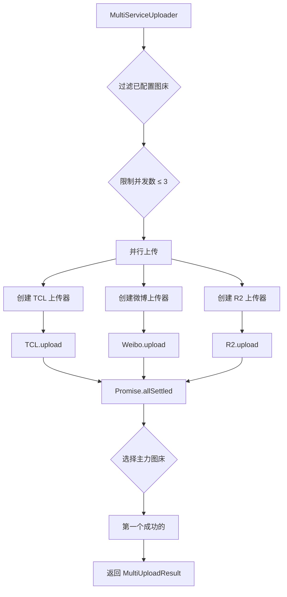
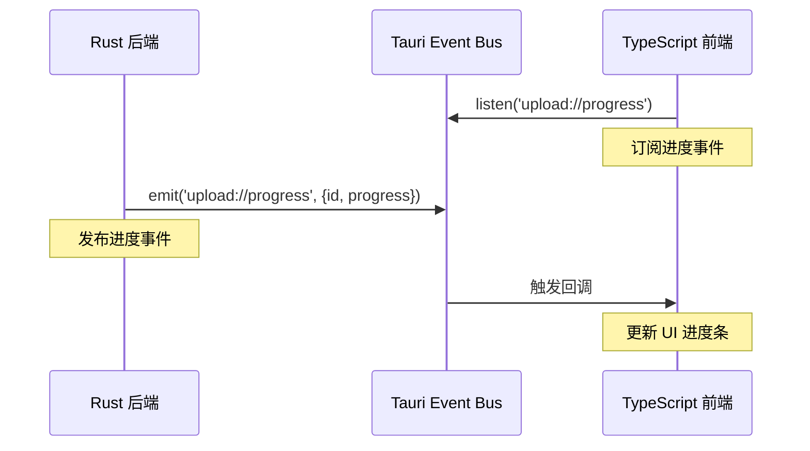

# 设计模式应用

## 学习目标

通过本节学习，你将能够：
- ✅ 理解项目中使用的 5 大设计模式
- ✅ 掌握工厂模式、策略模式、编排器模式的实际应用
- ✅ 了解单例模式和观察者模式的使用场景
- ✅ 学会如何在实际项目中应用设计模式
- ✅ 理解设计模式如何提高代码质量

## 前置知识

- 熟悉面向对象编程（OOP）基础
- 理解接口（Interface）和抽象类（Abstract Class）的概念
- 了解 TypeScript 和 Rust 的基本语法

---

## 项目中的 5 大设计模式

WeiboDR-Uploader 是学习设计模式的绝佳案例，它综合应用了多种设计模式：

| 设计模式 | 应用场景 | 核心类/文件 | 重要程度 |
|----------|----------|------------|----------|
| **工厂模式** | 创建上传器实例 | UploaderFactory | ⭐⭐⭐⭐⭐ |
| **策略模式** | 不同图床的不同上传策略 | IUploader 接口 | ⭐⭐⭐⭐⭐ |
| **编排器模式** | 协调多个上传器 | MultiServiceUploader | ⭐⭐⭐⭐⭐ |
| **单例模式** | 全局唯一的存储和HTTP客户端 | Store, HTTP Client | ⭐⭐⭐⭐ |
| **观察者模式** | 进度事件监听 | Tauri Event System | ⭐⭐⭐⭐ |

---

## 1. 工厂模式（Factory Pattern）

### 什么是工厂模式？

**定义**：定义一个创建对象的接口，让子类决定实例化哪一个类。

**核心思想**：将对象的创建逻辑集中管理，业务代码只关心使用对象，不关心如何创建。

---

### 在项目中的应用：UploaderFactory

**文件**：[src/uploaders/base/UploaderFactory.ts](../../src/uploaders/base/UploaderFactory.ts)

**类图**：
```
┌─────────────────────────┐
│   UploaderFactory       │
├─────────────────────────┤
│ - registry: Map         │ ← 存储所有工厂函数
├─────────────────────────┤
│ + register(id, factory) │ ← 注册上传器
│ + create(id): IUploader │ ← 创建上传器实例
│ + getAvailableServices()│
└─────────────────────────┘
           │
           │ creates
           ▼
┌─────────────────────────┐
│      IUploader          │
└─────────────────────────┘
     ▲         ▲         ▲
     │         │         │
┌────┴───┐ ┌──┴────┐ ┌──┴────┐
│ Weibo  │ │  TCL  │ │  R2   │
└────────┘ └───────┘ └───────┘
```

---

### 代码示例

**注册阶段**（应用启动时）：
```typescript
// main.ts
import { UploaderFactory } from './uploaders/base/UploaderFactory';
import { WeiboUploader } from './uploaders/weibo/WeiboUploader';
import { R2Uploader } from './uploaders/r2/R2Uploader';
import { TCLUploader } from './uploaders/tcl/TCLUploader';

// 注册所有上传器
UploaderFactory.register('weibo', () => new WeiboUploader());
UploaderFactory.register('r2', () => new R2Uploader());
UploaderFactory.register('tcl', () => new TCLUploader());
```

**使用阶段**（业务代码）：
```typescript
// 业务代码无需知道具体的上传器类
const uploader = UploaderFactory.create('tcl');
const result = await uploader.upload(filePath, options);
```

---

### 工厂模式的优势

✅ **开闭原则**：添加新图床无需修改工厂代码
```typescript
// 添加新图床：只需注册一次
UploaderFactory.register('newService', () => new NewUploader());
// ✅ 无需修改 UploaderFactory 内部代码
```

✅ **低耦合**：业务代码只依赖接口，不依赖具体实现
```typescript
// ❌ 高耦合（不推荐）
const uploader = new WeiboUploader();

// ✅ 低耦合（推荐）
const uploader = UploaderFactory.create('weibo');
```

✅ **集中管理**：所有上传器的创建逻辑在一处
```typescript
// 一眼看到所有可用的图床
const services = UploaderFactory.getAvailableServices();
// ['weibo', 'r2', 'tcl', 'jd', 'nowcoder', 'qiyu', 'zhihu', 'nami']
```

---

## 2. 策略模式（Strategy Pattern）

### 什么是策略模式？

**定义**：定义一系列算法，把它们封装起来，并使它们可以相互替换。

**核心思想**：同一个接口，不同的实现策略，运行时动态选择。

---

### 在项目中的应用：IUploader 接口

**文件**：[src/uploaders/base/IUploader.ts](../../src/uploaders/base/IUploader.ts)

**类图**：
```
┌────────────────────────────────────────┐
│           IUploader (接口)              │
├────────────────────────────────────────┤
│ + validateConfig(config)               │
│ + upload(filePath, options, onProgress)│
│ + getPublicUrl(result)                 │
│ + testConnection?()                    │
└────────────────────────────────────────┘
                    ▲
                    │ implements
        ┌───────────┼───────────┐
        │           │           │
┌───────┴──────┐ ┌──┴────────┐ ┌┴──────────┐
│WeiboUploader │ │TCLUploader│ │R2Uploader │
├──────────────┤ ├───────────┤ ├───────────┤
│策略：Cookie   │ │策略：无认证 │ │策略：S3 API│
│验证：检查SUB  │ │验证：直接✓  │ │验证：检查5字段│
│上传：multipart│ │上传：简单POST│ │上传：AWS SDK│
└──────────────┘ └───────────┘ └───────────┘
```

---

### 代码示例

**定义策略接口**：
```typescript
// IUploader.ts
export interface IUploader {
  readonly serviceId: string;
  readonly serviceName: string;

  // 不同图床有不同的验证策略
  validateConfig(config: any): Promise<ValidationResult>;

  // 不同图床有不同的上传策略
  upload(filePath: string, options: UploadOptions, onProgress?: ProgressCallback): Promise<UploadResult>;

  // 不同图床有不同的 URL 生成策略
  getPublicUrl(result: UploadResult): string;
}
```

**实现不同的策略**：

**策略 1：TCL（无认证策略）**
```typescript
export class TCLUploader extends BaseUploader {
  // 验证策略：无需验证
  async validateConfig(config: any): Promise<ValidationResult> {
    return { valid: true };
  }

  // 上传策略：简单 POST
  async upload(filePath: string, options: UploadOptions): Promise<UploadResult> {
    return this.uploadViaRust(filePath, {}, onProgress);
  }
}
```

**策略 2：微博（Cookie 认证策略）**
```typescript
export class WeiboUploader extends BaseUploader {
  // 验证策略：检查 Cookie 格式
  async validateConfig(config: WeiboConfig): Promise<ValidationResult> {
    if (!config.cookie || !config.cookie.includes('SUB=')) {
      return { valid: false, message: 'Cookie 格式不正确' };
    }
    return { valid: true };
  }

  // 上传策略：带 Cookie 的 multipart
  async upload(filePath: string, options: UploadOptions): Promise<UploadResult> {
    return this.uploadViaRust(filePath, { cookie: config.cookie }, onProgress);
  }
}
```

**策略 3：R2（S3 API 策略）**
```typescript
export class R2Uploader extends BaseUploader {
  // 验证策略：检查 5 个必填字段
  async validateConfig(config: R2Config): Promise<ValidationResult> {
    if (!config.accountId || !config.accessKeyId || /* ... */) {
      return { valid: false, message: '配置不完整' };
    }
    return { valid: true };
  }

  // 上传策略：AWS SDK S3 上传
  async upload(filePath: string, options: UploadOptions): Promise<UploadResult> {
    // 使用 AWS SDK 上传
    const s3Client = new S3Client({ /* ... */ });
    // ...
  }
}
```

---

### 运行时选择策略

```typescript
// 用户选择不同图床，自动切换策略
const serviceId = userSelectedService;  // 'tcl' | 'weibo' | 'r2'

const uploader = UploaderFactory.create(serviceId);  // 动态选择策略
const result = await uploader.upload(filePath, options);
```

---

### 策略模式的优势

✅ **算法独立**：每个策略独立封装，互不干扰
```typescript
// TCL 的修改不影响微博
class TCLUploader { /* ... */ }
class WeiboUploader { /* ... */ }
```

✅ **易于扩展**：添加新策略不影响现有代码
```typescript
// 添加新图床 = 添加新策略
class NewUploader extends BaseUploader { /* ... */ }
```

✅ **消除条件分支**：不需要大量 if-else
```typescript
// ❌ 不使用策略模式
if (serviceId === 'weibo') {
  // 微博上传逻辑...
} else if (serviceId === 'r2') {
  // R2 上传逻辑...
} else if (serviceId === 'tcl') {
  // TCL 上传逻辑...
}

// ✅ 使用策略模式
const uploader = UploaderFactory.create(serviceId);
await uploader.upload(filePath, options);
```

---

## 3. 编排器模式（Orchestrator Pattern）

### 什么是编排器模式？

**定义**：协调多个对象协同完成一个复杂任务。

**核心思想**：单个对象各司其职，编排器负责协调它们的工作流程。

---

### 在项目中的应用：MultiServiceUploader

**文件**：[src/core/MultiServiceUploader.ts](../../src/core/MultiServiceUploader.ts)

**流程图**：


---

### 代码示例

```typescript
export class MultiServiceUploader {
  async uploadToMultipleServices(
    filePath: string,
    enabledServices: ServiceType[],
    config: UserConfig
  ): Promise<MultiUploadResult> {
    // 【编排步骤 1】过滤已配置的图床
    const validServices = this.filterConfiguredServices(enabledServices, config);

    // 【编排步骤 2】限制并发数
    const limitedServices = validServices.slice(0, 3);

    // 【编排步骤 3】创建上传任务
    const uploadPromises = limitedServices.map(async (serviceId) => {
      const uploader = UploaderFactory.create(serviceId);
      const result = await uploader.upload(filePath, options);
      return { serviceId, result, status: 'success' };
    });

    // 【编排步骤 4】并行执行
    const results = await Promise.allSettled(uploadPromises);

    // 【编排步骤 5】选择主力图床
    const primaryResult = results.find(r => r.status === 'fulfilled');

    return {
      primaryService: primaryResult.serviceId,
      primaryUrl: primaryResult.result.url,
      results: results
    };
  }
}
```

---

### 编排器模式的优势

✅ **复杂任务分解**：将复杂的多图床上传分解为 5 个步骤

✅ **协调多个对象**：协调 TCL、微博、R2 三个上传器

✅ **统一错误处理**：集中处理所有图床的上传结果

✅ **业务逻辑清晰**：每个步骤职责明确

---

## 4. 单例模式（Singleton Pattern）

### 什么是单例模式？

**定义**：确保一个类只有一个实例，并提供全局访问点。

**核心思想**：全局共享一个实例，避免重复创建。

---

### 在项目中的应用

#### 应用 1：Store（本地存储单例）

**文件**：[src/store.ts](../../src/store.ts)

```typescript
// store.ts
class Store {
  private static instance: Store;

  private constructor() {
    // 私有构造函数，防止外部 new
  }

  static getInstance(): Store {
    if (!Store.instance) {
      Store.instance = new Store();
    }
    return Store.instance;
  }

  async get(key: string): Promise<any> { /* ... */ }
  async set(key: string, value: any): Promise<void> { /* ... */ }
}

// 导出单例实例
export const store = Store.getInstance();
```

**使用**：
```typescript
import { store } from './store';

// 所有地方使用的都是同一个实例
const config1 = await store.get('userConfig');
const config2 = await store.get('userConfig');
// config1 和 config2 访问的是同一个 Store 实例
```

---

#### 应用 2：HTTP Client（Rust 端单例）

**文件**：[src-tauri/src/main.rs](../../src-tauri/src/main.rs)

```rust
// main.rs
use std::sync::Arc;
use reqwest::Client;
use once_cell::sync::Lazy;

// 全局 HTTP 客户端单例
static HTTP_CLIENT: Lazy<Arc<Client>> = Lazy::new(|| {
    Arc::new(
        Client::builder()
            .pool_max_idle_per_host(10)  // 连接池配置
            .timeout(std::time::Duration::from_secs(30))
            .build()
            .expect("Failed to create HTTP client")
    )
});

// 所有 Rust 命令共享这个客户端
#[tauri::command]
async fn upload_to_tcl(/* ... */) -> Result</*...*/, String> {
    let client = HTTP_CLIENT.clone();  // 复用连接池
    // ...
}
```

---

### 单例模式的优势

✅ **节省资源**：HTTP Client 的连接池只创建一次

✅ **全局一致性**：所有地方访问的配置都是同一份

✅ **避免冲突**：防止多个实例导致的数据不一致

---

## 5. 观察者模式（Observer Pattern）

### 什么是观察者模式？

**定义**：定义对象间的一对多依赖关系，当一个对象状态改变时，所有依赖它的对象都得到通知。

**核心思想**：发布-订阅机制，解耦事件的发送者和接收者。

---

### 在项目中的应用：Tauri 事件系统

**流程图**：


---

### 代码示例

**订阅者（前端）**：
```typescript
// BaseUploader.ts
import { listen } from '@tauri-apps/api/event';

protected async uploadViaRust(/*...*/) {
  const uploadId = this.generateUniqueId();

  // 【订阅】监听进度事件
  const unlisten = await listen(`upload://progress/${uploadId}`, (event) => {
    const { progress, total } = event.payload;
    const percent = Math.round((progress / total) * 100);

    // 收到事件后更新 UI
    onProgress?.(percent);
  });

  // ... 上传逻辑

  // 取消订阅
  unlisten();
}
```

**发布者（Rust 后端）**：
```rust
// tcl.rs
use tauri::Window;

#[tauri::command]
async fn upload_to_tcl(window: Window, id: String, /*...*/) -> Result</*...*/, String> {
    // ... 上传逻辑

    // 【发布】发送进度事件
    let _ = window.emit("upload://progress", serde_json::json!({
        "id": id,
        "progress": 50,
        "total": 100
    }));

    // ... 继续上传
}
```

---

### 观察者模式的优势

✅ **解耦**：Rust 后端无需知道前端如何处理进度

✅ **多订阅者**：可以有多个监听器同时监听同一事件

✅ **动态订阅**：运行时可以随时订阅/取消订阅

---

## 设计模式的协同工作

在 WeiboDR-Uploader 中，这 5 种设计模式**不是孤立的**，而是**协同工作**的：

```
用户点击上传
    ↓
【编排器模式】MultiServiceUploader 协调整体流程
    ↓
【工厂模式】UploaderFactory 创建上传器实例
    ↓
【策略模式】不同的上传器使用不同的上传策略
    ↓
【单例模式】所有上传器共享 HTTP Client
    ↓
【观察者模式】Rust 发送进度事件，前端监听并更新 UI
```

---

## 设计模式对比表

| 模式 | 目的 | 解决的问题 | 关键类 |
|------|------|-----------|--------|
| **工厂模式** | 创建型 | 如何创建对象 | UploaderFactory |
| **策略模式** | 行为型 | 如何选择算法 | IUploader |
| **编排器模式** | 行为型 | 如何协调多对象 | MultiServiceUploader |
| **单例模式** | 创建型 | 如何确保唯一实例 | Store, HTTP Client |
| **观察者模式** | 行为型 | 如何解耦事件通知 | Tauri Event System |

---

## 实战练习

### 练习 1：识别设计模式

**任务**：阅读以下代码，识别使用了哪种设计模式

```typescript
class Logger {
  private static instance: Logger;

  private constructor() {}

  static getInstance(): Logger {
    if (!Logger.instance) {
      Logger.instance = new Logger();
    }
    return Logger.instance;
  }

  log(message: string) {
    console.log(message);
  }
}

const logger = Logger.getInstance();
```

**答案**：<details><summary>点击查看</summary>单例模式</details>

---

### 练习 2：实现策略模式

**任务**：实现一个图片压缩功能，支持不同的压缩策略

```typescript
interface ICompressor {
  compress(imagePath: string): Promise<CompressResult>;
}

class LowQualityCompressor implements ICompressor {
  async compress(imagePath: string): Promise<CompressResult> {
    // 低质量压缩（高压缩率）
    return { size: 100 * 1024, quality: 60 };
  }
}

class HighQualityCompressor implements ICompressor {
  async compress(imagePath: string): Promise<CompressResult> {
    // 高质量压缩（低压缩率）
    return { size: 500 * 1024, quality: 90 };
  }
}

// 使用
const compressor: ICompressor = new LowQualityCompressor();
const result = await compressor.compress('/path/to/image.jpg');
```

---

### 练习 3：理解工厂模式的好处

**任务**：对比以下两种代码，说明工厂模式的优势

**方式 1：直接 new（不推荐）**
```typescript
let uploader;
if (serviceId === 'weibo') {
  uploader = new WeiboUploader();
} else if (serviceId === 'tcl') {
  uploader = new TCLUploader();
}
```

**方式 2：工厂模式（推荐）**
```typescript
const uploader = UploaderFactory.create(serviceId);
```

**优势**：<details><summary>点击查看</summary>
1. 代码简洁（1 行 vs 多行）
2. 低耦合（只依赖工厂和接口）
3. 易扩展（添加新图床无需修改业务代码）
</details>

---

## 下一步学习

### 已完成
- ✅ 理解 5 大设计模式的概念
- ✅ 掌握每种模式在项目中的应用
- ✅ 了解设计模式的协同工作

### 接下来
1. [**03-type-system.md**](./03-type-system.md) - 类型系统设计
   - UserConfig 类型结构
   - UploadResult 类型定义
   - ServiceType 联合类型

2. [**04-event-driven.md**](./04-event-driven.md) - 事件驱动机制
   - Tauri 事件系统详解
   - 进度事件流程
   - Cookie 更新事件

---

## 总结

通过本节，你已经：

✅ **掌握了 5 种核心设计模式** - 工厂、策略、编排器、单例、观察者
✅ **理解了设计模式的实际应用** - 不是理论，而是真实项目中的应用
✅ **学会了设计模式的协同工作** - 多种模式配合解决复杂问题

**关键要点**：
1. **工厂模式** = 创建对象的统一入口
2. **策略模式** = 同一接口，不同实现
3. **编排器模式** = 协调多个对象完成复杂任务
4. **单例模式** = 全局唯一实例
5. **观察者模式** = 发布-订阅机制

设计模式不是为了炫技，而是为了**让代码更易维护、更易扩展、更易理解**！🎯
