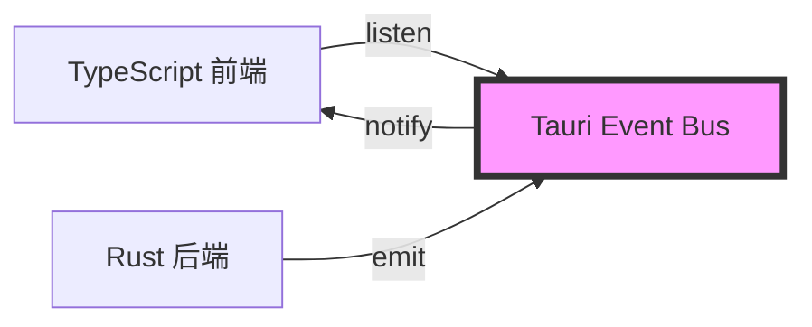
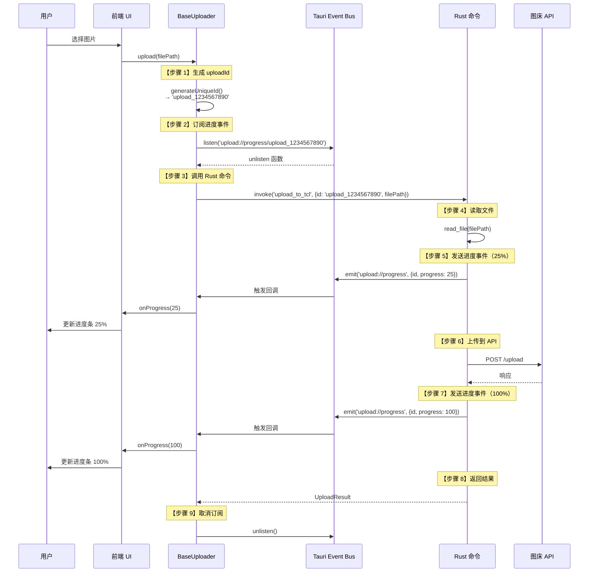

# 事件驱动机制

## 学习目标

通过本节学习，你将能够：
- ✅ 理解事件驱动编程的概念
- ✅ 掌握 Tauri 事件系统的工作原理
- ✅ 了解进度事件的完整流程
- ✅ 学会使用 listen 和 emit API
- ✅ 理解事件驱动如何解耦前后端

## 前置知识

- 熟悉 JavaScript 的事件监听（addEventListener）
- 了解发布-订阅模式
- 理解 Tauri 前后端分离架构

---

## 什么是事件驱动？

### 传统方式：轮询（Polling）

**问题**：后端如何通知前端上传进度？

**❌ 方式 1：轮询（不推荐）**
```typescript
// 前端不断询问后端
async function uploadWithPolling(filePath: string) {
  const uploadId = await startUpload(filePath);

  // 每 100ms 询问一次进度
  const interval = setInterval(async () => {
    const progress = await getUploadProgress(uploadId);
    console.log(`进度: ${progress}%`);

    if (progress >= 100) {
      clearInterval(interval);
    }
  }, 100);
}
```

**缺点**：
- ❌ 浪费资源（99% 的请求都是无效的）
- ❌ 延迟高（只能每 100ms 更新一次）
- ❌ 服务器负载大（大量无效请求）

---

### 事件驱动方式

**✅ 方式 2：事件驱动（推荐）**
```typescript
// 前端订阅进度事件
async function uploadWithEvent(filePath: string) {
  const uploadId = await startUpload(filePath);

  // 监听进度事件
  const unlisten = await listen(`upload://progress/${uploadId}`, (event) => {
    const { progress } = event.payload;
    console.log(`进度: ${progress}%`);
  });

  // 后端主动推送进度
  // 前端被动接收
}
```

**优点**：
- ✅ 实时性高（有进度立即推送）
- ✅ 资源效率高（只在有变化时推送）
- ✅ 解耦（前端不关心后端如何实现）

---

## Tauri 事件系统

### 架构图



**核心组件**：
1. **Event Bus（事件总线）** - Tauri 提供的消息中心
2. **Emit（发布）** - Rust 后端发送事件
3. **Listen（订阅）** - TypeScript 前端监听事件

---

### 事件命名规范

项目中使用的事件命名：

```typescript
// 格式：<模块>://<功能>/<参数>
'upload://progress/<uploadId>'     // 上传进度事件
'cookie://update/<serviceId>'      // Cookie 更新事件
'navigation://change'              // 导航变化事件
```

**为什么使用 `://` 分隔符？**
- 类似 URL 格式，易于理解
- 方便按模块分类
- 支持通配符匹配（未来扩展）

---

## 进度事件完整流程

### 时序图



---

## 前端：监听事件（listen）

### API 签名

```typescript
import { listen, UnlistenFn } from '@tauri-apps/api/event';

function listen<T>(
  event: string,
  handler: (event: Event<T>) => void
): Promise<UnlistenFn>;
```

**参数**：
- `event` - 事件名称（如 `'upload://progress/upload_123'`）
- `handler` - 事件处理函数

**返回值**：
- `Promise<UnlistenFn>` - 取消订阅的函数

---

### 完整示例

**文件**：[src/uploaders/base/BaseUploader.ts:95-100](../../src/uploaders/base/BaseUploader.ts#L95-L100)

```typescript
protected async uploadViaRust(
  filePath: string,
  params: Record<string, any>,
  onProgress?: ProgressCallback
): Promise<any> {
  // 【步骤 1】生成唯一 uploadId
  const uploadId = this.generateUniqueId();
  console.log(`[BaseUploader] 生成上传ID: ${uploadId}`);

  // 【步骤 2】设置进度监听器
  const eventName = `upload://progress/${uploadId}`;
  const unlisten = await listen<ProgressEvent>(eventName, (event) => {
    const { progress, total } = event.payload;

    // 计算百分比
    const percent = Math.round((progress / total) * 100);

    // 调用回调函数
    if (onProgress) {
      onProgress(percent);
    }

    console.log(`[BaseUploader] 上传进度: ${percent}%`);
  });

  try {
    // 【步骤 3】调用 Rust 命令
    const result = await invoke(this.getRustCommand(), {
      id: uploadId,
      filePath: filePath,
      ...params
    });

    return result;
  } finally {
    // 【步骤 4】清理监听器（防止内存泄漏）
    unlisten();
  }
}
```

---

### Event 对象结构

```typescript
interface Event<T> {
  /** 事件名称 */
  event: string;

  /** 事件负载（数据） */
  payload: T;

  /** 事件 ID */
  id: number;
}
```

**示例**：
```typescript
{
  event: 'upload://progress/upload_1234567890',
  payload: {
    id: 'upload_1234567890',
    progress: 50,
    total: 100
  },
  id: 12345
}
```

---

### 为什么需要 unlisten()？

**问题**：如果不调用 `unlisten()`，会发生什么？

```typescript
// ❌ 忘记 unlisten
async function upload() {
  await listen('upload://progress/upload_123', handler);
  // ... 上传完成
  // 忘记调用 unlisten()
}

// 多次上传后
upload();  // 注册监听器 1
upload();  // 注册监听器 2
upload();  // 注册监听器 3
// 内存中有 3 个监听器，但只有最后一次上传有效
// 其他 2 个监听器永远不会被清理 → 内存泄漏
```

**✅ 正确做法**：
```typescript
async function upload() {
  const unlisten = await listen('upload://progress/upload_123', handler);
  try {
    // ... 上传逻辑
  } finally {
    unlisten();  // 确保清理
  }
}
```

---

## 后端：发送事件（emit）

### API 签名

```rust
// Rust
use tauri::Window;

impl Window {
    pub fn emit<S: Serialize>(&self, event: &str, payload: S) -> Result<()>;
}
```

**参数**：
- `event` - 事件名称
- `payload` - 事件负载（自动序列化为 JSON）

---

### 完整示例

**文件**：[src-tauri/src/commands/tcl.rs:111-115](../../src-tauri/src/commands/tcl.rs#L111-L115)

```rust
#[tauri::command]
pub async fn upload_to_tcl(
    window: Window,      // Tauri 窗口（用于发送事件）
    id: String,          // 上传 ID
    file_path: String,   // 文件路径
) -> Result<TCLUploadResult, String> {
    println!("[TCL] 开始上传文件: {}", file_path);

    // 1. 读取文件
    let mut file = File::open(&file_path).await
        .map_err(|e| format!("无法打开文件: {}", e))?;

    let file_size = file.metadata().await
        .map_err(|e| format!("无法获取文件元数据: {}", e))?
        .len();

    // ... 上传逻辑 ...

    // 【发送进度事件】
    let _ = window.emit("upload://progress", serde_json::json!({
        "id": id,
        "progress": file_size,  // 已上传字节数
        "total": file_size      // 总字节数
    }));

    Ok(TCLUploadResult {
        url: https_url,
        size: file_size,
    })
}
```

---

### 事件负载（Payload）

```rust
// Rust 端发送
window.emit("upload://progress", serde_json::json!({
    "id": "upload_1234567890",
    "progress": 50,
    "total": 100
}));
```

**前端接收**：
```typescript
await listen<ProgressEvent>('upload://progress/upload_1234567890', (event) => {
  console.log(event.payload);
  // { id: 'upload_1234567890', progress: 50, total: 100 }
});
```

**类型定义**：
```typescript
interface ProgressEvent {
  id: string;
  progress: number;
  total: number;
}
```

---

## 事件匹配机制

### 精确匹配

```typescript
// 前端监听特定 uploadId 的进度
await listen('upload://progress/upload_123', handler);

// Rust 发送
window.emit("upload://progress", json!({ "id": "upload_123", ... }));
// ✅ 匹配成功
```

**Tauri 的事件匹配规则**：
1. 前端监听 `upload://progress/<uploadId>`
2. 后端发送 `upload://progress`，payload 包含 `id`
3. Tauri 自动根据 `id` 匹配到对应的监听器

---

### 全局监听

```typescript
// 监听所有上传进度事件（不带 uploadId）
await listen('upload://progress', (event) => {
  const { id, progress, total } = event.payload;
  console.log(`上传 ${id} 进度: ${progress}/${total}`);
});
```

---

## 其他事件示例

### Cookie 更新事件

**场景**：用户在登录窗口获取 Cookie 后，通知设置页面更新

**前端监听**：
```typescript
// 设置页面监听 Cookie 更新
await listen('cookie://update/weibo', (event) => {
  const { cookie } = event.payload;
  // 更新配置
  userConfig.services.weibo.cookie = cookie;
  await saveConfig(userConfig);
});
```

**前端发送**：
```typescript
// 登录窗口获取 Cookie 后发送事件
import { emit } from '@tauri-apps/api/event';

await emit('cookie://update/weibo', {
  cookie: 'SUB=abc123; SUBP=xyz789'
});
```

---

### 导航事件

**场景**：侧边栏导航切换时，通知主窗口更新

```typescript
// 发送导航事件
await emit('navigation://change', {
  view: 'upload'  // 'upload' | 'settings' | 'history'
});

// 监听导航事件
await listen('navigation://change', (event) => {
  const { view } = event.payload;
  switchView(view);
});
```

---

## 事件驱动的优势

### 1. 解耦（Decoupling）

**前端不关心后端如何实现**：
```typescript
// 前端只需监听事件
await listen('upload://progress', handler);

// 后端可以随意修改实现
// - 可以改用分块上传
// - 可以改用多线程
// - 前端代码无需修改
```

---

### 2. 实时性（Real-time）

```typescript
// 后端有进度立即推送
window.emit("upload://progress", json!({ "progress": 10 }));
window.emit("upload://progress", json!({ "progress": 20 }));
window.emit("upload://progress", json!({ "progress": 30 }));
// 前端实时接收，无延迟
```

---

### 3. 多订阅者（Multiple Subscribers）

```typescript
// 多个组件可以同时监听同一事件
await listen('upload://progress', handler1);  // 组件 1
await listen('upload://progress', handler2);  // 组件 2
await listen('upload://progress', handler3);  // 组件 3

// 后端发送一次，3 个组件都能收到
```

---

## 常见问题和解决方案

### 问题 1：忘记 unlisten 导致内存泄漏

**症状**：多次上传后，内存占用越来越高

**原因**：每次上传都注册监听器，但没有清理

**解决方案**：
```typescript
// ✅ 使用 try-finally 确保清理
const unlisten = await listen(event, handler);
try {
  // 上传逻辑
} finally {
  unlisten();  // 确保清理
}
```

---

### 问题 2：事件监听器没有触发

**可能原因**：
1. 事件名称不匹配
2. 后端没有发送事件
3. uploadId 不匹配

**调试方法**：
```typescript
// 添加日志
await listen('upload://progress/upload_123', (event) => {
  console.log('收到进度事件:', event);
});
```

```rust
// Rust 端添加日志
println!("[TCL] 发送进度事件: id={}, progress={}", id, progress);
let _ = window.emit("upload://progress", json!({ "id": id, ... }));
```

---

### 问题 3：事件负载类型不匹配

**错误**：
```typescript
interface ProgressEvent {
  progress: number;
  total: number;
}

await listen<ProgressEvent>('upload://progress', (event) => {
  const { progress, total } = event.payload;
  console.log(progress);  // undefined（如果 Rust 发送的字段名不同）
});
```

**解决方案**：确保前后端类型一致
```rust
// Rust
window.emit("upload://progress", json!({
    "progress": 50,  // 与 TypeScript 一致
    "total": 100
}));
```

---

## 实战练习

### 练习 1：实现简单的事件通信

**任务**：实现一个"刷新"按钮，点击后通知 Rust 刷新数据

**前端**：
```typescript
// 发送刷新事件
import { emit } from '@tauri-apps/api/event';

async function handleRefresh() {
  await emit('data://refresh', {});
}
```

**后端**：
```rust
// 监听刷新事件（在 Tauri 中，后端通常只发送事件，不监听）
// 通常使用命令而非事件
```

**更好的方式**：使用命令
```typescript
// 前端调用命令
await invoke('refresh_data');
```

---

### 练习 2：实现多阶段进度

**任务**：上传分为 3 个阶段，每个阶段发送进度

**Rust**：
```rust
// 阶段 1：读取文件（0-30%）
let _ = window.emit("upload://progress", json!({ "id": id, "progress": 10 }));
let _ = window.emit("upload://progress", json!({ "id": id, "progress": 30 }));

// 阶段 2：上传文件（30-70%）
let _ = window.emit("upload://progress", json!({ "id": id, "progress": 50 }));
let _ = window.emit("upload://progress", json!({ "id": id, "progress": 70 }));

// 阶段 3：处理响应（70-100%）
let _ = window.emit("upload://progress", json!({ "id": id, "progress": 90 }));
let _ = window.emit("upload://progress", json!({ "id": id, "progress": 100 }));
```

---

## 下一步学习

### 已完成
- ✅ 理解事件驱动编程的概念
- ✅ 掌握 Tauri 事件系统
- ✅ 了解进度事件的完整流程
- ✅ 学会使用 listen 和 emit

### 接下来
1. [**05-error-handling.md**](./05-error-handling.md) - 错误处理策略
   - 前端错误处理
   - Rust Result<T, E>
   - 错误传递机制

2. [**第 3 章：前端深入**](../03-frontend-deep-dive/06-upload-queue.md)
   - 上传队列管理
   - 配置管理系统
   - 加密存储实现

---

## 总结

通过本节，你已经：

✅ **掌握了事件驱动编程** - 发布-订阅模式的实际应用
✅ **理解了 Tauri 事件系统** - listen 和 emit 的使用
✅ **学会了进度事件实现** - 从 Rust 到 TypeScript 的完整流程
✅ **了解了事件驱动的优势** - 解耦、实时性、多订阅者

**关键要点**：
1. **事件驱动 vs 轮询** - 实时性高、资源效率高
2. **listen() 订阅** - 前端监听事件
3. **emit() 发布** - Rust 后端发送事件
4. **unlisten() 清理** - 防止内存泄漏
5. **事件命名规范** - `<模块>://<功能>/<参数>`

事件驱动让前后端通信变得简单优雅！🎯
