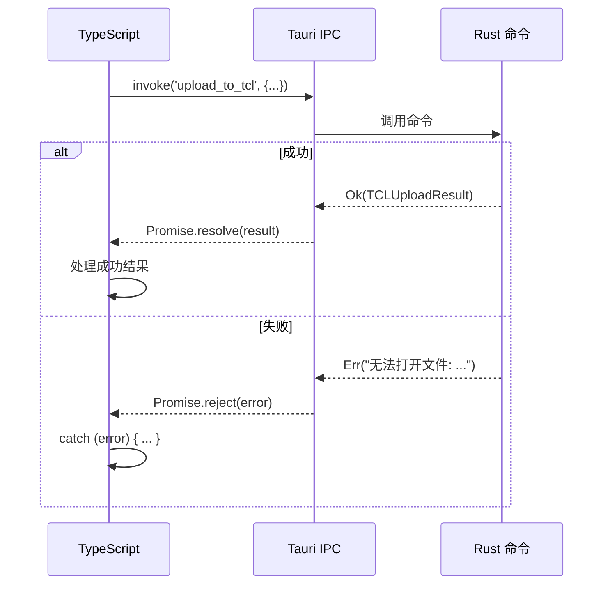

# 错误处理策略

## 学习目标

通过本节学习，你将能够：
- ✅ 理解错误处理的重要性
- ✅ 掌握 TypeScript 的错误处理机制
- ✅ 了解 Rust 的 Result<T, E> 模式
- ✅ 学会错误在前后端之间的传递
- ✅ 理解用户友好的错误提示设计

## 前置知识

- 熟悉 JavaScript/TypeScript 的 try-catch
- 了解 Rust 的基本语法
- 理解 Promise 的错误处理

---

## 为什么错误处理很重要？

### 没有错误处理的代码

```typescript
// ❌ 没有错误处理
async function uploadImage(filePath: string) {
  const uploader = UploaderFactory.create('weibo');
  const result = await uploader.upload(filePath, {});
  console.log('上传成功:', result.url);
}
```

**问题**：
- 文件不存在怎么办？
- 网络断开怎么办？
- Cookie 过期怎么办？
- 用户看到什么错误信息？

**可能的错误**：
```
Uncaught (in promise) Error: 无法打开文件
Uncaught (in promise) Error: Network request failed
Uncaught (in promise) Error: Cookie 无效
```

---

### 有错误处理的代码

```typescript
// ✅ 完善的错误处理
async function uploadImage(filePath: string) {
  try {
    const uploader = UploaderFactory.create('weibo');

    // 验证配置
    const validation = await uploader.validateConfig(config);
    if (!validation.valid) {
      throw new Error(`配置错误: ${validation.message}`);
    }

    // 上传
    const result = await uploader.upload(filePath, {});
    console.log('上传成功:', result.url);
    return result;

  } catch (error) {
    // 友好的错误提示
    if (error.message.includes('Cookie')) {
      console.error('Cookie 已过期，请重新登录');
    } else if (error.message.includes('Network')) {
      console.error('网络连接失败，请检查网络');
    } else {
      console.error('上传失败:', error.message);
    }

    // 抛出错误给上层处理
    throw error;
  }
}
```

---

## TypeScript 错误处理

### 1. try-catch 基础

```typescript
try {
  // 可能出错的代码
  const result = await someAsyncOperation();
} catch (error) {
  // 处理错误
  console.error('出错了:', error);
} finally {
  // 无论成功或失败都执行
  cleanup();
}
```

---

### 2. Error 类型处理

```typescript
try {
  // ...
} catch (error) {
  // ❌ 不推荐：假设 error 是 Error 类型
  console.error(error.message);

  // ✅ 推荐：先检查类型
  if (error instanceof Error) {
    console.error(error.message);
  } else if (typeof error === 'string') {
    console.error(error);
  } else {
    console.error('未知错误');
  }
}
```

---

### 3. 自定义错误类

```typescript
// 定义自定义错误类
class WeiboUploadError extends Error {
  constructor(message: string, public code: string) {
    super(message);
    this.name = 'WeiboUploadError';
  }
}

// 使用
throw new WeiboUploadError('Cookie 无效', 'INVALID_COOKIE');

// 捕获
try {
  // ...
} catch (error) {
  if (error instanceof WeiboUploadError) {
    console.error(`微博上传错误 [${error.code}]: ${error.message}`);
  }
}
```

---

### 4. Promise 错误处理

**方式 1：async/await + try-catch**
```typescript
// ✅ 推荐
async function uploadImage() {
  try {
    const result = await uploader.upload(filePath, {});
    return result;
  } catch (error) {
    console.error('上传失败:', error);
    throw error;
  }
}
```

**方式 2：Promise.catch()**
```typescript
function uploadImage() {
  return uploader.upload(filePath, {})
    .then(result => {
      console.log('上传成功');
      return result;
    })
    .catch(error => {
      console.error('上传失败:', error);
      throw error;
    });
}
```

---

## Rust 错误处理

### 1. Result<T, E> 模式

**Rust 的核心错误处理机制**：

```rust
// Result 类型定义
enum Result<T, E> {
    Ok(T),    // 成功，包含值 T
    Err(E),   // 失败，包含错误 E
}
```

---

### 2. 返回 Result

**示例**：TCL 上传命令

```rust
#[tauri::command]
pub async fn upload_to_tcl(
    window: Window,
    id: String,
    file_path: String,
) -> Result<TCLUploadResult, String> {
    // ↑ 成功返回 TCLUploadResult，失败返回 String（错误信息）

    // 读取文件
    let mut file = File::open(&file_path).await
        .map_err(|e| format!("无法打开文件: {}", e))?;
    //                                            ↑ ? 运算符

    // ... 上传逻辑 ...

    // 成功
    Ok(TCLUploadResult {
        url: https_url,
        size: file_size,
    })
}
```

---

### 3. ? 运算符（错误传播）

```rust
// ? 运算符：如果是 Err，立即返回错误；如果是 Ok，解包值
let file = File::open(&file_path).await?;
//                                      ↑ 等价于：
// let file = match File::open(&file_path).await {
//     Ok(f) => f,
//     Err(e) => return Err(e),
// };
```

---

### 4. map_err 转换错误

```rust
// 将 std::io::Error 转换为 String
let file = File::open(&file_path).await
    .map_err(|e| format!("无法打开文件: {}", e))?;
//  ↑ 转换错误类型
```

**为什么需要转换？**
- 命令的返回类型是 `Result<T, String>`
- `File::open` 返回的是 `Result<File, std::io::Error>`
- 需要将 `std::io::Error` 转换为 `String`

---

### 5. 完整的错误处理示例

```rust
#[tauri::command]
pub async fn upload_to_tcl(
    window: Window,
    id: String,
    file_path: String,
) -> Result<TCLUploadResult, String> {
    println!("[TCL] 开始上传文件: {}", file_path);

    // 【错误 1】文件打开失败
    let mut file = File::open(&file_path).await
        .map_err(|e| format!("无法打开文件: {}", e))?;

    // 【错误 2】获取文件元数据失败
    let file_size = file.metadata().await
        .map_err(|e| format!("无法获取文件元数据: {}", e))?
        .len();

    // 【错误 3】读取文件内容失败
    let mut buffer = Vec::new();
    file.read_to_end(&mut buffer).await
        .map_err(|e| format!("无法读取文件: {}", e))?;

    // 【错误 4】文件类型不支持
    let ext = file_name.split('.').last()
        .ok_or("无法获取文件扩展名")?
        .to_lowercase();

    if !["jpg", "jpeg", "png", "gif"].contains(&ext.as_str()) {
        return Err("只支持 JPG、PNG、GIF 格式的图片".to_string());
    }

    // 【错误 5】HTTP 请求失败
    let response = client.post(url)
        .multipart(form)
        .send()
        .await
        .map_err(|e| format!("请求失败: {}", e))?;

    // 【错误 6】JSON 解析失败
    let api_response: TCLApiResponse = serde_json::from_str(&response_text)
        .map_err(|e| format!("JSON 解析失败: {}", e))?;

    // 【错误 7】API 返回错误
    if api_response.code != 1 {
        return Err(format!("TCL API 返回错误: {}", api_response.msg));
    }

    // 成功
    Ok(TCLUploadResult {
        url: https_url,
        size: file_size,
    })
}
```

---

## 前后端错误传递

### 流程图



---

### 示例：完整的错误传递

**Rust 端**：
```rust
#[tauri::command]
pub async fn upload_to_tcl(/*...*/) -> Result<TCLUploadResult, String> {
    // 错误情况
    let file = File::open(&file_path).await
        .map_err(|e| format!("无法打开文件: {}", e))?;

    // 如果失败，返回 Err("无法打开文件: No such file or directory")
    // ...
}
```

**TypeScript 端**：
```typescript
try {
  const result = await invoke('upload_to_tcl', {
    id: uploadId,
    filePath: 'C:\\not\\exist.jpg'
  });
  console.log('成功:', result);
} catch (error) {
  // 收到错误信息："无法打开文件: No such file or directory"
  console.error('失败:', error);
}
```

---

## MultiServiceUploader 的错误处理

### 部分失败的优雅处理

```typescript
async uploadToMultipleServices(/*...*/) {
  // 并行上传到多个图床
  const uploadPromises = limitedServices.map(async (serviceId) => {
    try {
      // 【尝试上传】
      const uploader = UploaderFactory.create(serviceId);
      const result = await uploader.upload(filePath, options, onProgress);

      // 【成功】
      return {
        serviceId,
        result,
        status: 'success' as const
      };
    } catch (error) {
      // 【失败】捕获错误，不抛出（避免影响其他图床）
      let errorMsg = '未知错误';

      if (error instanceof Error) {
        errorMsg = error.message;
      } else if (typeof error === 'string') {
        errorMsg = error;
      }

      console.error(`[MultiUploader] ${serviceId} 上传失败:`, error);

      // 返回失败结果
      return {
        serviceId,
        status: 'failed' as const,
        error: errorMsg
      };
    }
  });

  // 等待所有完成（允许部分失败）
  const results = await Promise.allSettled(uploadPromises);

  // 【检查】是否至少一个成功
  const primaryResult = uploadResults.find(r => r.status === 'success');

  if (!primaryResult) {
    // 【所有失败】收集错误详情
    const failureDetails = uploadResults
      .filter(r => r.status === 'failed')
      .map(r => `  - ${r.serviceId}: ${r.error || '未知错误'}`)
      .join('\n');

    throw new Error(
      `所有图床上传均失败：\n${failureDetails}\n\n请检查网络连接和服务配置`
    );
  }

  // 【部分成功】返回结果
  return {
    primaryService: primaryResult.serviceId,
    results: uploadResults,
    primaryUrl: primaryResult.result.url
  };
}
```

**设计亮点**：
1. ✅ **失败隔离** - 一个图床失败不影响其他图床
2. ✅ **详细错误** - 收集所有失败详情
3. ✅ **优雅降级** - 至少一个成功就算成功

---

## 用户友好的错误提示

### 原则：让用户知道"为什么"和"怎么办"

**❌ 不友好的错误**：
```
Error: ENOENT
```

**✅ 友好的错误**：
```
无法打开文件 'C:\image.jpg'

可能原因：
1. 文件不存在
2. 文件被其他程序占用
3. 权限不足

建议：
- 检查文件路径是否正确
- 关闭可能占用文件的程序
- 以管理员权限运行
```

---

### 示例：微博 Cookie 错误提示

```typescript
async validateConfig(config: WeiboConfig): Promise<ValidationResult> {
  if (!config.cookie || config.cookie.trim().length === 0) {
    return {
      valid: false,
      message: '微博 Cookie 不能为空',
      errors: [
        'Cookie 未配置',
        '请前往设置页面获取微博 Cookie',
        '参考指南：docs/guides/OFFICIAL_LOGIN_GUIDE.md'
      ]
    };
  }

  if (!config.cookie.includes('SUB=')) {
    return {
      valid: false,
      message: 'Cookie 格式不正确',
      errors: [
        'Cookie 中缺少 SUB 字段',
        '请确保从 m.weibo.cn（移动版）获取',
        '不要从 weibo.com（桌面版）获取'
      ]
    };
  }

  return { valid: true };
}
```

---

### 示例：所有图床失败的错误提示

```typescript
// MultiServiceUploader.ts:157-159
throw new Error(
  `所有图床上传均失败：\n${failureDetails}\n\n请检查网络连接和服务配置`
);
```

**用户看到的错误**：
```
所有图床上传均失败：
  - weibo: Cookie 无效，请重新登录
  - r2: CORS 错误，请检查 R2 配置
  - tcl: 网络超时，请检查网络连接

请检查网络连接和服务配置
```

---

## 错误日志记录

### BaseUploader 的日志方法

```typescript
// BaseUploader.ts
protected log(level: 'info' | 'warn' | 'error', message: string, data?: any) {
  const prefix = `[${this.serviceName}]`;

  switch (level) {
    case 'info':
      console.log(prefix, message, data || '');
      break;
    case 'warn':
      console.warn(prefix, message, data || '');
      break;
    case 'error':
      console.error(prefix, message, data || '');
      break;
  }
}
```

**使用**：
```typescript
this.log('info', '开始上传到 TCL', { filePath });
this.log('error', 'TCL 上传失败', error);
```

**输出**：
```
[TCL图床] 开始上传到 TCL { filePath: 'C:\\image.jpg' }
[TCL图床] TCL 上传失败 Error: 网络超时
```

---

## 实战练习

### 练习 1：完善错误处理

**任务**：为以下代码添加完善的错误处理

```typescript
// ❌ 原始代码（无错误处理）
async function uploadImage(filePath: string) {
  const uploader = UploaderFactory.create('tcl');
  const result = await uploader.upload(filePath, {});
  console.log('上传成功:', result.url);
}
```

**答案**：
```typescript
// ✅ 完善的错误处理
async function uploadImage(filePath: string): Promise<UploadResult | null> {
  try {
    // 1. 创建上传器
    const uploader = UploaderFactory.create('tcl');

    // 2. 验证配置
    const validation = await uploader.validateConfig({});
    if (!validation.valid) {
      throw new Error(`配置错误: ${validation.message}`);
    }

    // 3. 上传
    const result = await uploader.upload(filePath, {});
    console.log('✓ 上传成功:', result.url);
    return result;

  } catch (error) {
    // 4. 友好的错误提示
    if (error instanceof Error) {
      if (error.message.includes('ENOENT')) {
        console.error('✗ 文件不存在:', filePath);
      } else if (error.message.includes('Network')) {
        console.error('✗ 网络错误，请检查网络连接');
      } else {
        console.error('✗ 上传失败:', error.message);
      }
    }

    // 5. 抛出或返回 null
    return null;
  }
}
```

---

### 练习 2：Rust 错误处理

**任务**：改进以下 Rust 代码的错误处理

```rust
// ❌ 原始代码（使用 unwrap）
#[tauri::command]
pub async fn upload(file_path: String) -> String {
    let file = File::open(&file_path).await.unwrap();
    let content = read_file(file).await.unwrap();
    upload_to_server(content).await.unwrap()
}
```

**答案**：
```rust
// ✅ 使用 Result
#[tauri::command]
pub async fn upload(file_path: String) -> Result<String, String> {
    // 1. 打开文件
    let file = File::open(&file_path).await
        .map_err(|e| format!("无法打开文件 '{}': {}", file_path, e))?;

    // 2. 读取内容
    let content = read_file(file).await
        .map_err(|e| format!("无法读取文件: {}", e))?;

    // 3. 上传
    let url = upload_to_server(content).await
        .map_err(|e| format!("上传失败: {}", e))?;

    Ok(url)
}
```

---

## 错误处理最佳实践

### 1. 永远不要忽略错误

```typescript
// ❌ 错误：忽略错误
try {
  await someOperation();
} catch (error) {
  // 什么都不做
}

// ✅ 正确：至少记录日志
try {
  await someOperation();
} catch (error) {
  console.error('操作失败:', error);
  // 或者抛出错误
  throw error;
}
```

---

### 2. 提供上下文信息

```typescript
// ❌ 错误：没有上下文
throw new Error('上传失败');

// ✅ 正确：包含上下文
throw new Error(`上传失败: 文件 '${filePath}' 到 ${serviceId} 图床`);
```

---

### 3. 使用类型安全的错误处理

```typescript
// ✅ TypeScript
try {
  // ...
} catch (error) {
  if (error instanceof Error) {
    console.error(error.message);
  } else if (typeof error === 'string') {
    console.error(error);
  } else {
    console.error('未知错误');
  }
}
```

---

### 4. 友好的错误提示

```typescript
// ❌ 技术性错误
throw new Error('ENOENT: no such file or directory');

// ✅ 用户友好的错误
throw new Error(
  `文件不存在: ${filePath}\n` +
  `请检查文件路径是否正确`
);
```

---

## 下一步学习

### 已完成（第 2 章完成！）
- ✅ 掌握插件化架构设计
- ✅ 理解 5 种设计模式应用
- ✅ 学会类型系统设计
- ✅ 理解事件驱动机制
- ✅ 掌握错误处理策略

### 接下来
1. [**第 3 章：前端深入**](../03-frontend-deep-dive/06-upload-queue.md)
   - 上传队列管理
   - 配置管理系统
   - 加密存储实现

2. [**第 4 章：后端深入**](../04-backend-deep-dive/01-tauri-main.md)
   - Tauri 主程序详解
   - Rust 命令系统
   - HTTP 客户端管理

---

## 总结

通过本节，你已经：

✅ **理解了错误处理的重要性** - 让用户知道发生了什么
✅ **掌握了 TypeScript 错误处理** - try-catch、自定义错误类
✅ **学会了 Rust 错误处理** - Result<T, E>、? 运算符、map_err
✅ **理解了错误传递机制** - 从 Rust 到 TypeScript 的完整流程
✅ **学会了用户友好的错误提示** - 告诉用户"为什么"和"怎么办"

**关键要点**：
1. **永远处理错误** - 不要忽略任何错误
2. **提供上下文** - 让错误信息更有用
3. **类型安全** - 使用 TypeScript 和 Rust 的类型系统
4. **友好提示** - 技术错误转换为用户友好的提示
5. **失败隔离** - 一个模块的错误不影响其他模块

良好的错误处理是高质量软件的标志！🛡️

---

**🎉 恭喜你完成了第 2 章：核心概念！**

你已经掌握了 WeiboDR-Uploader 的核心设计理念和编程模式。接下来，我们将深入前端和后端的具体实现细节！
