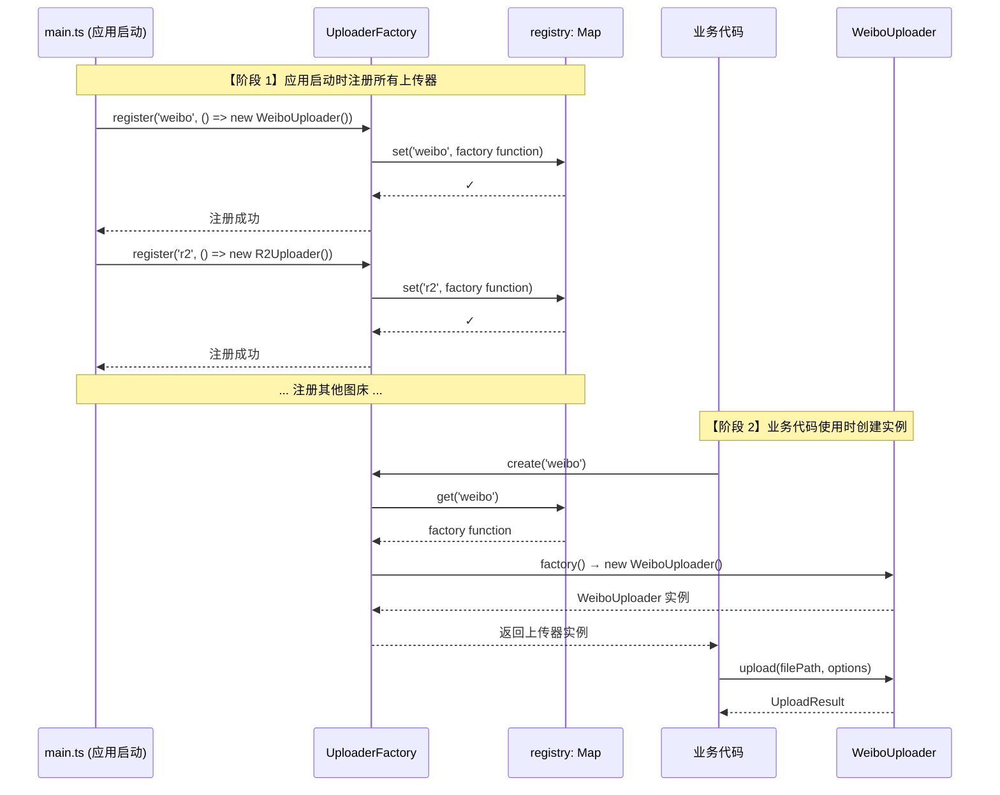

# UploaderFactory 工厂模式详解

## 学习目标

通过本节学习,你将能够：
- ✅ 理解工厂模式的概念和作用
- ✅ 掌握 UploaderFactory 的完整实现
- ✅ 了解如何注册和创建上传器
- ✅ 理解工厂模式如何支持插件化架构
- ✅ 学会使用工厂模式管理对象创建

## 前置知识

- 熟悉 TypeScript 基础语法
- 理解 IUploader 接口（参见 [01-uploader-interface.md](./01-uploader-interface.md)）
- 了解 Map 数据结构

---

## 什么是工厂模式？

### 问题：为什么需要工厂模式？

假设没有工厂模式，每次需要创建上传器时，你需要这样做：

```typescript
// ❌ 不使用工厂模式的代码（不推荐）
let uploader: IUploader;

if (serviceId === 'weibo') {
  uploader = new WeiboUploader();
} else if (serviceId === 'r2') {
  uploader = new R2Uploader();
} else if (serviceId === 'tcl') {
  uploader = new TCLUploader();
} else if (serviceId === 'jd') {
  uploader = new JDUploader();
} else if (serviceId === 'nowcoder') {
  uploader = new NowcoderUploader();
} else if (serviceId === 'qiyu') {
  uploader = new QiyuUploader();
} else if (serviceId === 'zhihu') {
  uploader = new ZhihuUploader();
} else if (serviceId === 'nami') {
  uploader = new NamiUploader();
} else {
  throw new Error(`未知的图床服务: ${serviceId}`);
}
```

**问题**：
1. ❌ **代码重复** - 每次需要创建上传器的地方都要写一遍
2. ❌ **难以维护** - 添加新图床需要修改所有创建逻辑
3. ❌ **违反开闭原则** - 对修改开放，对扩展关闭
4. ❌ **耦合度高** - 业务代码直接依赖具体实现类

---

### 解决方案：工厂模式

```typescript
// ✅ 使用工厂模式的代码（推荐）
const uploader = UploaderFactory.create(serviceId);
```

**优势**：
1. ✅ **简洁** - 一行代码搞定
2. ✅ **可维护** - 添加新图床只需注册一次
3. ✅ **符合开闭原则** - 对扩展开放，对修改关闭
4. ✅ **低耦合** - 业务代码只依赖工厂和接口

---

## UploaderFactory 完整源码解析

**文件位置**：[src/uploaders/base/UploaderFactory.ts](../../src/uploaders/base/UploaderFactory.ts)

**代码行数**：171 行

### 核心数据结构

```typescript
/**
 * 上传器工厂函数类型
 * 这是一个函数类型，返回 IUploader 接口的实现
 */
type UploaderFactoryFunction = () => IUploader;

/**
 * 上传器工厂类
 */
export class UploaderFactory {
  /**
   * 上传器注册表（核心！）
   * key: 服务ID (如 'weibo', 'r2')
   * value: 工厂函数（返回上传器实例）
   */
  private static registry: Map<string, UploaderFactoryFunction> = new Map();

  // ... 方法实现
}
```

**设计要点**：
1. **静态成员** - `registry` 是静态私有成员，全局唯一
2. **Map 数据结构** - 键值对存储，O(1) 查找效率
3. **工厂函数** - 存储的是函数，而非实例（延迟创建）

---

### 核心方法 1：register() - 注册上传器

**完整源码**：
```typescript
/**
 * 注册上传器
 * 在应用启动时调用，注册所有可用的上传器
 *
 * @param serviceId 服务唯一标识符 (如 'weibo', 'r2', 'nami')
 * @param factory 工厂函数，返回上传器实例
 */
static register(serviceId: string, factory: UploaderFactoryFunction): void {
  // 【步骤 1】验证 serviceId 不为空
  if (!serviceId || serviceId.trim().length === 0) {
    throw new Error('服务 ID 不能为空');
  }

  // 【步骤 2】检查是否重复注册（警告但不报错）
  if (this.registry.has(serviceId)) {
    console.warn(`[UploaderFactory] 服务 "${serviceId}" 已存在，将被覆盖`);
  }

  // 【步骤 3】保存到注册表
  this.registry.set(serviceId, factory);

  // 【步骤 4】输出日志
  console.log(`[UploaderFactory] 已注册上传器: ${serviceId}`);
}
```

**使用示例**：
```typescript
// 在 main.ts 中注册所有上传器
UploaderFactory.register('weibo', () => new WeiboUploader());
UploaderFactory.register('r2', () => new R2Uploader());
UploaderFactory.register('tcl', () => new TCLUploader());
UploaderFactory.register('jd', () => new JDUploader());
UploaderFactory.register('nowcoder', () => new NowcoderUploader());
UploaderFactory.register('qiyu', () => new QiyuUploader());
UploaderFactory.register('zhihu', () => new ZhihuUploader());
UploaderFactory.register('nami', () => new NamiUploader());
```

**为什么使用工厂函数？**

**方式 1：直接存储实例（不推荐）**
```typescript
// ❌ 不推荐：直接存储实例
UploaderFactory.register('weibo', new WeiboUploader());
```

**问题**：
- 启动时就创建所有实例，浪费内存
- 如果上传器需要配置参数，无法传递

**方式 2：存储工厂函数（推荐）**
```typescript
// ✅ 推荐：存储工厂函数
UploaderFactory.register('weibo', () => new WeiboUploader());
```

**优势**：
- 延迟创建（Lazy Initialization），只有使用时才创建
- 每次调用 `create()` 都返回新实例（如果需要）
- 可以在工厂函数中传递参数

---

### 核心方法 2：create() - 创建上传器实例

**完整源码**：
```typescript
/**
 * 创建上传器实例
 * 根据服务 ID 创建对应的上传器实例
 *
 * @param serviceId 服务唯一标识符
 * @returns 上传器实例
 * @throws {Error} 如果服务 ID 未注册
 */
static create(serviceId: string): IUploader {
  // 【步骤 1】从注册表中查找工厂函数
  const factory = this.registry.get(serviceId);

  // 【步骤 2】未注册则抛出错误
  if (!factory) {
    const available = Array.from(this.registry.keys()).join(', ');
    throw new Error(
      `未知的图床服务: "${serviceId}"\n可用服务: ${available || '无'}`
    );
  }

  // 【步骤 3】调用工厂函数创建实例
  try {
    const uploader = factory();  // 调用工厂函数
    console.log(`[UploaderFactory] 已创建上传器: ${serviceId} (${uploader.serviceName})`);
    return uploader;
  } catch (error) {
    // 【步骤 4】创建失败时抛出详细错误
    console.error(`[UploaderFactory] 创建上传器失败: ${serviceId}`, error);
    throw new Error(`创建上传器 "${serviceId}" 失败: ${error}`);
  }
}
```

**使用示例**：
```typescript
// 创建微博上传器
const weiboUploader = UploaderFactory.create('weibo');
await weiboUploader.upload('/path/to/image.jpg', {...});

// 创建 R2 上传器
const r2Uploader = UploaderFactory.create('r2');
await r2Uploader.upload('/path/to/image.jpg', {...});

// 尝试创建未注册的服务（会抛出错误）
try {
  const unknown = UploaderFactory.create('unknown');
} catch (error) {
  console.error(error.message);
  // 输出：未知的图床服务: "unknown"
  //       可用服务: weibo, r2, tcl, jd, nowcoder, qiyu, zhihu, nami
}
```

**错误处理的设计**：

注意 `create()` 方法的错误消息非常友好：
```typescript
未知的图床服务: "unknown"
可用服务: weibo, r2, tcl, jd, nowcoder
```

这样开发者可以立即知道：
1. 输入了什么错误的服务 ID
2. 有哪些可用的服务

---

### 辅助方法 3：getAvailableServices() - 获取所有服务列表

**完整源码**：
```typescript
/**
 * 获取所有已注册的服务 ID 列表
 *
 * @returns 服务 ID 数组
 */
static getAvailableServices(): string[] {
  return Array.from(this.registry.keys());
}
```

**使用示例**：
```typescript
const services = UploaderFactory.getAvailableServices();
console.log(services);
// 输出：['weibo', 'r2', 'tcl', 'jd', 'nowcoder', 'qiyu', 'zhihu', 'nami']

// 在 UI 中显示所有可用图床
services.forEach(serviceId => {
  const uploader = UploaderFactory.create(serviceId);
  console.log(`${serviceId}: ${uploader.serviceName}`);
});
```

---

### 辅助方法 4：isRegistered() - 检查服务是否注册

**完整源码**：
```typescript
/**
 * 检查服务是否已注册
 *
 * @param serviceId 服务 ID
 * @returns 是否已注册
 */
static isRegistered(serviceId: string): boolean {
  return this.registry.has(serviceId);
}
```

**使用示例**：
```typescript
if (UploaderFactory.isRegistered('weibo')) {
  console.log('微博图床可用');
} else {
  console.log('微博图床未注册');
}
```

---

### 辅助方法 5：unregister() - 注销服务

**完整源码**：
```typescript
/**
 * 注销服务
 * 从注册表中移除服务（一般用于测试或动态插件场景）
 *
 * @param serviceId 服务 ID
 * @returns 是否成功注销
 */
static unregister(serviceId: string): boolean {
  const existed = this.registry.has(serviceId);

  if (existed) {
    this.registry.delete(serviceId);
    console.log(`[UploaderFactory] 已注销上传器: ${serviceId}`);
  } else {
    console.warn(`[UploaderFactory] 服务 "${serviceId}" 未注册，无需注销`);
  }

  return existed;
}
```

**使用场景**：
- 单元测试（测试后清理）
- 动态插件系统（运行时加载/卸载插件）

---

### 辅助方法 6：clear() - 清空所有注册

**完整源码**：
```typescript
/**
 * 清空所有注册的服务
 * 一般用于测试场景
 */
static clear(): void {
  const count = this.registry.size;
  this.registry.clear();
  console.log(`[UploaderFactory] 已清空所有注册的上传器 (共 ${count} 个)`);
}
```

**使用场景**：
- 单元测试的 `beforeEach()` 或 `afterEach()`
- 重新初始化应用

---

### 辅助方法 7：getRegistrySnapshot() - 获取注册表快照

**完整源码**：
```typescript
/**
 * 获取注册表的快照（用于调试）
 *
 * @returns 服务 ID 到服务名称的映射
 */
static getRegistrySnapshot(): Map<string, string> {
  const snapshot = new Map<string, string>();

  for (const [serviceId, factory] of this.registry) {
    try {
      const uploader = factory();
      snapshot.set(serviceId, uploader.serviceName);
    } catch (error) {
      snapshot.set(serviceId, '(创建失败)');
    }
  }

  return snapshot;
}
```

**使用示例**：
```typescript
const snapshot = UploaderFactory.getRegistrySnapshot();
console.log(snapshot);
// 输出：Map {
//   'weibo' => '微博图床',
//   'r2' => 'Cloudflare R2',
//   'tcl' => 'TCL图床',
//   'jd' => '京东图床',
//   'nowcoder' => '牛客图床',
//   'qiyu' => '七鱼图床',
//   'zhihu' => '知乎图床',
//   'nami' => '纳米图床'
// }
```

**用途**：
- DevTools Console 中调试
- 显示所有可用图床的中文名称
- 检查注册状态

---

## 工厂模式的工作流程

### 流程图：从注册到使用



---

## 实际应用：在 main.ts 中的使用

**完整示例**（简化版）：
```typescript
// src/main.ts

import { UploaderFactory } from './uploaders/base/UploaderFactory';
import { WeiboUploader } from './uploaders/weibo/WeiboUploader';
import { R2Uploader } from './uploaders/r2/R2Uploader';
import { TCLUploader } from './uploaders/tcl/TCLUploader';
import { JDUploader } from './uploaders/jd/JDUploader';
import { NowcoderUploader } from './uploaders/nowcoder/NowcoderUploader';
import { QiyuUploader } from './uploaders/qiyu/QiyuUploader';
import { ZhihuUploader } from './uploaders/zhihu/ZhihuUploader';
import { NamiUploader } from './uploaders/nami/NamiUploader';

// 【步骤 1】应用启动时注册所有上传器
function registerUploaders() {
  UploaderFactory.register('weibo', () => new WeiboUploader());
  UploaderFactory.register('r2', () => new R2Uploader());
  UploaderFactory.register('tcl', () => new TCLUploader());
  UploaderFactory.register('jd', () => new JDUploader());
  UploaderFactory.register('nowcoder', () => new NowcoderUploader());
  UploaderFactory.register('qiyu', () => new QiyuUploader());
  UploaderFactory.register('zhihu', () => new ZhihuUploader());
  UploaderFactory.register('nami', () => new NamiUploader());

  console.log('✓ 所有上传器已注册');
}

// 【步骤 2】业务代码使用工厂创建实例
async function uploadImage(serviceId: string, filePath: string) {
  try {
    // 创建上传器实例
    const uploader = UploaderFactory.create(serviceId);

    // 上传图片
    const result = await uploader.upload(filePath, {});

    // 获取公开链接
    const url = uploader.getPublicUrl(result);
    console.log(`上传成功: ${url}`);
  } catch (error) {
    console.error(`上传失败: ${error.message}`);
  }
}

// 【步骤 3】应用初始化
async function init() {
  registerUploaders();  // 注册所有上传器

  // 使用示例
  await uploadImage('tcl', '/path/to/image.jpg');
  await uploadImage('weibo', '/path/to/image.jpg');
  await uploadImage('r2', '/path/to/image.jpg');
}

init();
```

---

## 工厂模式的设计优势

### 1. 符合开闭原则（Open-Closed Principle）

**开闭原则**：软件实体应该对扩展开放，对修改关闭。

**添加新图床的步骤**（无需修改工厂代码）：

```typescript
// 【步骤 1】创建新的上传器类
export class NewUploader extends BaseUploader {
  readonly serviceId = 'new';
  readonly serviceName = '新图床';
  // ... 实现接口方法
}

// 【步骤 2】在 main.ts 中注册（只添加一行）
UploaderFactory.register('new', () => new NewUploader());

// ✅ 完成！无需修改 UploaderFactory 的代码
```

---

### 2. 低耦合（Loose Coupling）

业务代码只依赖：
1. **IUploader 接口** - 定义规范
2. **UploaderFactory** - 创建实例

**不依赖**：
- ❌ WeiboUploader 具体类
- ❌ R2Uploader 具体类
- ❌ TCLUploader 具体类

**好处**：
- 更换实现时，业务代码无需修改
- 测试时可以注册 Mock 上传器

---

### 3. 集中管理（Centralized Management）

所有上传器的创建逻辑集中在一个地方：
```typescript
// 所有上传器的注册都在 main.ts
registerUploaders();
```

**好处**：
- 一眼看到所有可用的图床
- 方便管理生命周期
- 便于调试和日志记录

---

### 4. 延迟创建（Lazy Initialization）

工厂函数只有在调用 `create()` 时才执行：

```typescript
// 注册时：只保存工厂函数，不创建实例
UploaderFactory.register('weibo', () => new WeiboUploader());

// 创建时：调用工厂函数，才创建实例
const uploader = UploaderFactory.create('weibo');  // 此时才 new WeiboUploader()
```

**好处**：
- 节省内存（未使用的上传器不创建）
- 加快启动速度

---

## 工厂模式 vs 直接 new

### 对比表格

| 对比项 | 工厂模式 | 直接 new |
|--------|----------|----------|
| **创建代码** | `UploaderFactory.create('weibo')` | `new WeiboUploader()` |
| **业务代码耦合** | 只依赖工厂和接口 | 依赖具体实现类 |
| **添加新图床** | 注册一次即可 | 修改所有创建逻辑 |
| **代码重复** | 无重复 | 大量 if-else 重复 |
| **可测试性** | 可注册 Mock 实现 | 难以 Mock |
| **符合开闭原则** | ✅ | ❌ |

---

## 实战练习

### 练习 1：注册并使用自定义上传器

**任务**：创建一个简单的"测试上传器"并使用工厂模式管理

**代码**：
```typescript
// 1. 创建测试上传器
class TestUploader extends BaseUploader {
  readonly serviceId = 'test';
  readonly serviceName = '测试图床';

  async validateConfig(config: any): Promise<ValidationResult> {
    return { valid: true };
  }

  async upload(filePath: string, options: UploadOptions): Promise<UploadResult> {
    console.log(`[TestUploader] 上传文件: ${filePath}`);
    return {
      serviceId: 'test',
      fileKey: 'test_' + Date.now(),
      url: 'https://test.example.com/image.jpg'
    };
  }

  getPublicUrl(result: UploadResult): string {
    return result.url;
  }
}

// 2. 注册到工厂
UploaderFactory.register('test', () => new TestUploader());

// 3. 使用工厂创建实例
const testUploader = UploaderFactory.create('test');
await testUploader.upload('/path/to/image.jpg', {});
```

---

### 练习 2：查看所有注册的图床

**任务**：在 DevTools Console 中查看所有已注册的图床

**代码**：
```typescript
// 方式 1：获取服务 ID 列表
const services = UploaderFactory.getAvailableServices();
console.log('已注册的图床:', services);

// 方式 2：获取详细快照（包含中文名称）
const snapshot = UploaderFactory.getRegistrySnapshot();
for (const [id, name] of snapshot) {
  console.log(`${id}: ${name}`);
}
```

---

### 练习 3：动态注销和重新注册

**任务**：注销微博图床，然后重新注册

**代码**：
```typescript
// 1. 注销微博图床
const removed = UploaderFactory.unregister('weibo');
console.log('注销结果:', removed);  // true

// 2. 尝试创建（会失败）
try {
  UploaderFactory.create('weibo');
} catch (error) {
  console.error(error.message);
  // 输出：未知的图床服务: "weibo"
}

// 3. 重新注册
UploaderFactory.register('weibo', () => new WeiboUploader());

// 4. 现在可以创建了
const weiboUploader = UploaderFactory.create('weibo');
console.log('重新注册成功');
```

---

## 下一步学习

### 已完成
- ✅ 理解工厂模式的概念和优势
- ✅ 掌握 UploaderFactory 的完整实现
- ✅ 了解如何注册和创建上传器
- ✅ 理解工厂模式如何支持插件化架构

### 接下来
1. [**04-tcl-uploader.md**](./04-tcl-uploader.md) - TCL 上传器案例研究
   - 完整源码逐行讲解
   - 最简单的上传器实现
   - 如何继承 BaseUploader
   - 如何实现 IUploader 接口

2. [**05-multi-service-uploader.md**](./05-multi-service-uploader.md) - 多图床编排器
   - 并行上传核心逻辑
   - 如何使用工厂创建多个上传器
   - 主力图床选择策略

---

## 总结

通过本节，你已经：

✅ **理解了工厂模式的价值** - 解决对象创建的复杂性
✅ **掌握了 UploaderFactory 的实现** - 171 行代码，7 个核心方法
✅ **了解了注册和创建流程** - register() → create()
✅ **认识到设计模式的威力** - 开闭原则、低耦合、集中管理

**关键要点**：
1. **工厂模式** = 集中管理对象的创建
2. **注册表** = Map<string, () => IUploader>
3. **延迟创建** = 只有使用时才创建实例
4. **开闭原则** = 添加新图床无需修改工厂代码

下一节，我们将通过 **TCLUploader** 的完整源码，学习如何实现一个最简单的上传器！🚀
