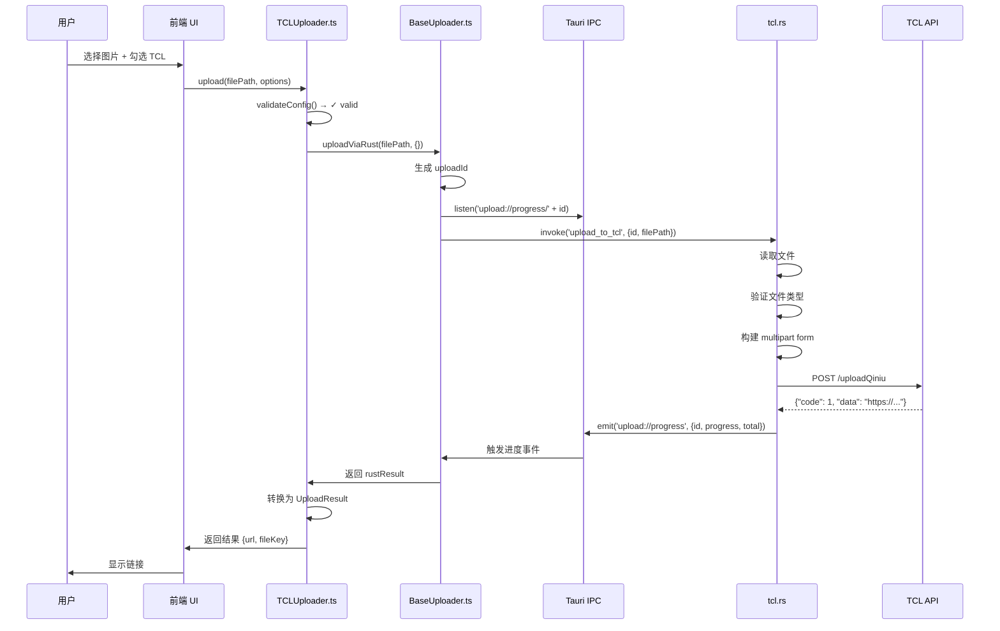

# TCL 上传器案例研究

## 学习目标

通过本节学习，你将能够：
- ✅ 完整理解 TCL 上传器的实现（TypeScript + Rust）
- ✅ 学会如何继承 BaseUploader 实现新上传器
- ✅ 掌握前后端协作的完整流程
- ✅ 了解如何处理文件上传和进度事件
- ✅ 为实现自己的图床上传器打下基础

## 前置知识

- 熟悉 TypeScript 和 Rust 基础语法
- 理解 IUploader 接口（参见 [01-uploader-interface.md](./01-uploader-interface.md)）
- 理解 BaseUploader 抽象类（参见 [02-base-uploader.md](./02-base-uploader.md)）

---

## 为什么选择 TCL 作为案例？

TCL 图床是项目中**最简单**的上传器，非常适合作为学习案例：

| 特性 | TCL 图床 | 其他图床（如微博、R2） |
|------|----------|----------------------|
| **配置需求** | ✅ 零配置 | ❌ 需要 Cookie/API 密钥 |
| **认证逻辑** | ✅ 无需认证 | ❌ 复杂的认证流程 |
| **代码行数** | ✅ 95 行（TS） + 122 行（Rust） | ❌ 200+ 行 |
| **学习难度** | ⭐ 简单 | ⭐⭐⭐⭐ 复杂 |

**学习路径**：
1. 先学习 TCL（本节）- 理解基本流程
2. 再学习微博/R2 - 理解复杂场景

---

## TCL 图床简介

### 什么是 TCL 图床？

TCL 图床是 TCL 公司提供的免费图片上传服务：
- **API 地址**：`https://service2.tcl.com/api.php/Center/uploadQiniu`
- **无需认证**：直接上传即可
- **支持格式**：JPG、PNG、GIF
- **稳定性**：⭐⭐⭐⭐（4星）
- **速度**：⭐⭐⭐⭐（4星）

### 为什么 TCL 适合新手？

1. ✅ **开箱即用** - 无需配置，安装即可使用
2. ✅ **代码简洁** - 实现逻辑清晰易懂
3. ✅ **稳定可靠** - 适合日常使用

---

## 完整架构流程图



---

## 前端实现：TCLUploader.ts（95 行）

### 文件位置

[src/uploaders/tcl/TCLUploader.ts](../../src/uploaders/tcl/TCLUploader.ts)

### 完整源码逐行讲解

#### 第 1-7 行：导入依赖

```typescript
// src/uploaders/tcl/TCLUploader.ts
// TCL 图床上传器实现

import { BaseUploader } from '../base/BaseUploader';
import { UploadResult, ValidationResult, UploadOptions, ProgressCallback } from '../base/types';
import { TCLServiceConfig } from '../../config/types';
```

**说明**：
- `BaseUploader` - 抽象基类，提供通用逻辑
- `UploadResult`, `ValidationResult` 等 - TypeScript 类型定义
- `TCLServiceConfig` - TCL 配置类型（虽然 TCL 无需配置）

---

#### 第 8-14 行：定义 Rust 返回类型

```typescript
/**
 * Rust 返回的 TCL 上传结果
 */
interface TCLRustResult {
  url: string;   // 图片的完整 URL
  size: number;  // 文件大小（字节）
}
```

**为什么需要这个接口**？
- Rust 命令返回的 JSON 会被反序列化为这个类型
- TypeScript 类型系统需要明确知道 Rust 返回什么

**Rust 端对应的结构体**（`tcl.rs:10-14`）：
```rust
#[derive(Debug, Serialize, Deserialize)]
pub struct TCLUploadResult {
    pub url: String,
    pub size: u64,
}
```

---

#### 第 16-23 行：类定义和基本属性

```typescript
/**
 * TCL 图床上传器
 * TCL 图床无需认证，完全开箱即用
 */
export class TCLUploader extends BaseUploader {
  readonly serviceId = 'tcl';
  readonly serviceName = 'TCL 图床';
```

**关键点**：
1. **继承 BaseUploader** - 获得通用逻辑（uploadViaRust、日志等）
2. **serviceId** - 唯一标识符，用于工厂模式
3. **serviceName** - 中文名称，用于 UI 显示

---

#### 第 24-29 行：getRustCommand() - 指定 Rust 命令

```typescript
  /**
   * 返回对应的 Rust 命令名
   */
  protected getRustCommand(): string {
    return 'upload_to_tcl';
  }
```

**作用**：
- 告诉 BaseUploader 调用哪个 Rust 命令
- BaseUploader 的 `uploadViaRust()` 会使用这个命令名

**对应的 Rust 命令**（`tcl.rs:23`）：
```rust
#[tauri::command]
pub async fn upload_to_tcl(/*...*/) -> Result<TCLUploadResult, String> {
    // ...
}
```

---

#### 第 31-37 行：validateConfig() - 验证配置

```typescript
  /**
   * 验证 TCL 配置
   * TCL 图床无需配置，直接返回 valid
   */
  async validateConfig(config: any): Promise<ValidationResult> {
    return { valid: true };
  }
```

**为什么直接返回 valid?**
- TCL 图床**无需任何配置**（无需 Cookie、API 密钥）
- 开箱即用

**对比：微博图床的 validateConfig()**
```typescript
// 微博需要验证 Cookie
async validateConfig(config: WeiboConfig): Promise<ValidationResult> {
  if (!config.cookie || config.cookie.trim().length === 0) {
    return { valid: false, message: '微博 Cookie 不能为空' };
  }

  if (!config.cookie.includes('SUB=')) {
    return { valid: false, message: 'Cookie 格式不正确，缺少 SUB 字段' };
  }

  return { valid: true };
}
```

---

#### 第 39-71 行：upload() - 核心上传逻辑

```typescript
  /**
   * 上传文件到 TCL
   */
  async upload(
    filePath: string,
    options: UploadOptions,
    onProgress?: ProgressCallback
  ): Promise<UploadResult> {
    // 【步骤 1】记录日志
    this.log('info', '开始上传到 TCL', { filePath });

    try {
      // 【步骤 2】调用基类的 Rust 上传方法
      // TCL 无需额外参数，传递空对象 {}
      const rustResult = await this.uploadViaRust(
        filePath,
        {},  // 空对象：TCL 无需额外参数
        onProgress
      ) as TCLRustResult;

      // 【步骤 3】上传成功，记录日志
      this.log('info', 'TCL 上传成功', { url: rustResult.url });

      // 【步骤 4】转换为标准 UploadResult
      return {
        serviceId: 'tcl',
        fileKey: rustResult.url,  // TCL 使用完整 URL 作为 fileKey
        url: rustResult.url,
        size: rustResult.size
      };
    } catch (error) {
      // 【步骤 5】上传失败，记录错误并抛出
      this.log('error', 'TCL 上传失败', error);
      throw new Error(`TCL 图床上传失败: ${error}`);
    }
  }
```

**代码解析**：

**步骤 2：调用 BaseUploader.uploadViaRust()**
- `filePath` - 文件路径（如 `C:\Users\...\image.jpg`）
- `{}` - 额外参数（TCL 无需参数，所以传空对象）
- `onProgress` - 进度回调函数

**BaseUploader.uploadViaRust() 会做什么**？（参见 [02-base-uploader.md](./02-base-uploader.md)）
1. 生成唯一 `uploadId`
2. 设置进度监听器 `listen('upload://progress/' + uploadId)`
3. 调用 Rust 命令 `invoke('upload_to_tcl', {id, filePath})`
4. 等待 Rust 返回结果
5. 清理监听器 `unlisten()`

**步骤 4：转换为标准 UploadResult**
```typescript
return {
  serviceId: 'tcl',           // 图床标识
  fileKey: rustResult.url,    // 文件的唯一标识（TCL 使用完整 URL）
  url: rustResult.url,        // 公开访问链接
  size: rustResult.size       // 文件大小
};
```

**为什么 fileKey = url？**
- 不同图床的 fileKey 含义不同：
  - **微博** - fileKey 是 `pid`（如 `006dEjGnly1abc123def456`）
  - **R2** - fileKey 是 S3 对象键（如 `uploads/2024/image.jpg`）
  - **TCL** - fileKey 就是完整 URL（TCL 不提供单独的文件标识）

---

#### 第 73-93 行：URL 生成方法

```typescript
  /**
   * 生成 TCL 公开访问 URL
   */
  getPublicUrl(result: UploadResult): string {
    return result.url;
  }

  /**
   * 生成 TCL 缩略图 URL
   * TCL 图床没有专门的缩略图服务，直接返回原图
   */
  getThumbnailUrl(result: UploadResult): string {
    return result.url;
  }

  /**
   * 生成 TCL 原图 URL
   */
  getOriginalUrl(result: UploadResult): string {
    return result.url;
  }
```

**为什么三个方法都返回相同的 URL？**
- TCL 图床**没有**专门的缩略图服务
- 所有情况都返回原图 URL

**对比：微博图床的 URL 生成**
```typescript
getPublicUrl(result: UploadResult): string {
  return `https://wx1.sinaimg.cn/large/${result.fileKey}`;
}

getThumbnailUrl(result: UploadResult): string {
  return `https://wx1.sinaimg.cn/thumbnail/${result.fileKey}`;
}

getOriginalUrl(result: UploadResult): string {
  return `https://wx1.sinaimg.cn/original/${result.fileKey}`;
}
```

---

## Rust 后端实现：tcl.rs（122 行）

### 文件位置

[src-tauri/src/commands/tcl.rs](../../src-tauri/src/commands/tcl.rs)

### 完整源码逐行讲解

#### 第 1-8 行：导入依赖

```rust
// src-tauri/src/commands/tcl.rs
// TCL 图床上传命令

use tauri::Window;
use serde::{Deserialize, Serialize};
use reqwest::multipart;
use tokio::fs::File;
use tokio::io::AsyncReadExt;
```

**依赖说明**：
- `tauri::Window` - Tauri 窗口，用于发送进度事件
- `serde` - JSON 序列化/反序列化
- `reqwest::multipart` - 构建 multipart/form-data 请求
- `tokio::fs::File` - 异步文件操作
- `tokio::io::AsyncReadExt` - 异步读取文件内容

---

#### 第 10-21 行：定义数据结构

```rust
#[derive(Debug, Serialize, Deserialize)]
pub struct TCLUploadResult {
    pub url: String,
    pub size: u64,
}

#[derive(Debug, Deserialize)]
struct TCLApiResponse {
    code: i32,
    msg: String,
    data: Option<String>,
}
```

**结构体说明**：

1. **TCLUploadResult** - 返回给前端的结果
   ```json
   {
     "url": "https://p9-tcl.byteimg.com/tos-cn-i-...",
     "size": 123456
   }
   ```

2. **TCLApiResponse** - TCL API 的响应格式
   ```json
   {
     "code": 1,
     "msg": "success",
     "data": "https://p9-tcl.byteimg.com/tos-cn-i-...?e=..."
   }
   ```

---

#### 第 23-28 行：命令函数签名

```rust
#[tauri::command]
pub async fn upload_to_tcl(
    window: Window,
    id: String,
    file_path: String,
) -> Result<TCLUploadResult, String> {
```

**参数说明**：
- `window: Window` - Tauri 窗口（用于发送进度事件）
- `id: String` - 上传 ID（由前端 BaseUploader 生成）
- `file_path: String` - 文件路径

**返回类型**：
- `Result<TCLUploadResult, String>` - 成功返回 TCLUploadResult，失败返回错误信息

**前端如何调用**？
```typescript
const result = await invoke('upload_to_tcl', {
  id: 'upload_1234567890',
  filePath: 'C:\\Users\\...\\image.jpg'
});
```

---

#### 第 29-41 行：读取文件

```rust
    println!("[TCL] 开始上传文件: {}", file_path);

    // 1. 读取文件
    let mut file = File::open(&file_path).await
        .map_err(|e| format!("无法打开文件: {}", e))?;

    let file_size = file.metadata().await
        .map_err(|e| format!("无法获取文件元数据: {}", e))?
        .len();

    let mut buffer = Vec::new();
    file.read_to_end(&mut buffer).await
        .map_err(|e| format!("无法读取文件: {}", e))?;
```

**代码解析**：

1. **打开文件**
   ```rust
   let mut file = File::open(&file_path).await
       .map_err(|e| format!("无法打开文件: {}", e))?;
   ```
   - `File::open()` - 异步打开文件
   - `.await` - 等待异步操作完成
   - `.map_err()` - 将错误转换为字符串
   - `?` - 如果失败则立即返回错误

2. **获取文件大小**
   ```rust
   let file_size = file.metadata().await
       .map_err(|e| format!("无法获取文件元数据: {}", e))?
       .len();
   ```

3. **读取文件内容到内存**
   ```rust
   let mut buffer = Vec::new();
   file.read_to_end(&mut buffer).await
       .map_err(|e| format!("无法读取文件: {}", e))?;
   ```

---

#### 第 43-55 行：验证文件类型

```rust
    // 2. 验证文件类型（只允许图片）
    let file_name = std::path::Path::new(&file_path)
        .file_name()
        .and_then(|n| n.to_str())
        .ok_or("无法获取文件名")?;

    let ext = file_name.split('.').last()
        .ok_or("无法获取文件扩展名")?
        .to_lowercase();

    if !["jpg", "jpeg", "png", "gif"].contains(&ext.as_str()) {
        return Err("只支持 JPG、PNG、GIF 格式的图片".to_string());
    }
```

**代码解析**：

1. **提取文件名**
   ```rust
   let file_name = std::path::Path::new(&file_path)
       .file_name()  // 获取文件名（如 "image.jpg"）
       .and_then(|n| n.to_str())  // 转换为字符串
       .ok_or("无法获取文件名")?;
   ```

2. **提取扩展名**
   ```rust
   let ext = file_name.split('.').last()  // 按 '.' 分割，取最后一部分
       .ok_or("无法获取文件扩展名")?
       .to_lowercase();  // 转为小写（处理 "JPG"、"Jpg" 等情况）
   ```

3. **验证扩展名**
   ```rust
   if !["jpg", "jpeg", "png", "gif"].contains(&ext.as_str()) {
       return Err("只支持 JPG、PNG、GIF 格式的图片".to_string());
   }
   ```

---

#### 第 59-66 行：构建 multipart form

```rust
    // 3. 构建 multipart form
    let part = multipart::Part::bytes(buffer)
        .file_name(file_name.to_string())
        .mime_str("image/*")
        .map_err(|e| format!("无法设置 MIME 类型: {}", e))?;

    let form = multipart::Form::new()
        .part("file", part);
```

**代码解析**：

1. **创建文件部分**
   ```rust
   let part = multipart::Part::bytes(buffer)  // 使用文件内容创建 Part
       .file_name(file_name.to_string())      // 设置文件名
       .mime_str("image/*")                   // 设置 MIME 类型
       .map_err(|e| format!("无法设置 MIME 类型: {}", e))?;
   ```

2. **创建表单**
   ```rust
   let form = multipart::Form::new()
       .part("file", part);  // 添加字段名为 "file" 的部分
   ```

**HTTP 请求格式**：
```http
POST /api.php/Center/uploadQiniu
Content-Type: multipart/form-data; boundary=----...

------...
Content-Disposition: form-data; name="file"; filename="image.jpg"
Content-Type: image/*

<文件二进制内容>
------...--
```

---

#### 第 68-75 行：发送 HTTP 请求

```rust
    // 4. 发送请求到 TCL API
    let client = reqwest::Client::new();
    let response = client
        .post("https://service2.tcl.com/api.php/Center/uploadQiniu")
        .multipart(form)
        .send()
        .await
        .map_err(|e| format!("请求失败: {}", e))?;
```

**代码解析**：
- `reqwest::Client::new()` - 创建 HTTP 客户端
- `.post(url)` - 发送 POST 请求
- `.multipart(form)` - 使用 multipart/form-data 格式
- `.send().await` - 发送请求并等待响应

---

#### 第 77-89 行：解析响应

```rust
    // 5. 解析响应
    let response_text = response.text().await
        .map_err(|e| format!("无法读取响应: {}", e))?;

    println!("[TCL] API 响应: {}", response_text);

    let api_response: TCLApiResponse = serde_json::from_str(&response_text)
        .map_err(|e| format!("JSON 解析失败: {}", e))?;

    // 6. 检查上传结果
    if api_response.code != 1 && api_response.msg != "success" {
        return Err(format!("TCL API 返回错误: {}", api_response.msg));
    }

    let data_url = api_response.data
        .ok_or("API 未返回图片链接")?;
```

**TCL API 响应示例**：
```json
{
  "code": 1,
  "msg": "success",
  "data": "https://p9-tcl.byteimg.com/tos-cn-i-xv2o930gc9/1234567890?e=1234567890&token=xyz"
}
```

---

#### 第 94-106 行：处理 URL

```rust
    // 7. 提取 URL（去掉 ?e= 参数）
    let clean_url = if let Some(pos) = data_url.find("?e=") {
        &data_url[..pos]
    } else {
        &data_url
    };

    // 8. 将 http 转换为 https
    let https_url = if clean_url.starts_with("http://") {
        clean_url.replacen("http://", "https://", 1)
    } else {
        clean_url.to_string()
    };
```

**为什么要处理 URL？**

1. **去掉查询参数**
   ```
   原始：https://p9-tcl.byteimg.com/tos-cn-i-xv2o930gc9/123?e=1234567890&token=xyz
   处理后：https://p9-tcl.byteimg.com/tos-cn-i-xv2o930gc9/123
   ```
   - 查询参数可能包含时效性信息
   - 去掉后链接更简洁

2. **HTTP 转 HTTPS**
   ```
   原始：http://p9-tcl.byteimg.com/...
   处理后：https://p9-tcl.byteimg.com/...
   ```
   - 现代浏览器更安全
   - 避免混合内容警告

---

#### 第 108-121 行：发送进度事件并返回结果

```rust
    println!("[TCL] 上传成功: {}", https_url);

    // 9. 发送进度完成事件
    let _ = window.emit("upload://progress", serde_json::json!({
        "id": id,
        "progress": file_size,
        "total": file_size
    }));

    Ok(TCLUploadResult {
        url: https_url,
        size: file_size,
    })
}
```

**代码解析**：

1. **发送进度事件**
   ```rust
   window.emit("upload://progress", serde_json::json!({
       "id": id,
       "progress": file_size,
       "total": file_size
   }));
   ```
   - `window.emit()` - 发送事件给前端
   - `"upload://progress"` - 事件名称
   - `{"id": "...", "progress": 100, "total": 100}` - 进度数据（100% 完成）

2. **返回结果**
   ```rust
   Ok(TCLUploadResult {
       url: https_url,
       size: file_size,
   })
   ```
   - 前端会收到这个 JSON：`{"url": "...", "size": 123456}`

---

## 前后端完整交互流程

### 1. 用户选择图片

```typescript
// 前端 UI 代码
const fileInput = document.getElementById('file-input');
fileInput.addEventListener('change', async (e) => {
  const file = e.target.files[0];
  const filePath = file.path;  // 例如：C:\Users\...\image.jpg

  // 调用 TCLUploader
  const uploader = UploaderFactory.create('tcl');
  const result = await uploader.upload(filePath, {}, (progress) => {
    console.log(`进度: ${progress}%`);
  });

  console.log(`上传成功: ${result.url}`);
});
```

---

### 2. TCLUploader.upload() 调用 BaseUploader

```typescript
// TCLUploader.ts:42-56
const rustResult = await this.uploadViaRust(
  filePath,
  {},  // 无额外参数
  onProgress
) as TCLRustResult;
```

---

### 3. BaseUploader.uploadViaRust() 处理

```typescript
// BaseUploader.ts (简化版)
protected async uploadViaRust(
  filePath: string,
  params: Record<string, any>,
  onProgress?: ProgressCallback
): Promise<any> {
  // 1. 生成唯一 ID
  const uploadId = this.generateUniqueId();  // 'upload_1234567890'

  // 2. 设置进度监听器
  const unlisten = await listen(`upload://progress/${uploadId}`, (event) => {
    const { progress, total } = event.payload;
    const percent = Math.round((progress / total) * 100);
    onProgress?.(percent);
  });

  // 3. 调用 Rust 命令
  try {
    const result = await invoke('upload_to_tcl', {
      id: uploadId,
      filePath: filePath
    });
    return result;
  } finally {
    // 4. 清理监听器
    unlisten();
  }
}
```

---

### 4. Rust 命令执行

```rust
// tcl.rs:23-121
#[tauri::command]
pub async fn upload_to_tcl(
    window: Window,
    id: String,
    file_path: String,
) -> Result<TCLUploadResult, String> {
    // 1. 读取文件
    // 2. 验证文件类型
    // 3. 构建 multipart form
    // 4. 发送 HTTP 请求
    // 5. 解析响应
    // 6. 处理 URL
    // 7. 发送进度事件
    // 8. 返回结果
}
```

---

### 5. 返回结果给前端

```typescript
// TCLUploader.ts:58-66
return {
  serviceId: 'tcl',
  fileKey: rustResult.url,
  url: rustResult.url,
  size: rustResult.size
};
```

---

## 实战练习

### 练习 1：测试 TCL 上传

**任务**：在 DevTools Console 中手动测试 TCL 上传

**代码**：
```typescript
// 1. 创建 TCL 上传器
const tcl = UploaderFactory.create('tcl');

// 2. 验证配置（应该总是返回 valid）
const validation = await tcl.validateConfig({});
console.log(validation);  // { valid: true }

// 3. 上传文件（替换为实际路径）
const result = await tcl.upload('C:\\Users\\...\\image.jpg', {}, (progress) => {
  console.log(`上传进度: ${progress}%`);
});

// 4. 查看结果
console.log(result);
// {
//   serviceId: 'tcl',
//   fileKey: 'https://p9-tcl.byteimg.com/...',
//   url: 'https://p9-tcl.byteimg.com/...',
//   size: 123456
// }

// 5. 获取公开链接
const url = tcl.getPublicUrl(result);
console.log(url);  // https://p9-tcl.byteimg.com/...
```

---

### 练习 2：对比 TCL 和微博的实现差异

**任务**：找出 TCL 和微博上传器的 5 个主要差异

**参考答案**：
| 特性 | TCL | 微博 |
|------|-----|------|
| 配置需求 | 无需配置 | 需要 Cookie |
| validateConfig() | 直接返回 valid | 验证 Cookie 格式 |
| upload() 参数 | `{}` 空对象 | `{ cookie: '...' }` |
| Rust 命令参数 | 只需 filePath | 需要 filePath + cookie |
| URL 处理 | 单一 URL | 多种 URL（large/thumbnail/original） |

---

### 练习 3：实现一个类似 TCL 的简单上传器

**任务**：参考 TCL 的实现，创建一个"测试图床"上传器

**提示**：
1. 创建 `src/uploaders/test/TestUploader.ts`
2. 继承 `BaseUploader`
3. 实现 `validateConfig()`, `upload()`, `getPublicUrl()`
4. 创建对应的 Rust 命令 `src-tauri/src/commands/test.rs`

---

## 下一步学习

### 已完成
- ✅ 理解 TCL 上传器的完整实现
- ✅ 掌握前后端协作流程
- ✅ 学会如何继承 BaseUploader
- ✅ 了解文件上传和进度事件的处理

### 接下来
1. [**05-multi-service-uploader.md**](./05-multi-service-uploader.md) - 多图床编排器
   - 如何并行上传到多个图床
   - 如何选择主力图床
   - 并发控制和错误处理

2. [**第 4 章：Rust 后端深入**](../04-backend-deep-dive/01-tauri-main.md)
   - Tauri 主程序详解
   - Rust 命令系统
   - HTTP 客户端管理

---

## 总结

通过本节，你已经：

✅ **完整理解了 TCL 上传器** - TypeScript + Rust 两端实现
✅ **掌握了插件化架构的实践** - 继承 BaseUploader，实现 IUploader
✅ **学会了前后端协作** - invoke 调用命令，emit 发送事件
✅ **理解了文件上传流程** - 读取文件 → 构建 multipart → 发送请求 → 解析响应

**关键要点**：
1. **TCL 最简单** - 无需配置，无需认证
2. **继承 BaseUploader** - 复用 uploadViaRust()，避免重复代码
3. **前后端分离** - TypeScript 处理业务逻辑，Rust 处理文件操作
4. **进度事件** - Rust 发送 emit()，TypeScript 监听 listen()

下一节，我们将学习 **MultiServiceUploader**，了解如何协调多个上传器并行工作！🚀
