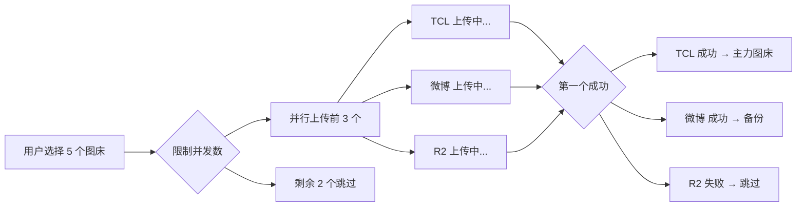
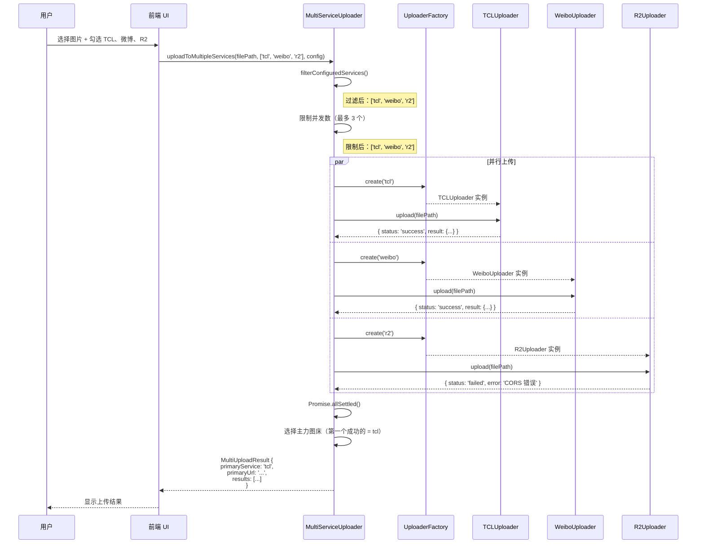

# MultiServiceUploader 多图床编排器详解

## 学习目标

通过本节学习，你将能够：
- ✅ 理解多图床并行上传的核心逻辑
- ✅ 掌握并发控制（最多 3 个并行）的实现
- ✅ 了解主力图床的选择策略
- ✅ 学会错误处理和失败降级机制
- ✅ 理解如何编排多个上传器协同工作

## 前置知识

- 熟悉 TypeScript 的 async/await 和 Promise
- 理解 IUploader 接口和 BaseUploader 抽象类
- 理解 UploaderFactory 工厂模式

---

## MultiServiceUploader 是什么？

### 问题：为什么需要 MultiServiceUploader？

假设你有 5 个图床（微博、R2、TCL、京东、牛客），你希望：
1. **同时上传到多个图床** - 提供冗余备份
2. **并行上传** - 而不是一个一个串行上传（太慢）
3. **限制并发数** - 不能同时上传太多（会失败）
4. **选择主力图床** - 第一个成功的作为主力链接
5. **优雅处理失败** - 某个图床失败不影响其他图床

**如果没有 MultiServiceUploader**，你需要手动处理：
```typescript
// ❌ 手动管理多个上传器（复杂且易出错）
const weiboUploader = UploaderFactory.create('weibo');
const r2Uploader = UploaderFactory.create('r2');
const tclUploader = UploaderFactory.create('tcl');

const weiboPromise = weiboUploader.upload(filePath, {...});
const r2Promise = r2Uploader.upload(filePath, {...});
const tclPromise = tclUploader.upload(filePath, {...});

// 等待所有完成
const [weiboResult, r2Result, tclResult] = await Promise.all([
  weiboPromise,
  r2Promise,
  tclPromise
]);

// 手动选择主力图床...
// 手动处理失败...
// 太复杂了！
```

---

### 解决方案：MultiServiceUploader

```typescript
// ✅ 使用 MultiServiceUploader（简洁明了）
const multiUploader = new MultiServiceUploader();

const result = await multiUploader.uploadToMultipleServices(
  filePath,
  ['weibo', 'r2', 'tcl'],  // 启用的图床列表
  config,                   // 用户配置
  (serviceId, percent) => {  // 进度回调
    console.log(`${serviceId}: ${percent}%`);
  }
);

// 自动选择主力图床
console.log(`主力图床: ${result.primaryService}`);
console.log(`主力链接: ${result.primaryUrl}`);

// 查看所有结果
result.results.forEach(r => {
  console.log(`${r.serviceId}: ${r.status}`);
});
```

---

## 核心特性

### 1. 并行上传（最多 3 个并发）



---

### 2. 主力图床自动选择

**规则**：第一个上传成功的图床成为主力图床

```
┌─ TCL 上传（3秒）──────────────┐ ← 第一个成功！主力图床
├─ 微博 上传（5秒）────────────────────┤ → 备份
└─ R2 上传（失败）──────X
```

**主力图床的作用**：
- 用户复制链接时，默认复制主力图床的链接
- 历史记录中标记为"主力"
- 其他图床作为"备份"

---

### 3. 优雅的错误处理

**场景 1：部分图床失败，但至少一个成功**
```
TCL: ✓ 成功
微博: ✓ 成功
R2: ✗ 失败（网络错误）

结果：上传成功，主力图床 = TCL
```

**场景 2：所有图床失败**
```
TCL: ✗ 失败（网络超时）
微博: ✗ 失败（Cookie 无效）
R2: ✗ 失败（配置错误）

结果：抛出错误，显示所有失败详情
```

---

## 完整源码解析（314 行）

### 文件位置

[src/core/MultiServiceUploader.ts](../../src/core/MultiServiceUploader.ts)

---

### 第 8-25 行：MultiUploadResult 类型定义

```typescript
/**
 * 多图床上传结果
 */
export interface MultiUploadResult {
  /** 主力图床（第一个成功的） */
  primaryService: ServiceType;

  /** 所有图床的上传结果 */
  results: Array<{
    serviceId: ServiceType;
    result?: UploadResult;
    status: 'success' | 'failed';
    error?: string;
  }>;

  /** 主力图床的 URL */
  primaryUrl: string;
}
```

**结构说明**：

**示例返回值**：
```typescript
{
  primaryService: 'tcl',
  primaryUrl: 'https://p9-tcl.byteimg.com/...',
  results: [
    {
      serviceId: 'tcl',
      status: 'success',
      result: { serviceId: 'tcl', url: '...', fileKey: '...', size: 123456 }
    },
    {
      serviceId: 'weibo',
      status: 'success',
      result: { serviceId: 'weibo', url: '...', fileKey: '...', size: 123456 }
    },
    {
      serviceId: 'r2',
      status: 'failed',
      error: 'CORS 错误'
    }
  ]
}
```

---

### 第 31-33 行：类定义和并发限制

```typescript
export class MultiServiceUploader {
  /** 最大并发上传数（同时上传的图床数量） */
  private readonly MAX_CONCURRENT_UPLOADS = 3;
```

**为什么限制为 3 个？**
1. **避免过多并发** - 太多并发请求可能导致部分失败
2. **浏览器限制** - 浏览器对同一域名的并发请求有限制
3. **用户体验** - 3 个已经足够提供冗余

---

### 第 44-49 行：uploadToMultipleServices() 方法签名

```typescript
async uploadToMultipleServices(
  filePath: string,
  enabledServices: ServiceType[],
  config: UserConfig,
  onProgress?: (serviceId: ServiceType, percent: number) => void
): Promise<MultiUploadResult> {
```

**参数说明**：
- `filePath` - 文件路径（如 `C:\Users\...\image.jpg`）
- `enabledServices` - 用户启用的图床列表（如 `['tcl', 'weibo', 'r2']`）
- `config` - 用户配置（包含所有图床的配置信息）
- `onProgress` - 进度回调（每个图床独立的进度）

**onProgress 回调示例**：
```typescript
onProgress: (serviceId, percent) => {
  console.log(`${serviceId}: ${percent}%`);
  // 输出：
  // tcl: 25%
  // weibo: 10%
  // tcl: 50%
  // tcl: 100%
  // weibo: 50%
  // weibo: 100%
}
```

---

### 第 52-60 行：步骤 1 - 过滤已配置的图床

```typescript
  // 确保 config.services 存在（兼容旧版本配置）
  if (!config.services) {
    console.warn('[MultiUploader] 配置中缺少 services 字段，使用默认值');
    config.services = {};
  }

  // 1. 过滤出已配置的图床
  const validServices = this.filterConfiguredServices(enabledServices, config);
```

**为什么需要过滤？**

用户可能勾选了"微博图床"，但没有配置 Cookie：
```
用户勾选：['tcl', 'weibo', 'r2']
实际配置：
  - tcl: 无需配置（✓ 可用）
  - weibo: Cookie 为空（✗ 跳过）
  - r2: 未配置（✗ 跳过）

过滤后：['tcl']
```

**filterConfiguredServices() 方法详解**（稍后讲解）

---

### 第 62-76 行：检查是否有可用的图床

```typescript
  // 检查是否有启用的服务
  if (enabledServices.length === 0) {
    throw new Error('没有启用任何图床服务，请在上传界面选择至少一个图床');
  }

  // 检查是否有已配置的服务
  if (validServices.length === 0) {
    const unconfiguredList = enabledServices
      .filter(svc => !validServices.includes(svc))
      .join(', ');

    throw new Error(
      `已启用的图床尚未配置：${unconfiguredList}\n` +
      `请前往设置页面完成配置`
    );
  }
```

**错误提示设计**：

**场景 1：用户没有勾选任何图床**
```
Error: 没有启用任何图床服务，请在上传界面选择至少一个图床
```

**场景 2：用户勾选了图床，但都未配置**
```
Error: 已启用的图床尚未配置：weibo, r2, nowcoder
请前往设置页面完成配置
```

---

### 第 78-85 行：步骤 2 - 限制并发数

```typescript
  // 2. 限制并发上传（最多3个图床同时上传）
  const limitedServices = validServices.slice(0, this.MAX_CONCURRENT_UPLOADS);
  if (validServices.length > this.MAX_CONCURRENT_UPLOADS) {
    console.warn(
      `[MultiUploader] 已选择 ${validServices.length} 个图床，` +
      `但只会并行上传前 ${this.MAX_CONCURRENT_UPLOADS} 个`
    );
  }
```

**示例**：
```
用户启用：['tcl', 'jd', 'weibo', 'r2', 'nowcoder']  (5 个)
限制后：['tcl', 'jd', 'weibo']  (前 3 个)

控制台警告：
[MultiUploader] 已选择 5 个图床，但只会并行上传前 3 个
```

---

### 第 87-129 行：步骤 3 - 并行上传核心逻辑

```typescript
  // 3. 并行上传到所有图床
  const uploadPromises = limitedServices.map(async (serviceId) => {
    try {
      // 【3.1】创建上传器实例
      const uploader = UploaderFactory.create(serviceId);
      const serviceConfig = config.services[serviceId];

      // 【3.2】验证配置
      const validation = await uploader.validateConfig(serviceConfig);
      if (!validation.valid) {
        throw new Error(`配置验证失败: ${validation.errors?.join(', ')}`);
      }

      // 【3.3】上传文件
      const result = await uploader.upload(
        filePath,
        { config: serviceConfig },
        onProgress ? (percent) => onProgress(serviceId, percent) : undefined
      );

      console.log(`[MultiUploader] ${serviceId} 上传成功`);
      return {
        serviceId,
        result,
        status: 'success' as const
      };
    } catch (error) {
      // 【3.4】捕获错误，不抛出（避免影响其他图床）
      let errorMsg = '未知错误';

      if (error instanceof Error) {
        errorMsg = error.message;
      } else if (typeof error === 'string') {
        errorMsg = error;
      }

      console.error(`[MultiUploader] ${serviceId} 上传失败:`, error);
      return {
        serviceId,
        status: 'failed' as const,
        error: errorMsg
      };
    }
  });
```

**关键设计**：

1. **使用 map() 创建 Promise 数组**
   ```typescript
   const uploadPromises = limitedServices.map(async (serviceId) => { /*...*/ });
   // uploadPromises = [Promise, Promise, Promise]
   ```

2. **每个图床独立的 try-catch**
   - 某个图床失败不影响其他图床
   - 失败返回 `{ serviceId, status: 'failed', error: '...' }`
   - 成功返回 `{ serviceId, status: 'success', result: {...} }`

3. **进度回调的处理**
   ```typescript
   onProgress ? (percent) => onProgress(serviceId, percent) : undefined
   ```
   - 将通用的进度回调转换为带 serviceId 的回调
   - 前端可以区分是哪个图床的进度

---

### 第 131-145 行：等待所有上传完成

```typescript
  const results = await Promise.allSettled(uploadPromises);

  // 4. 提取结果（已在 Promise 内部包含 serviceId，简化映射逻辑）
  const uploadResults = results.map((r) => {
    if (r.status === 'fulfilled') {
      return r.value;
    } else {
      // rejected 的情况（理论上不应该发生，因为内部已 catch）
      return {
        serviceId: 'unknown' as ServiceType,
        status: 'failed' as const,
        error: r.reason?.message || '未知错误'
      };
    }
  });
```

**为什么使用 Promise.allSettled 而非 Promise.all？**

| 方法 | 行为 | 适用场景 |
|------|------|----------|
| `Promise.all()` | 任何一个 Promise reject，立即抛出错误 | 所有操作必须成功 |
| `Promise.allSettled()` | 等待所有 Promise 完成（无论成功或失败） | 允许部分失败 ✅ |

**Promise.allSettled() 返回格式**：
```typescript
[
  { status: 'fulfilled', value: { serviceId: 'tcl', status: 'success', result: {...} } },
  { status: 'fulfilled', value: { serviceId: 'weibo', status: 'success', result: {...} } },
  { status: 'fulfilled', value: { serviceId: 'r2', status: 'failed', error: '...' } }
]
```

---

### 第 147-172 行：步骤 5 - 确定主力图床并返回结果

```typescript
  // 5. 确定主力图床（第一个成功的）
  const primaryResult = uploadResults.find(r => r.status === 'success');

  if (!primaryResult || !primaryResult.result) {
    // 收集所有失败详情
    const failureDetails = uploadResults
      .filter(r => r.status === 'failed')
      .map(r => `  - ${r.serviceId}: ${r.error || '未知错误'}`)
      .join('\n');

    throw new Error(
      `所有图床上传均失败：\n${failureDetails}\n\n请检查网络连接和服务配置`
    );
  }

  console.log('[MultiUploader] 主力图床:', primaryResult.serviceId);
  console.log('[MultiUploader] 上传结果:', {
    成功: uploadResults.filter(r => r.status === 'success').length,
    失败: uploadResults.filter(r => r.status === 'failed').length
  });

  return {
    primaryService: primaryResult.serviceId,
    results: uploadResults,
    primaryUrl: primaryResult.result.url
  };
```

**主力图床选择逻辑**：
```typescript
const primaryResult = uploadResults.find(r => r.status === 'success');
```
- 第一个成功的图床（数组顺序）

**示例**：
```
上传顺序：TCL → 微博 → R2
TCL 完成：3秒（成功）← 主力图床
微博 完成：5秒（成功）← 备份
R2 完成：失败

主力图床 = TCL
```

**所有图床失败的错误提示**：
```
所有图床上传均失败：
  - tcl: 网络超时
  - weibo: Cookie 无效
  - r2: CORS 错误

请检查网络连接和服务配置
```

---

### 第 175-213 行：retryUpload() - 单图床重试

```typescript
  /**
   * 单个图床重试上传
   */
  async retryUpload(
    filePath: string,
    serviceId: ServiceType,
    config: UserConfig,
    onProgress?: (percent: number) => void
  ): Promise<UploadResult> {
    console.log(`[MultiUploader] 重试上传到 ${serviceId}`);

    // 确保 config.services 存在
    if (!config.services) {
      console.warn('[MultiUploader] 配置中缺少 services 字段，使用默认值');
      config.services = {};
    }

    const uploader = UploaderFactory.create(serviceId);
    const serviceConfig = config.services[serviceId];

    // 验证配置
    const validation = await uploader.validateConfig(serviceConfig);
    if (!validation.valid) {
      throw new Error(`配置验证失败: ${validation.errors?.join(', ')}`);
    }

    // 上传
    return await uploader.upload(
      filePath,
      { config: serviceConfig },
      onProgress
    );
  }
```

**使用场景**：
- 用户看到 R2 上传失败
- 点击"重试"按钮
- 调用 `retryUpload('r2', ...)`

---

### 第 215-312 行：filterConfiguredServices() - 过滤已配置图床

这是一个非常重要的方法，用于判断哪些图床已经配置完成。

```typescript
  private filterConfiguredServices(
    enabledServices: ServiceType[],
    config: UserConfig
  ): ServiceType[] {
    return enabledServices.filter(serviceId => {
      const serviceConfig = config.services[serviceId];

      // 【规则 1】TCL 和京东图床无需配置，直接返回 true
      if (serviceId === 'tcl' || serviceId === 'jd') {
        return true;
      }

      // 【规则 2】其他图床检查是否已配置
      if (!serviceConfig) {
        console.warn(`[MultiUploader] ${serviceId} 未配置，跳过`);
        return false;
      }

      // 【规则 3】检查各图床的必填字段
      if (serviceId === 'weibo') {
        const weiboConfig = serviceConfig as any;
        if (!weiboConfig.cookie || weiboConfig.cookie.trim().length === 0) {
          console.warn(`[MultiUploader] ${serviceId} Cookie 未配置，跳过`);
          return false;
        }
        return true;
      }

      // ... 类似的检查 nowcoder、zhihu、nami、r2

      if (serviceId === 'r2') {
        const r2Config = serviceConfig as any;
        if (
          !r2Config.accountId ||
          !r2Config.accessKeyId ||
          !r2Config.secretAccessKey ||
          !r2Config.bucketName ||
          !r2Config.publicDomain
        ) {
          console.warn(`[MultiUploader] ${serviceId} 配置不完整，跳过`);
          return false;
        }
        return true;
      }

      // 【规则 4】对于其他图床，检查 enabled 字段
      if (serviceConfig.enabled === false) {
        console.warn(`[MultiUploader] ${serviceId} 未启用，跳过`);
        return false;
      }

      return true;
    });
  }
```

**过滤规则总结**：

| 图床 | 检查逻辑 |
|------|----------|
| **TCL** | 无需配置，直接可用 ✓ |
| **京东** | 无需配置，直接可用 ✓ |
| **七鱼** | Token 自动获取，直接可用 ✓ |
| **微博** | 检查 `cookie` 字段是否非空 |
| **牛客** | 检查 `cookie` 字段是否非空 |
| **知乎** | 检查 `cookie` 字段是否非空 |
| **纳米** | 检查 `cookie` 字段是否非空 |
| **R2** | 检查 `accountId`, `accessKeyId`, `secretAccessKey`, `bucketName`, `publicDomain` 是否都存在 |

---

## 完整流程图



---

## 实战练习

### 练习 1：测试并行上传

**任务**：在 DevTools Console 中测试并行上传到 TCL 和京东

**代码**：
```typescript
const multiUploader = new MultiServiceUploader();

const result = await multiUploader.uploadToMultipleServices(
  'C:\\Users\\...\\image.jpg',
  ['tcl', 'jd'],  // 两个零配置图床
  userConfig,
  (serviceId, percent) => {
    console.log(`${serviceId}: ${percent}%`);
  }
);

console.log('主力图床:', result.primaryService);
console.log('所有结果:', result.results);
```

**预期输出**：
```
tcl: 50%
jd: 25%
tcl: 100%
jd: 75%
jd: 100%
[MultiUploader] tcl 上传成功
[MultiUploader] jd 上传成功
主力图床: tcl
```

---

### 练习 2：模拟部分失败场景

**任务**：上传到 TCL、微博（未配置）、R2（未配置）

**代码**：
```typescript
const result = await multiUploader.uploadToMultipleServices(
  'C:\\Users\\...\\image.jpg',
  ['tcl', 'weibo', 'r2'],
  {
    services: {
      tcl: {},          // TCL 无需配置
      weibo: { cookie: '' },  // 微博未配置（Cookie 为空）
      r2: {}            // R2 未配置
    }
  }
);
```

**预期行为**：
```
[MultiUploader] weibo Cookie 未配置，跳过
[MultiUploader] r2 配置不完整，跳过
[MultiUploader] 开始并行上传到: ['tcl']
[MultiUploader] tcl 上传成功
主力图床: tcl
```

---

### 练习 3：观察并发限制

**任务**：尝试上传到 5 个图床，观察只有前 3 个并行

**代码**：
```typescript
const result = await multiUploader.uploadToMultipleServices(
  'C:\\Users\\...\\image.jpg',
  ['tcl', 'jd', 'weibo', 'r2', 'nowcoder'],  // 5 个图床
  userConfig
);
```

**预期警告**：
```
[MultiUploader] 已选择 5 个图床，但只会并行上传前 3 个
[MultiUploader] 开始并行上传到: ['tcl', 'jd', 'weibo']
```

---

## 下一步学习

### 已完成
- ✅ 理解多图床并行上传的核心逻辑
- ✅ 掌握并发控制和主力图床选择
- ✅ 了解错误处理和失败降级机制
- ✅ 学会编排多个上传器协同工作

### 接下来
1. [**第 4 章：Rust 后端深入**](../04-backend-deep-dive/01-tauri-main.md)
   - Tauri 主程序详解
   - Rust 命令系统
   - HTTP 客户端管理

2. [**第 5 章：前后端通信**](../05-communication/01-tauri-ipc.md)
   - Tauri IPC 机制
   - invoke 调用详解
   - 事件监听系统

---

## 总结

通过本节，你已经：

✅ **掌握了多图床并行上传** - 使用 Promise.allSettled() 并行上传
✅ **理解了并发控制** - 限制最多 3 个图床同时上传
✅ **学会了主力图床选择** - 第一个成功的作为主力
✅ **掌握了错误处理** - 部分失败不影响整体，所有失败才抛出错误

**关键要点**：
1. **编排器模式** - 协调多个上传器协同工作
2. **Promise.allSettled()** - 等待所有 Promise 完成（允许部分失败）
3. **并发限制** - 最多 3 个并行上传
4. **优雅降级** - 部分失败不影响其他图床
5. **主力图床自动选择** - 第一个成功的作为主力

**设计亮点**：
- 每个图床独立的 try-catch（失败隔离）
- 友好的错误提示（收集所有失败详情）
- 配置自动过滤（未配置的图床自动跳过）
- 进度回调带 serviceId（区分不同图床）

恭喜你完成了第 3 章的核心文档！这些知识是理解 WeiboDR-Uploader 前端架构的关键！🎉