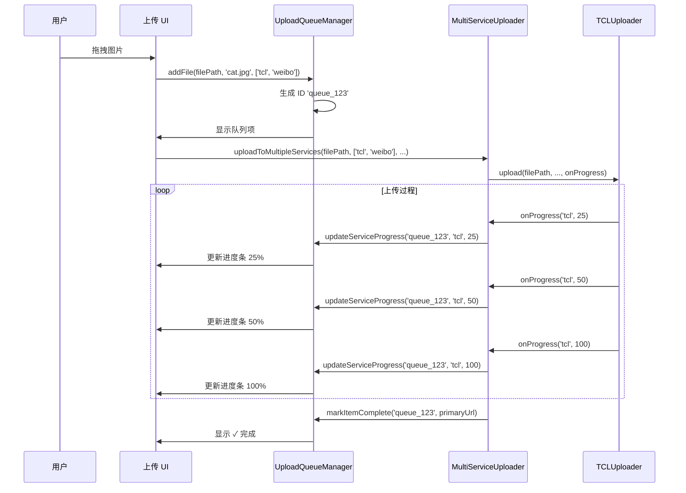

# 上传队列管理

## 学习目标

通过本节学习，你将能够：
- ✅ 理解上传队列的作用和设计
- ✅ 掌握 UploadQueueManager 的完整实现
- ✅ 了解 Vue 3 组件与队列管理器的集成
- ✅ 学会实时更新上传进度的机制
- ✅ 理解队列项的状态管理

## 前置知识

- 熟悉 Vue 3 的基本概念
- 了解响应式数据（ref、reactive）
- 理解组件挂载和生命周期

---

## 什么是上传队列？

### 问题：如何管理多个文件的上传？

**场景**：用户拖拽 5 张图片到上传区域

**需要解决的问题**：
1. 如何显示 5 张图片的上传进度？
2. 每张图片上传到 3 个图床，如何显示每个图床的进度？
3. 某张图片失败了，如何重试？
4. 如何清空队列？

---

### 解决方案：上传队列管理器

```
┌─────────────────────────────────────┐
│      UploadQueueManager             │
│  ┌────────────────────────────────┐ │
│  │ 队列项 1: image1.jpg           │ │
│  │  ├─ TCL:   [██████░░] 60%      │ │
│  │  ├─ 微博:  [████░░░░] 40%      │ │
│  │  └─ R2:    [等待中...]         │ │
│  ├────────────────────────────────┤ │
│  │ 队列项 2: image2.jpg           │ │
│  │  ├─ TCL:   [██████████] 100%   │ │
│  │  ├─ 微博:  [██████████] 100%   │ │
│  │  └─ R2:    [失败]              │ │
│  └────────────────────────────────┘ │
└─────────────────────────────────────┘
```

---

## 核心数据结构

### 文件位置

[src/uploadQueue.ts](../../src/uploadQueue.ts) (356 行)

---

### 1. QueueItem - 队列项

```typescript
/**
 * 队列项类型定义（新架构 - 支持多图床）
 */
export interface QueueItem {
  /** 唯一标识符 */
  id: string;

  /** 文件名 */
  fileName: string;

  /** 文件路径 */
  filePath: string;

  /** 启用的图床列表 */
  enabledServices: ServiceType[];

  /** 各图床独立进度 */
  serviceProgress: Record<ServiceType, ServiceProgress>;

  /** 整体状态 */
  status: 'pending' | 'uploading' | 'success' | 'error';

  /** 错误信息 */
  errorMessage?: string;

  /** 主力图床的 URL */
  primaryUrl?: string;

  /** 缩略图 URL */
  thumbUrl?: string;

  // 向后兼容字段（旧 UI 使用）
  uploadToR2?: boolean;
  weiboProgress?: number;
  r2Progress?: number;
  weiboStatus?: string;
  r2Status?: string;
  weiboPid?: string;
  weiboLink?: string;
  baiduLink?: string;
  r2Link?: string;
}
```

---

### 2. ServiceProgress - 图床进度

```typescript
/**
 * 单个图床服务的进度状态
 */
export interface ServiceProgress {
  /** 图床服务 ID */
  serviceId: ServiceType;

  /** 进度百分比 (0-100) */
  progress: number;

  /** 状态文本 */
  status: string;  // '等待中...' | '50%' | '✓ 完成' | '✗ 失败'

  /** 上传成功后的链接 */
  link?: string;

  /** 错误信息 */
  error?: string;
}
```

---

### 示例数据

```typescript
const queueItem: QueueItem = {
  id: 'queue-1234567890-abc123',
  fileName: 'cat.jpg',
  filePath: 'C:\\Users\\...\\cat.jpg',
  enabledServices: ['tcl', 'weibo', 'r2'],
  serviceProgress: {
    tcl: {
      serviceId: 'tcl',
      progress: 100,
      status: '✓ 完成',
      link: 'https://p9-tcl.byteimg.com/...'
    },
    weibo: {
      serviceId: 'weibo',
      progress: 60,
      status: '60%'
    },
    r2: {
      serviceId: 'r2',
      progress: 0,
      status: '等待中...'
    }
  },
  status: 'uploading',
  primaryUrl: 'https://p9-tcl.byteimg.com/...'  // TCL 是主力
};
```

---

## Upload Queue Manager 完整解析

### 类定义

```typescript
/**
 * 上传队列管理器类
 */
export class UploadQueueManager {
  /** Vue 应用实例 */
  private app: App;

  /** Vue 组件实例 */
  private vm: InstanceType<typeof UploadQueueVue> | null = null;

  constructor(queueListElementId: string) {
    const el = document.getElementById(queueListElementId);
    if (!el) {
      console.error(`[UploadQueue] 队列列表元素不存在: ${queueListElementId}`);
      throw new Error(`Element #${queueListElementId} not found`);
    }

    // 挂载 Vue 应用
    this.app = createApp(UploadQueueVue);
    this.vm = this.app.mount(el);
  }

  // ... 方法实现
}
```

---

### 核心方法 1：addFile() - 添加文件到队列

```typescript
/**
 * 添加文件到队列（新架构 - 多图床支持）
 */
addFile(filePath: string, fileName: string, enabledServices: ServiceType[]): string {
  // 【步骤 1】生成唯一 ID
  const id = `queue-${Date.now()}-${Math.random().toString(36).substr(2, 9)}`;

  // 【步骤 2】初始化每个图床的进度状态
  const serviceProgress: Record<string, ServiceProgress> = {};
  enabledServices.forEach(serviceId => {
    serviceProgress[serviceId] = {
      serviceId,
      progress: 0,
      status: '等待中...'
    };
  });

  // 【步骤 3】创建队列项
  const item: QueueItem = {
    id,
    fileName,
    filePath,
    enabledServices,
    serviceProgress: serviceProgress as Record<ServiceType, ServiceProgress>,
    status: 'pending',
    // 向后兼容
    uploadToR2: enabledServices.includes('r2'),
    weiboProgress: 0,
    r2Progress: 0,
    weiboStatus: '等待中...',
    r2Status: enabledServices.includes('r2') ? '等待中...' : '已跳过',
  };

  // 【步骤 4】添加到 Vue 组件
  this.vm.addFile(item);

  console.log(`[UploadQueue] 添加文件到队列: ${fileName} (图床: ${enabledServices.join(', ')})`);
  return id;
}
```

**使用示例**：
```typescript
const queueManager = new UploadQueueManager('queue-list');

// 用户拖拽 3 张图片
const id1 = queueManager.addFile('C:\\cat.jpg', 'cat.jpg', ['tcl', 'weibo']);
const id2 = queueManager.addFile('C:\\dog.jpg', 'dog.jpg', ['tcl', 'r2']);
const id3 = queueManager.addFile('C:\\bird.jpg', 'bird.jpg', ['tcl', 'weibo', 'r2']);
```

---

### 核心方法 2：updateServiceProgress() - 更新图床进度

```typescript
/**
 * 更新某个图床的上传进度
 */
updateServiceProgress(itemId: string, serviceId: ServiceType, percent: number): void {
  // 【步骤 1】查找队列项
  const item = this.vm.getItem(itemId);
  if (!item) {
    console.warn(`[UploadQueue] 找不到队列项: ${itemId}`);
    return;
  }

  // 【步骤 2】限制进度在 0-100 范围内
  const safePercent = Math.max(0, Math.min(100, percent));

  // 【步骤 3】构建更新数据
  const updates: Partial<QueueItem> = {
    status: 'uploading',
    serviceProgress: {
      ...item.serviceProgress,
      [serviceId]: {
        ...item.serviceProgress[serviceId],
        progress: safePercent,
        status: `${safePercent}%`
      }
    }
  };

  // 【步骤 4】向后兼容（更新旧字段）
  if (serviceId === 'weibo') {
    updates.weiboProgress = safePercent;
    updates.weiboStatus = `${safePercent}%`;
  } else if (serviceId === 'r2') {
    updates.r2Progress = safePercent;
    updates.r2Status = `${safePercent}%`;
  }

  // 【步骤 5】更新 Vue 组件
  this.vm.updateItem(itemId, updates);
}
```

**调用示例**：
```typescript
// 上传过程中，不断更新进度
queueManager.updateServiceProgress(itemId, 'tcl', 25);
queueManager.updateServiceProgress(itemId, 'tcl', 50);
queueManager.updateServiceProgress(itemId, 'tcl', 75);
queueManager.updateServiceProgress(itemId, 'tcl', 100);
```

---

### 核心方法 3：markItemComplete() - 标记完成

```typescript
/**
 * 标记队列项上传成功
 */
markItemComplete(itemId: string, primaryUrl: string): void {
  const item = this.vm.getItem(itemId);
  if (!item) {
    console.warn(`[UploadQueue] 找不到队列项: ${itemId}`);
    return;
  }

  // 【步骤 1】更新成功的图床状态
  const serviceProgress = { ...item.serviceProgress };
  item.enabledServices.forEach((serviceId: ServiceType) => {
    if (serviceProgress[serviceId]?.progress === 100) {
      serviceProgress[serviceId] = {
        ...serviceProgress[serviceId],
        status: '✓ 完成'
      };
    }
  });

  // 【步骤 2】设置缩略图 URL（使用主力图床的 URL）
  const thumbUrl = primaryUrl;

  // 【步骤 3】根据启用的服务设置对应的链接字段
  const linkFields: any = {
    thumbUrl,
    primaryUrl
  };

  item.enabledServices.forEach((serviceId: ServiceType) => {
    const serviceLink = serviceProgress[serviceId]?.link;
    if (serviceLink) {
      if (serviceId === 'weibo') {
        linkFields.weiboLink = serviceLink;
      } else if (serviceId === 'r2') {
        linkFields.r2Link = serviceLink;
      } else if (serviceId === 'tcl') {
        linkFields.tclLink = serviceLink;
      }
    }
  });

  // 【步骤 4】更新状态为成功
  this.vm.updateItem(itemId, {
    status: 'success',
    serviceProgress,
    ...linkFields,
    weiboStatus: item.enabledServices.includes('weibo') ? '✓ 完成' : '已跳过',
    r2Status: item.enabledServices.includes('r2') ? '✓ 完成' : '已跳过'
  });

  console.log(`[UploadQueue] ${item.fileName} 上传成功`);
}
```

---

### 核心方法 4：markItemFailed() - 标记失败

```typescript
/**
 * 标记队列项上传失败
 */
markItemFailed(itemId: string, errorMessage: string): void {
  const item = this.vm.getItem(itemId);
  if (!item) {
    console.warn(`[UploadQueue] 找不到队列项: ${itemId}`);
    return;
  }

  this.vm.updateItem(itemId, {
    status: 'error',
    errorMessage,
    weiboStatus: '✗ 失败',  // 向后兼容
  });

  console.error(`[UploadQueue] ${item.fileName} 上传失败: ${errorMessage}`);
}
```

---

## 与主上传逻辑的集成

### 完整流程图



---

### 代码示例：主上传逻辑

```typescript
// main.ts（简化版）

async function handleFileUpload(file: File) {
  const filePath = file.path;
  const fileName = file.name;
  const enabledServices = userSelectedServices;  // ['tcl', 'weibo', 'r2']

  // 【步骤 1】添加到队列
  const queueId = queueManager.addFile(filePath, fileName, enabledServices);

  try {
    // 【步骤 2】创建进度回调
    const onProgress = (serviceId: ServiceType, percent: number) => {
      queueManager.updateServiceProgress(queueId, serviceId, percent);
    };

    // 【步骤 3】并行上传到多个图床
    const result = await multiUploader.uploadToMultipleServices(
      filePath,
      enabledServices,
      userConfig,
      onProgress
    );

    // 【步骤 4】标记完成
    queueManager.markItemComplete(queueId, result.primaryUrl);

  } catch (error) {
    // 【步骤 5】标记失败
    queueManager.markItemFailed(queueId, error.message);
  }
}
```

---

## Vue 组件集成

### UploadQueue.vue（简化版）

```vue
<template>
  <div class="upload-queue">
    <div v-for="item in items" :key="item.id" class="queue-item">
      <div class="file-name">{{ item.fileName }}</div>

      <!-- 各图床进度 -->
      <div v-for="serviceId in item.enabledServices" :key="serviceId">
        <span>{{ getServiceName(serviceId) }}</span>
        <div class="progress-bar">
          <div
            class="progress-fill"
            :style="{ width: item.serviceProgress[serviceId].progress + '%' }"
          ></div>
        </div>
        <span>{{ item.serviceProgress[serviceId].status }}</span>
      </div>

      <!-- 错误信息 -->
      <div v-if="item.status === 'error'" class="error">
        {{ item.errorMessage }}
      </div>

      <!-- 操作按钮 -->
      <button v-if="item.status === 'error'" @click="retryUpload(item.id)">
        重试
      </button>
    </div>
  </div>
</template>

<script setup lang="ts">
import { ref } from 'vue';

const items = ref<QueueItem[]>([]);

function addFile(item: QueueItem) {
  items.value.push(item);
}

function updateItem(itemId: string, updates: Partial<QueueItem>) {
  const index = items.value.findIndex(item => item.id === itemId);
  if (index !== -1) {
    items.value[index] = { ...items.value[index], ...updates };
  }
}

function getItem(itemId: string): QueueItem | undefined {
  return items.value.find(item => item.id === itemId);
}

function clear() {
  items.value = [];
}

function count() {
  return items.value.length;
}

// 暴露方法给外部调用
defineExpose({
  addFile,
  updateItem,
  getItem,
  clear,
  count
});
</script>
```

---

## 其他实用方法

### resetItemForRetry() - 重置队列项（用于重试）

```typescript
/**
 * 重置队列项状态（用于重试）
 */
resetItemForRetry(itemId: string): void {
  const item = this.vm.getItem(itemId);
  if (!item) {
    console.warn(`[UploadQueue] 重试失败: 找不到队列项 ${itemId}`);
    return;
  }

  // 重置状态
  this.vm.updateItem(itemId, {
    status: 'pending',
    weiboProgress: 0,
    r2Progress: 0,
    weiboStatus: '等待中...',
    r2Status: item.uploadToR2 ? '等待中...' : '已跳过',
    weiboLink: undefined,
    r2Link: undefined,
    baiduLink: undefined,
    weiboPid: undefined,
    errorMessage: undefined,
  });
}
```

**使用场景**：
```typescript
// 用户点击"重试"按钮
async function handleRetry(itemId: string) {
  // 1. 重置队列项
  queueManager.resetItemForRetry(itemId);

  // 2. 获取文件路径
  const item = queueManager.getItem(itemId);
  if (!item) return;

  // 3. 重新上传
  await handleFileUpload(item.filePath);
}
```

---

### clearQueue() - 清空队列

```typescript
/**
 * 清空队列
 */
clearQueue(): void {
  this.vm.clear();
  console.log('[UploadQueue] 队列已清空');
}
```

---

### getQueueSize() - 获取队列大小

```typescript
/**
 * 获取队列大小
 */
getQueueSize(): number {
  return this.vm.count();
}
```

---

## 实战练习

### 练习 1：添加多个文件到队列

**任务**：模拟用户拖拽 3 张图片

```typescript
const queueManager = new UploadQueueManager('queue-list');

// 添加 3 张图片
const id1 = queueManager.addFile('C:\\cat.jpg', 'cat.jpg', ['tcl', 'weibo']);
const id2 = queueManager.addFile('C:\\dog.jpg', 'dog.jpg', ['tcl']);
const id3 = queueManager.addFile('C:\\bird.jpg', 'bird.jpg', ['tcl', 'weibo', 'r2']);

console.log('队列大小:', queueManager.getQueueSize());  // 3
```

---

### 练习 2：模拟上传进度

**任务**：模拟 TCL 图床的上传进度

```typescript
async function simulateUpload(itemId: string) {
  // 模拟进度：0% → 25% → 50% → 75% → 100%
  for (let i = 0; i <= 100; i += 25) {
    queueManager.updateServiceProgress(itemId, 'tcl', i);
    await new Promise(resolve => setTimeout(resolve, 500));  // 延迟 500ms
  }

  // 标记完成
  queueManager.markItemComplete(itemId, 'https://p9-tcl.byteimg.com/...');
}

simulateUpload(id1);
```

---

### 练习 3：处理上传失败

**任务**：模拟上传失败并重试

```typescript
// 标记失败
queueManager.markItemFailed(id1, '网络连接失败');

// 用户点击重试
queueManager.resetItemForRetry(id1);

// 重新上传
await handleFileUpload(filePath);
```

---

## 下一步学习

### 已完成
- ✅ 理解上传队列的作用和设计
- ✅ 掌握 UploadQueueManager 的实现
- ✅ 了解 Vue 组件集成
- ✅ 学会实时更新上传进度

### 接下来
1. [**07-config-management.md**](./07-config-management.md) - 配置管理系统
   - UserConfig 加载和保存
   - sanitizeConfig() 脱敏处理
   - migrateConfig() 配置迁移

2. [**08-crypto-storage.md**](./08-crypto-storage.md) - 加密存储实现
   - AES-GCM 加密原理
   - Web Crypto API 使用
   - 密钥管理

---

## 总结

通过本节，你已经：

✅ **掌握了上传队列管理** - UploadQueueManager 完整实现
✅ **理解了队列项数据结构** - QueueItem 和 ServiceProgress
✅ **学会了Vue组件集成** - 如何将队列管理器与 Vue 组件连接
✅ **了解了进度更新机制** - 实时更新多个图床的上传进度
✅ **掌握了状态管理** - pending → uploading → success/error

**关键要点**：
1. **UploadQueueManager** - 队列管理器，负责添加、更新、完成队列项
2. **QueueItem** - 队列项，包含文件信息和各图床进度
3. **ServiceProgress** - 图床进度，独立跟踪每个图床的状态
4. **Vue 集成** - 使用 Vue 3 实现响应式 UI
5. **实时更新** - onProgress 回调实时更新进度条

上传队列让多文件、多图床的并行上传变得井然有序！📋
