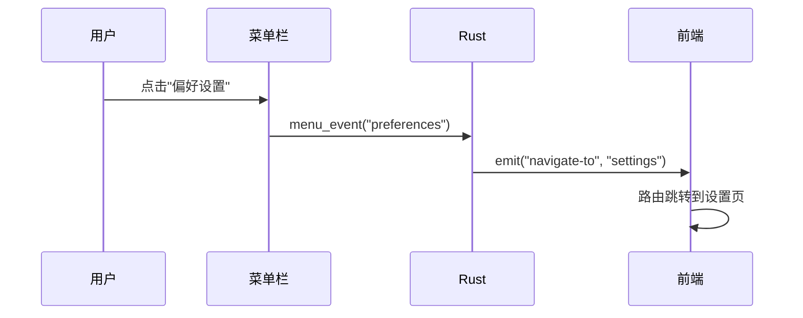
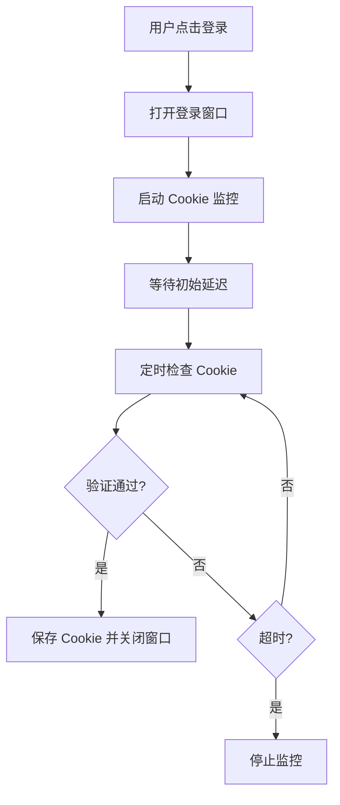
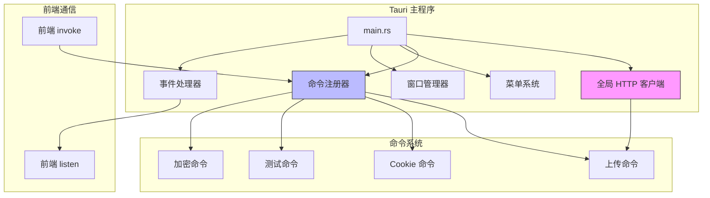

# 4.1 Tauri 主程序详解

## 学习目标

通过本节学习，你将掌握：
- Tauri 应用的入口点和初始化流程
- 全局 HTTP 客户端的单例模式实现
- 命令注册机制（`generate_handler!`）
- 菜单栏和系统托盘设置
- 窗口管理和自适应布局策略
- 事件处理系统（菜单、托盘事件）

## 前置知识

- Rust 基础语法（模块、结构体、函数）
- Tauri 框架概览（见 [0.5 Tauri 概览](../../00-prerequisites/05-tauri-overview.md)）
- HTTP 客户端概念（连接池、超时）

---

## 核心内容

### 文件位置

```
src-tauri/src/main.rs (1377 行)
```

这是 Tauri 应用的入口文件，负责：
1. ✅ 初始化应用
2. ✅ 注册所有 Rust 命令
3. ✅ 配置菜单和托盘
4. ✅ 管理窗口生命周期
5. ✅ 处理用户交互事件

---

## 1. 文件头部和依赖导入

### 1.1 禁用控制台窗口（Windows Release 模式）

```rust
// Prevents additional console window on Windows in release, DO NOT REMOVE!!
#![cfg_attr(
    all(not(debug_assertions), target_os = "windows"),
    windows_subsystem = "windows"
)]
```

**解释**：
- `cfg_attr` 条件编译属性
- `not(debug_assertions)` → Release 模式
- `target_os = "windows"` → Windows 平台
- `windows_subsystem = "windows"` → 不显示黑色控制台窗口

**为什么需要**：
- Debug 模式需要看调试日志 → 保留控制台
- Release 模式给用户使用 → 隐藏控制台（更专业）

---

### 1.2 模块导入

```rust
mod error;
mod commands;

use tauri::{CustomMenuItem, Manager, Menu, MenuItem, Submenu, SystemTray,
            SystemTrayMenu, SystemTrayMenuItem, SystemTrayEvent};
use window_shadows::set_shadow;
use std::time::Duration;
```

**关键模块**：
- `commands` → 所有上传命令（tcl、r2、jd、qiyu 等）
- `tauri::Manager` → 管理窗口和事件
- `window_shadows` → 窗口阴影效果（macOS/Windows）

---

## 2. 全局 HTTP 客户端（单例模式）

### 2.1 定义全局状态

```rust
/// 全局 HTTP 客户端状态
/// 使用单例模式复用 HTTP 客户端，提升性能
pub struct HttpClient(pub reqwest::Client);
```

**设计模式**：**单例模式**（Singleton）

**为什么需要全局 HTTP 客户端**？
- ❌ 每次上传都创建新客户端 → 重复建立 TCP 连接 → 慢
- ✅ 使用全局客户端 → 复用连接池 → 快

---

### 2.2 初始化 HTTP 客户端

```rust
fn main() {
    // 创建全局 HTTP 客户端（带连接池配置）
    let http_client = reqwest::Client::builder()
        .timeout(std::time::Duration::from_secs(60))  // 60秒超时
        .connect_timeout(std::time::Duration::from_secs(10))  // 10秒连接超时
        .pool_idle_timeout(std::time::Duration::from_secs(90))  // 连接池空闲超时
        .pool_max_idle_per_host(10)  // 每个主机最多保持10个空闲连接
        .build()
        .expect("Failed to create HTTP client");
```

**配置解释**：

| 配置项 | 值 | 含义 |
|-------|-----|------|
| `timeout` | 60秒 | 整体请求超时（上传大文件需要更长时间） |
| `connect_timeout` | 10秒 | TCP 连接超时（网络慢时快速失败） |
| `pool_idle_timeout` | 90秒 | 空闲连接保持时间（减少重连） |
| `pool_max_idle_per_host` | 10 | 每个域名最多保持10个连接（并发上传） |

**性能优化**：
```
第一次上传到微博: 建立新连接 (慢)
第二次上传到微博: 复用连接 (快！)
```

---

## 3. 菜单栏配置（原生菜单）

### 3.1 创建菜单项

```rust
// 1. 定义原生菜单栏 (PRD 1.1)
let preferences = CustomMenuItem::new("preferences".to_string(), "偏好设置...")
    .accelerator("CmdOrCtrl+,"); // 快捷键 CmdOrCtrl+,
let quit = CustomMenuItem::new("quit".to_string(), "退出");
```

**跨平台快捷键**：
- `CmdOrCtrl+,` → macOS 用 `Cmd+,`，Windows/Linux 用 `Ctrl+,`

---

### 3.2 平台差异处理

```rust
let file_menu = if cfg!(target_os = "macos") {
    // macOS 使用 "应用" 菜单
    Submenu::new(
        "WeiboDR-Uploader",
        Menu::new()
            .add_item(preferences)
            .add_native_item(MenuItem::Quit)
    )
} else {
    // Windows/Linux 使用 "文件" 菜单
    Submenu::new(
        "文件",
        Menu::new()
            .add_item(preferences)
            .add_item(quit)
    )
};
```

**为什么需要平台差异处理**？
- macOS → 应用名菜单（符合 macOS 规范）
- Windows/Linux → "文件"菜单（符合 Windows 规范）

---

## 4. 命令注册机制

### 4.1 使用 `generate_handler!` 宏

```rust
tauri::Builder::default()
    .manage(HttpClient(http_client))     // 注册全局 HTTP 客户端
    .invoke_handler(tauri::generate_handler![
        save_cookie_from_login,
        start_cookie_monitoring,
        get_request_header_cookie,
        test_r2_connection,
        test_webdav_connection,
        list_r2_objects,
        delete_r2_object,
        commands::upload::upload_file_stream,
        commands::r2::upload_to_r2,
        commands::tcl::upload_to_tcl,
        commands::jd::upload_to_jd,
        commands::nowcoder::upload_to_nowcoder,
        commands::qiyu::upload_to_qiyu,
        commands::qiyu_token::fetch_qiyu_token,
        commands::qiyu_token::check_chrome_installed,
        commands::zhihu::upload_to_zhihu,
        commands::nami::upload_to_nami,
        commands::nami_token::fetch_nami_token,
        commands::nami_token::check_nami_chrome_installed,
        commands::utils::file_exists,
        get_or_create_secure_key
    ])
```

**关键概念**：
1. **`generate_handler!` 宏** → 自动生成命令分发器
2. **`manage()` 方法** → 注册全局状态（HTTP 客户端）
3. **命令命名** → 前端通过字符串调用（如 `invoke('upload_to_tcl')`）

**命令分类**：
- 🍪 Cookie 管理：`save_cookie_from_login`、`start_cookie_monitoring`
- 📤 上传命令：`upload_to_tcl`、`upload_to_r2`、`upload_to_jd` 等
- 🔧 测试命令：`test_r2_connection`、`test_webdav_connection`
- 🔐 加密命令：`get_or_create_secure_key`

---

## 5. 窗口自适应布局策略

### 5.1 最佳适配方案（三档布局）

```rust
.setup(|app| {
    let window = app.get_window("main").unwrap();

    if let Ok(Some(monitor)) = window.current_monitor() {
        let screen_size = monitor.size();
        let sw = screen_size.width;
        let sh = screen_size.height;

        // Tier 1: 4K / 2K 大屏 (宽度大于 1920 或 高度大于 1200)
        if sw > 1920 || sh > 1200 {
            window.set_size(tauri::Size::Physical(tauri::PhysicalSize {
                width: 1600,
                height: 1200,
            }));
            window.center();
        }
        // Tier 2: 标准 1080P (宽度在 1366~1920 之间)
        else if sw >= 1366 && sh >= 900 {
            window.set_size(tauri::Size::Physical(tauri::PhysicalSize {
                width: 1280,
                height: 900,
            }));
            window.center();
        }
        // Tier 3: 小屏幕 (如 MacBook Air 13寸)
        else {
            window.maximize();
        }
    }
```

**布局策略表**：

| 屏幕类型 | 分辨率范围 | 窗口大小 | 策略 |
|---------|-----------|---------|------|
| Tier 1 | > 1920×1200 | 1600×1200 | 豪华体验 |
| Tier 2 | 1366~1920 | 1280×900 | 舒适默认 |
| Tier 3 | < 1366 | 最大化 | 充分利用 |

**为什么需要三档布局**？
- 用户屏幕大小差异大（从 1366×768 到 3840×2160）
- 固定尺寸 → 小屏幕会超出、大屏幕显得小
- 三档布局 → 所有屏幕都有良好体验

---

## 6. 事件处理系统

### 6.1 菜单事件处理

```rust
.on_menu_event(|event| {
    let app = event.window().app_handle();
    let menu_id = event.menu_item_id().to_string();

    match event.menu_item_id() {
        "preferences" => {
            if let Some(main_window) = app.get_window("main") {
                let _ = main_window.emit("navigate-to", "settings");
            }
        }
        "history" => {
            if let Some(main_window) = app.get_window("main") {
                let _ = main_window.emit("navigate-to", "history");
            }
        }
        "quit" => {
            std::process::exit(0);
        }
        _ => {}
    }
})
```

**事件流向**：


**关键方法**：
- `event.menu_item_id()` → 获取菜单项 ID（如 "preferences"）
- `window.emit()` → 发送事件到前端
- `std::process::exit(0)` → 退出应用

---

### 6.2 系统托盘事件处理

```rust
.on_system_tray_event(|app, event| match event {
    SystemTrayEvent::MenuItemClick { id, .. } => {
        match id.as_str() {
            "quit" => {
                std::process::exit(0);
            }
            "open_settings" => {
                if let Some(main_window) = app.get_window("main") {
                    let _ = main_window.emit("navigate-to", "settings");
                }
            }
            "open_history" => {
                if let Some(main_window) = app.get_window("main") {
                    let _ = main_window.emit("navigate-to", "history");
                }
            }
            _ => {}
        }
    }
    _ => {}
})
```

**系统托盘功能**：
- ✅ 最小化到托盘（不退出应用）
- ✅ 快速打开设置/历史
- ✅ 右键菜单退出

---

## 7. Cookie 管理命令（核心功能）

### 7.1 保存 Cookie 命令

```rust
#[tauri::command]
async fn save_cookie_from_login(
    cookie: String,
    service_id: Option<String>,
    required_fields: Option<Vec<String>>,
    any_of_fields: Option<Vec<String>>,
    app: tauri::AppHandle
) -> Result<(), String> {
    // 1. 输入验证
    if cookie.trim().is_empty() {
        return Err("Cookie不能为空".to_string());
    }

    // 2. 验证必要字段
    if !validate_cookie_fields(&cookie, &required_fields, &any_of_fields) {
        return Err("Cookie 缺少必要字段".to_string());
    }

    // 3. 发送事件到主窗口
    if let Some(main_window) = app.get_window("main") {
        main_window.emit("cookie-updated", CookieUpdatedPayload {
            service_id: service.clone(),
            cookie: cookie.clone(),
        })?;

        // 4. 关闭登录窗口
        if let Some(login_window) = app.get_window("login-webview") {
            let _ = login_window.close();
        }
    }

    Ok(())
}
```

**Cookie 验证流程**：
```
输入 Cookie → 验证非空 → 验证字段 → 发送事件 → 关闭登录窗口
```

**验证字段示例**（微博）：
- `required_fields: ["SUB", "SUBP"]` → 必须包含 SUB **且** SUBP
- `any_of_fields: []` → 无 OR 逻辑

---

### 7.2 自动监控 Cookie

```rust
#[tauri::command]
async fn start_cookie_monitoring(
    app: tauri::AppHandle,
    service_id: Option<String>,
    target_domain: Option<String>,
    required_fields: Option<Vec<String>>,
    any_of_fields: Option<Vec<String>>,
    initial_delay_ms: Option<u64>,
    polling_interval_ms: Option<u64>,
) -> Result<(), String> {
    // 在新线程中运行监控
    std::thread::spawn(move || {
        // 初始延迟，等待页面加载完成
        std::thread::sleep(Duration::from_millis(initial_delay));

        while check_count < max_checks {
            // 每隔 polling_interval 检查一次 Cookie
            std::thread::sleep(Duration::from_millis(polling_interval));

            if let Some(login_window) = app_handle.get_window("login-webview") {
                // 提取 Cookie 并验证
                if attempt_cookie_capture_and_save_generic(...) {
                    break; // 成功后退出循环
                }
            }
        }
    });

    Ok(())
}
```

**监控流程**：


**关键参数**：
- `initial_delay_ms: 3000` → 等待3秒后开始检查（避免页面未加载完）
- `polling_interval_ms: 1000` → 每1秒检查一次
- `max_checks: 240` → 最多检查240次（4分钟超时）

---

## 8. 加密密钥管理

### 8.1 获取或创建密钥

```rust
#[tauri::command]
fn get_or_create_secure_key() -> Result<String, String> {
    let entry = Entry::new(SERVICE_NAME, KEY_NAME)
        .map_err(|e| format!("无法访问系统钥匙串: {}", e))?;

    match entry.get_password() {
        Ok(key) => {
            eprintln!("[密钥管理] 从钥匙串读取现有密钥");
            Ok(key)
        },
        Err(_) => {
            // 生成新的 32 字节 (256 位) 随机密钥
            let mut key_bytes = [0u8; 32];
            rand::thread_rng().fill(&mut key_bytes);
            let new_key = general_purpose::STANDARD.encode(key_bytes);

            // 存入系统钥匙串
            entry.set_password(&new_key)
                .map_err(|e| format!("无法保存密钥: {}", e))?;

            Ok(new_key)
        }
    }
}
```

**密钥存储位置**（跨平台）：
- **Windows**: Windows Credential Manager（凭据管理器）
- **macOS**: Keychain（钥匙串访问）
- **Linux**: Secret Service API（GNOME Keyring / KWallet）

**为什么使用系统钥匙串**？
- ❌ 密钥存在代码里 → 不安全
- ❌ 密钥存在配置文件 → 不安全
- ✅ 密钥存在系统钥匙串 → **操作系统级加密保护**

---

## 核心架构图



---

## 实战练习

### 练习 1：添加新的菜单项

**任务**：在"窗口"菜单中添加"关于"菜单项，点击后发送事件到前端。

**提示**：
```rust
let about = CustomMenuItem::new("about".to_string(), "关于")
    .accelerator("CmdOrCtrl+I");

// 在 on_menu_event 中添加处理
"about" => {
    if let Some(main_window) = app.get_window("main") {
        let _ = main_window.emit("navigate-to", "about");
    }
}
```

---

### 练习 2：修改窗口默认大小

**任务**：将 Tier 2 的窗口大小改为 1400×1000。

**步骤**：
1. 找到 Tier 2 的 `set_size` 调用
2. 修改 `width: 1400`, `height: 1000`
3. 重新编译：`npm run tauri dev`

---

## 总结

本节我们深入学习了 Tauri 主程序的实现：

### 关键知识点
1. ✅ **全局 HTTP 客户端**：单例模式 + 连接池配置
2. ✅ **命令注册**：`generate_handler!` 宏自动生成分发器
3. ✅ **窗口自适应**：三档布局适配不同屏幕
4. ✅ **事件系统**：菜单事件 + 托盘事件 + emit 通信
5. ✅ **Cookie 管理**：自动监控 + 字段验证
6. ✅ **密钥管理**：系统钥匙串安全存储

### 设计模式
- **单例模式**：全局 HTTP 客户端
- **观察者模式**：事件监听和发送
- **策略模式**：窗口自适应策略

### 下一步

下一节我们将学习 **Rust 命令系统详解**，深入理解 `#[tauri::command]` 宏的工作原理。

👉 [下一节：4.2 Rust 命令系统](./02-rust-commands.md)
