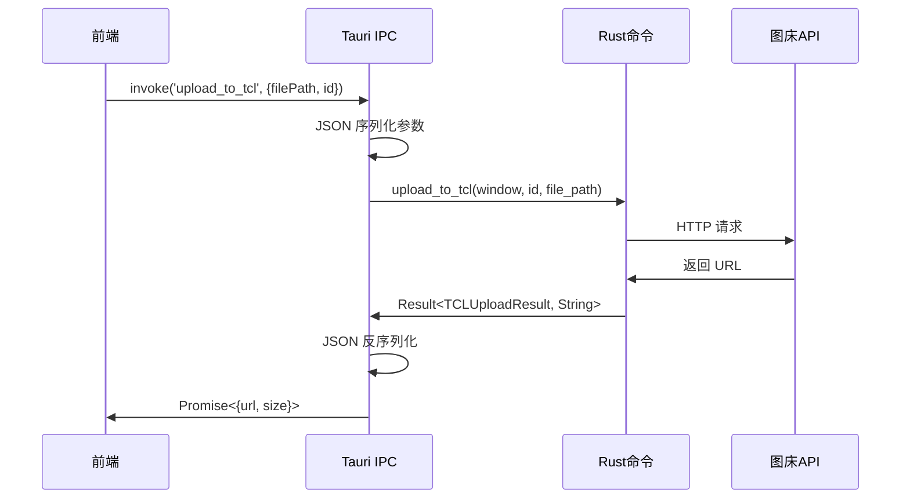
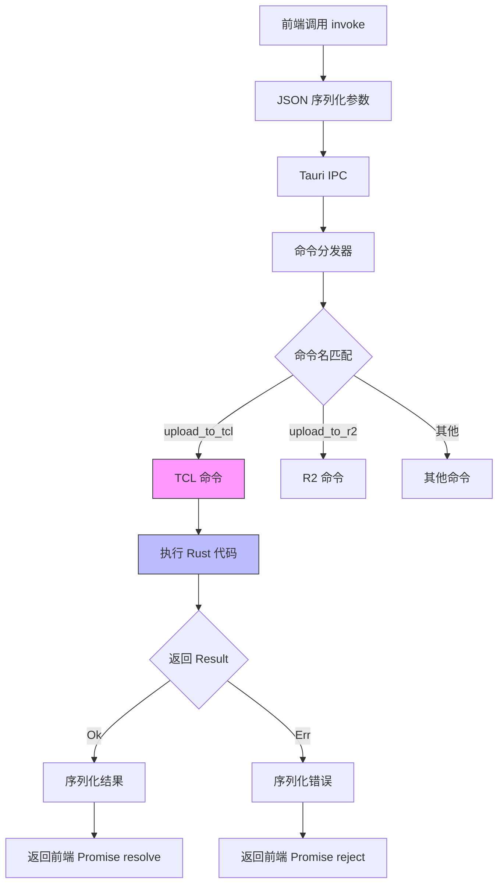

# 4.2 Rust 命令系统详解

## 学习目标

通过本节学习,你将掌握：
- `#[tauri::command]` 宏的工作原理
- 命令参数的序列化和反序列化
- 返回值处理（`Result<T, String>`）
- 依赖注入机制（`Window`、`State`）
- 异步命令实现（`async fn`）
- 前端如何调用 Rust 命令

## 前置知识

- Rust 基础语法（函数、结构体、Result）
- serde 序列化库（JSON 转换）
- Tauri IPC 通信机制

---

## 核心内容

### 什么是 Tauri 命令？

**Tauri 命令**是前端（JavaScript/TypeScript）调用后端（Rust）功能的桥梁。

**核心流程**：


---

## 1. 命令宏 `#[tauri::command]`

### 1.1 最简单的命令

```rust
#[tauri::command]
fn hello_world() -> String {
    "Hello from Rust!".to_string()
}
```

**前端调用**：
```typescript
import { invoke } from '@tauri-apps/api/tauri';

const message = await invoke('hello_world');
console.log(message); // "Hello from Rust!"
```

**关键点**：
1. ✅ 函数名自动变成命令名（`hello_world`）
2. ✅ 返回值自动序列化为 JSON
3. ✅ 宏自动生成 IPC 通信代码

---

### 1.2 带参数的命令

```rust
#[tauri::command]
fn greet(name: String, age: u32) -> String {
    format!("Hello {}! You are {} years old.", name, age)
}
```

**前端调用**：
```typescript
const greeting = await invoke('greet', {
  name: 'Alice',
  age: 25
});
console.log(greeting); // "Hello Alice! You are 25 years old."
```

**参数规则**：
- ✅ 参数必须实现 `serde::Deserialize` 特征
- ✅ 前端传递的对象键名**必须**与 Rust 参数名一致
- ✅ 自动类型转换（JSON number → Rust u32）

---

### 1.3 返回结果类型

```rust
#[tauri::command]
fn divide(a: f64, b: f64) -> Result<f64, String> {
    if b == 0.0 {
        Err("Division by zero!".to_string())
    } else {
        Ok(a / b)
    }
}
```

**前端调用**：
```typescript
try {
  const result = await invoke('divide', { a: 10.0, b: 2.0 });
  console.log(result); // 5.0
} catch (error) {
  console.error(error); // "Division by zero!"
}
```

**Result 类型映射**：
| Rust 类型 | 前端行为 |
|----------|---------|
| `Ok(value)` | Promise resolve(value) |
| `Err(msg)` | Promise reject(msg) |

---

## 2. 项目实际命令案例

### 2.1 TCL 上传命令（完整实现）

**文件位置**：`src-tauri/src/commands/tcl.rs`

```rust
#[tauri::command]
pub async fn upload_to_tcl(
    window: Window,           // 窗口句柄（用于发送事件）
    id: String,               // 上传任务 ID
    file_path: String,        // 文件路径
) -> Result<TCLUploadResult, String> {
    println!("[TCL] 开始上传文件: {}", file_path);

    // 1. 读取文件
    let mut file = File::open(&file_path).await
        .map_err(|e| format!("无法打开文件: {}", e))?;

    let file_size = file.metadata().await
        .map_err(|e| format!("无法获取文件元数据: {}", e))?
        .len();

    let mut buffer = Vec::new();
    file.read_to_end(&mut buffer).await
        .map_err(|e| format!("无法读取文件: {}", e))?;

    // 2. 验证文件类型
    let file_name = std::path::Path::new(&file_path)
        .file_name()
        .and_then(|n| n.to_str())
        .ok_or("无法获取文件名")?;

    let ext = file_name.split('.').last()
        .ok_or("无法获取文件扩展名")?
        .to_lowercase();

    if !["jpg", "jpeg", "png", "gif"].contains(&ext.as_str()) {
        return Err("只支持 JPG、PNG、GIF 格式的图片".to_string());
    }

    // 3. 构建 multipart form
    let part = multipart::Part::bytes(buffer)
        .file_name(file_name.to_string())
        .mime_str("image/*")
        .map_err(|e| format!("无法设置 MIME 类型: {}", e))?;

    let form = multipart::Form::new().part("file", part);

    // 4. 发送请求到 TCL API
    let client = reqwest::Client::new();
    let response = client
        .post("https://service2.tcl.com/api.php/Center/uploadQiniu")
        .multipart(form)
        .send()
        .await
        .map_err(|e| format!("请求失败: {}", e))?;

    // 5. 解析响应
    let response_text = response.text().await
        .map_err(|e| format!("无法读取响应: {}", e))?;

    let api_response: TCLApiResponse = serde_json::from_str(&response_text)
        .map_err(|e| format!("JSON 解析失败: {}", e))?;

    // 6. 检查上传结果
    if api_response.code != 1 && api_response.msg != "success" {
        return Err(format!("TCL API 返回错误: {}", api_response.msg));
    }

    let data_url = api_response.data.ok_or("API 未返回图片链接")?;

    // 7. 提取 URL（去掉 ?e= 参数）
    let clean_url = if let Some(pos) = data_url.find("?e=") {
        &data_url[..pos]
    } else {
        &data_url
    };

    // 8. 将 http 转换为 https
    let https_url = if clean_url.starts_with("http://") {
        clean_url.replacen("http://", "https://", 1)
    } else {
        clean_url.to_string()
    };

    // 9. 发送进度完成事件
    let _ = window.emit("upload://progress", serde_json::json!({
        "id": id,
        "progress": file_size,
        "total": file_size
    }));

    Ok(TCLUploadResult {
        url: https_url,
        size: file_size,
    })
}
```

---

### 2.2 逐行代码解析

#### **参数解释**

| 参数 | 类型 | 用途 |
|-----|------|-----|
| `window` | `Window` | 发送进度事件到前端 |
| `id` | `String` | 唯一标识本次上传任务 |
| `file_path` | `String` | 待上传文件的绝对路径 |

---

#### **第1步：读取文件**

```rust
let mut file = File::open(&file_path).await
    .map_err(|e| format!("无法打开文件: {}", e))?;
```

**关键技术**：
- `File::open` → 异步打开文件（`tokio::fs::File`）
- `.await` → 等待异步操作完成
- `.map_err()` → 错误转换（`std::io::Error` → `String`）
- `?` 操作符 → 如果 Err，立即返回错误

**等价于**：
```rust
let file = match File::open(&file_path).await {
    Ok(f) => f,
    Err(e) => return Err(format!("无法打开文件: {}", e)),
};
```

---

#### **第2步：验证文件类型**

```rust
let ext = file_name.split('.').last()
    .ok_or("无法获取文件扩展名")?
    .to_lowercase();

if !["jpg", "jpeg", "png", "gif"].contains(&ext.as_str()) {
    return Err("只支持 JPG、PNG、GIF 格式的图片".to_string());
}
```

**为什么需要验证**？
- TCL 图床只支持图片格式
- 提前验证 → 避免无效请求（节省网络流量）

---

#### **第3步：构建 multipart form**

```rust
let part = multipart::Part::bytes(buffer)
    .file_name(file_name.to_string())
    .mime_str("image/*")
    .map_err(|e| format!("无法设置 MIME 类型: {}", e))?;

let form = multipart::Form::new().part("file", part);
```

**multipart/form-data 格式**：
```
POST /upload HTTP/1.1
Content-Type: multipart/form-data; boundary=----WebKitFormBoundary

------WebKitFormBoundary
Content-Disposition: form-data; name="file"; filename="test.jpg"
Content-Type: image/*

[文件二进制数据]
------WebKitFormBoundary--
```

---

#### **第4步：发送 HTTP 请求**

```rust
let client = reqwest::Client::new();
let response = client
    .post("https://service2.tcl.com/api.php/Center/uploadQiniu")
    .multipart(form)
    .send()
    .await
    .map_err(|e| format!("请求失败: {}", e))?;
```

**为什么不使用全局 HTTP 客户端**？
- TCL 命令较早实现，未使用全局客户端
- **改进建议**：可以改为注入 `http_client: State<HttpClient>`

---

#### **第5步：解析 JSON 响应**

```rust
let api_response: TCLApiResponse = serde_json::from_str(&response_text)
    .map_err(|e| format!("JSON 解析失败: {}", e))?;
```

**TCLApiResponse 结构体**：
```rust
#[derive(Debug, Deserialize)]
struct TCLApiResponse {
    code: i32,
    msg: String,
    data: Option<String>,
}
```

**示例 JSON**：
```json
{
  "code": 1,
  "msg": "success",
  "data": "http://example.com/image.jpg?e=1234567890"
}
```

---

#### **第9步：发送进度事件**

```rust
let _ = window.emit("upload://progress", serde_json::json!({
    "id": id,
    "progress": file_size,
    "total": file_size
}));
```

**事件负载结构**：
```typescript
interface ProgressEvent {
  id: string;      // 上传任务 ID
  progress: number; // 当前进度（字节）
  total: number;    // 总大小（字节）
}
```

**前端监听**：
```typescript
await listen(`upload://progress/${uploadId}`, (event) => {
  const { progress, total } = event.payload;
  const percent = Math.round((progress / total) * 100);
  onProgress?.(percent);
});
```

---

## 3. 依赖注入机制

### 3.1 注入 Window 句柄

```rust
#[tauri::command]
async fn send_notification(window: Window, message: String) -> Result<(), String> {
    window.emit("notification", message)
        .map_err(|e| e.to_string())?;
    Ok(())
}
```

**Window 用途**：
- ✅ 发送事件到前端（`emit`）
- ✅ 执行 JavaScript（`eval`）
- ✅ 控制窗口（`minimize`、`maximize`、`close`）

---

### 3.2 注入全局状态（State）

```rust
#[tauri::command]
async fn test_r2_connection(
    config: R2Config,
    http_client: tauri::State<'_, HttpClient>
) -> Result<String, String> {
    // 使用全局 HTTP 客户端
    match http_client.0
        .head(&endpoint_url)
        .header("Host", host)
        .send()
        .await
    {
        Ok(response) => Ok("R2 连接成功！".to_string()),
        Err(err) => Err(format!("连接失败: {}", err))
    }
}
```

**State 特征**：
- ✅ 全局单例（整个应用共享）
- ✅ 线程安全（`State<T>` 内部使用 `Arc`）
- ✅ 自动依赖注入

---

## 4. 错误处理最佳实践

### 4.1 使用 `map_err` 转换错误

```rust
let file = File::open(&file_path).await
    .map_err(|e| format!("无法打开文件: {}", e))?;
```

**等价于**：
```rust
let file = match File::open(&file_path).await {
    Ok(f) => f,
    Err(e) => return Err(format!("无法打开文件: {}", e)),
};
```

---

### 4.2 使用 `?` 操作符简化代码

```rust
// ❌ 繁琐写法
let response = match client.send().await {
    Ok(r) => r,
    Err(e) => return Err(format!("请求失败: {}", e)),
};

// ✅ 简洁写法
let response = client.send().await
    .map_err(|e| format!("请求失败: {}", e))?;
```

---

### 4.3 提供友好的错误信息

```rust
// ❌ 不友好
Err("Error".to_string())

// ✅ 友好
Err("R2 连接失败: 存储桶 'my-bucket' 未找到。请检查配置。".to_string())
```

---

## 5. 异步命令实现

### 5.1 为什么需要 async？

```rust
// ❌ 同步版本 - 阻塞线程
#[tauri::command]
fn upload_sync(file_path: String) -> Result<String, String> {
    // 文件 I/O 会阻塞整个应用！
    let content = std::fs::read_to_string(file_path)?;
    Ok(content)
}

// ✅ 异步版本 - 不阻塞
#[tauri::command]
async fn upload_async(file_path: String) -> Result<String, String> {
    // 文件 I/O 期间，其他任务可以继续执行
    let content = tokio::fs::read_to_string(file_path).await?;
    Ok(content)
}
```

**异步优势**：
- ✅ 不阻塞 UI 线程 → 应用响应快
- ✅ 支持并发上传 → 多个文件同时上传
- ✅ 高效利用资源 → 等待 I/O 时 CPU 可以做其他事情

---

## 核心流程图



---

## 实战练习

### 练习 1：创建文件大小检查命令

**任务**：实现一个命令，检查文件大小是否超过 10MB。

**提示**：
```rust
#[tauri::command]
async fn check_file_size(file_path: String) -> Result<bool, String> {
    let metadata = tokio::fs::metadata(file_path).await
        .map_err(|e| format!("无法获取文件信息: {}", e))?;

    let size_mb = metadata.len() as f64 / 1024.0 / 1024.0;
    Ok(size_mb <= 10.0)
}
```

**前端调用**：
```typescript
const isValid = await invoke('check_file_size', {
  filePath: '/path/to/file.jpg'
});
```

---

### 练习 2：添加自定义错误类型

**任务**：创建一个自定义错误枚举，提供更详细的错误信息。

**提示**：
```rust
#[derive(Debug)]
enum UploadError {
    FileNotFound,
    InvalidFormat,
    NetworkError(String),
}

impl std::fmt::Display for UploadError {
    fn fmt(&self, f: &mut std::fmt::Formatter) -> std::fmt::Result {
        match self {
            UploadError::FileNotFound => write!(f, "文件未找到"),
            UploadError::InvalidFormat => write!(f, "文件格式无效"),
            UploadError::NetworkError(msg) => write!(f, "网络错误: {}", msg),
        }
    }
}
```

---

## 总结

本节我们深入学习了 Rust 命令系统的实现：

### 关键知识点
1. ✅ **`#[tauri::command]` 宏**：自动生成 IPC 通信代码
2. ✅ **参数序列化**：前端 JSON → Rust 结构体
3. ✅ **Result 类型**：`Ok` → Promise resolve，`Err` → Promise reject
4. ✅ **依赖注入**：Window、State 自动注入
5. ✅ **异步命令**：使用 `async/await` 避免阻塞
6. ✅ **错误处理**：`map_err` + `?` 简化错误转换

### 最佳实践
- ✅ 使用 `Result<T, String>` 返回类型
- ✅ 提供友好的错误信息
- ✅ 异步命令使用 `tokio::fs` 而非 `std::fs`
- ✅ 复用全局 HTTP 客户端（State 注入）

### 下一步

下一节我们将深入学习 **TCL 上传 Rust 实现**，完整解析一个上传命令的实现细节。

👉 [下一节：4.3 TCL 上传 Rust 实现](./03-tcl-rust.md)
