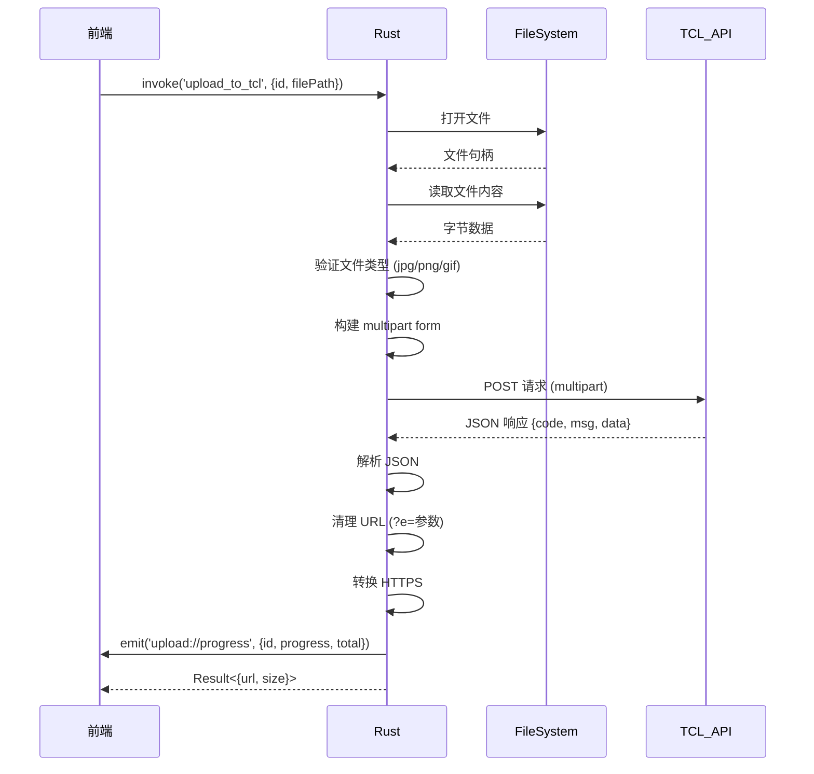
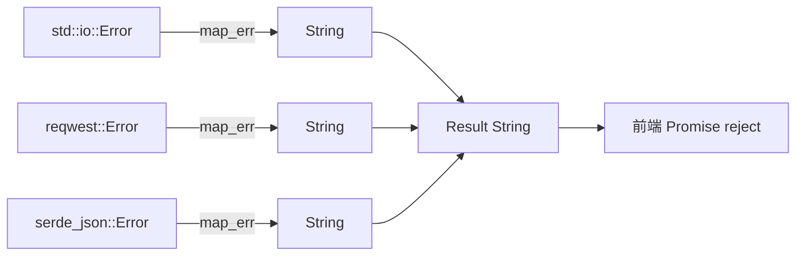

# 4.3 TCL 上传 Rust 实现案例研究

## 学习目标

通过本节学习，你将掌握：
- TCL 图床上传命令的完整实现
- multipart/form-data 请求构建
- 文件读取和验证
- JSON 响应解析
- 进度事件发送
- URL 清理和转换

## 前置知识

- Rust 命令系统（见 [4.2 Rust 命令系统](./02-rust-commands.md)）
- HTTP multipart 上传原理
- tokio 异步文件操作

---

## 核心内容

### 文件位置

```
src-tauri/src/commands/tcl.rs (122 行)
```

这是 **最简单的上传器实现**，适合作为学习案例：
- ✅ 无需认证（不需要 Cookie/API Key）
- ✅ 逻辑清晰（文件读取 → 验证 → 上传 → 解析）
- ✅ 代码简洁（122 行完整实现）

---

## 1. 数据结构定义

### 1.1 上传结果结构体

```rust
#[derive(Debug, Serialize, Deserialize)]
pub struct TCLUploadResult {
    pub url: String,
    pub size: u64,
}
```

**字段解释**：
| 字段 | 类型 | 含义 |
|-----|------|------|
| `url` | `String` | 图片的公开访问链接 |
| `size` | `u64` | 文件大小（字节） |

**derive 宏解释**：
- `Debug` → 可以用 `{:?}` 打印调试
- `Serialize` → 可以转换为 JSON 返回前端
- `Deserialize` → 可以从 JSON 解析（虽然这里未用到）

---

### 1.2 API 响应结构体

```rust
#[derive(Debug, Deserialize)]
struct TCLApiResponse {
    code: i32,
    msg: String,
    data: Option<String>,
}
```

**对应的 JSON 响应**：
```json
{
  "code": 1,
  "msg": "success",
  "data": "http://img.tcl.com/uploads/2024/01/image.jpg?e=1234567890"
}
```

**为什么 data 是 `Option<String>`**？
- 上传失败时，`data` 字段可能不存在
- `Option<String>` → 可以处理 `null` 情况

---

## 2. 上传命令完整实现

### 2.1 函数签名

```rust
#[tauri::command]
pub async fn upload_to_tcl(
    window: Window,           // 窗口句柄（用于发送事件）
    id: String,               // 上传任务 ID
    file_path: String,        // 文件路径
) -> Result<TCLUploadResult, String>
```

**参数说明**：
- `window: Window` → 依赖注入，由 Tauri 自动提供
- `id: String` → 前端生成的唯一 ID，用于匹配进度事件
- `file_path: String` → 文件的绝对路径（如 `C:\Users\xxx\image.jpg`）

**返回值说明**：
- `Ok(TCLUploadResult)` → 上传成功，返回 URL 和大小
- `Err(String)` → 上传失败，返回错误信息

---

## 3. 实现步骤详解

### 步骤 1：读取文件

```rust
// 1. 读取文件
let mut file = File::open(&file_path).await
    .map_err(|e| format!("无法打开文件: {}", e))?;

let file_size = file.metadata().await
    .map_err(|e| format!("无法获取文件元数据: {}", e))?
    .len();

let mut buffer = Vec::new();
file.read_to_end(&mut buffer).await
    .map_err(|e| format!("无法读取文件: {}", e))?;
```

**代码分析**：

#### 打开文件
```rust
let mut file = File::open(&file_path).await
    .map_err(|e| format!("无法打开文件: {}", e))?;
```
- `File::open` → 异步打开文件（`tokio::fs::File`）
- `.await` → 等待文件打开完成
- `.map_err()` → 如果失败，将 `std::io::Error` 转换为 `String`
- `?` → 如果是 Err，立即返回错误

#### 获取文件大小
```rust
let file_size = file.metadata().await
    .map_err(|e| format!("无法获取文件元数据: {}", e))?
    .len();
```
- `metadata()` → 获取文件元数据（大小、修改时间等）
- `.len()` → 提取文件大小（字节）

#### 读取文件内容到内存
```rust
let mut buffer = Vec::new();
file.read_to_end(&mut buffer).await
    .map_err(|e| format!("无法读取文件: {}", e))?;
```
- `Vec::new()` → 创建空的字节数组
- `read_to_end()` → 读取整个文件到 buffer
- **注意**：大文件会占用大量内存

---

### 步骤 2：验证文件类型

```rust
// 2. 验证文件类型（只允许图片）
let file_name = std::path::Path::new(&file_path)
    .file_name()
    .and_then(|n| n.to_str())
    .ok_or("无法获取文件名")?;

let ext = file_name.split('.').last()
    .ok_or("无法获取文件扩展名")?
    .to_lowercase();

if !["jpg", "jpeg", "png", "gif"].contains(&ext.as_str()) {
    return Err("只支持 JPG、PNG、GIF 格式的图片".to_string());
}
```

**代码分析**：

#### 提取文件名
```rust
let file_name = std::path::Path::new(&file_path)
    .file_name()
    .and_then(|n| n.to_str())
    .ok_or("无法获取文件名")?;
```

**流程**：
```
C:\Users\Jiawei\Pictures\test.jpg
        ↓ Path::new()
Path("C:\Users\Jiawei\Pictures\test.jpg")
        ↓ file_name()
Some(OsStr("test.jpg"))
        ↓ to_str()
Some("test.jpg")
        ↓ ok_or()
Result<&str, &str>
```

#### 提取文件扩展名
```rust
let ext = file_name.split('.').last()
    .ok_or("无法获取文件扩展名")?
    .to_lowercase();
```

**示例**：
- `"test.jpg".split('.')` → `["test", "jpg"]`
- `.last()` → `Some("jpg")`
- `.to_lowercase()` → `"jpg"`

#### 验证扩展名
```rust
if !["jpg", "jpeg", "png", "gif"].contains(&ext.as_str()) {
    return Err("只支持 JPG、PNG、GIF 格式的图片".to_string());
}
```

**为什么需要验证**？
- TCL 图床只支持图片
- 提前验证 → 避免浪费网络请求

---

### 步骤 3：构建 multipart form

```rust
// 3. 构建 multipart form
let part = multipart::Part::bytes(buffer)
    .file_name(file_name.to_string())
    .mime_str("image/*")
    .map_err(|e| format!("无法设置 MIME 类型: {}", e))?;

let form = multipart::Form::new()
    .part("file", part);
```

**代码分析**：

#### 创建文件 Part
```rust
let part = multipart::Part::bytes(buffer)
    .file_name(file_name.to_string())
    .mime_str("image/*")
    .map_err(|e| format!("无法设置 MIME 类型: {}", e))?;
```

**等价的 HTTP 请求**：
```http
Content-Disposition: form-data; name="file"; filename="test.jpg"
Content-Type: image/*

[文件的二进制数据]
```

#### 创建 multipart Form
```rust
let form = multipart::Form::new()
    .part("file", part);
```

**完整的 multipart/form-data 格式**：
```http
POST /upload HTTP/1.1
Host: service2.tcl.com
Content-Type: multipart/form-data; boundary=----WebKitFormBoundary

------WebKitFormBoundary
Content-Disposition: form-data; name="file"; filename="test.jpg"
Content-Type: image/*

[文件的二进制数据]
------WebKitFormBoundary--
```

---

### 步骤 4：发送 HTTP 请求

```rust
// 4. 发送请求到 TCL API
let client = reqwest::Client::new();
let response = client
    .post("https://service2.tcl.com/api.php/Center/uploadQiniu")
    .multipart(form)
    .send()
    .await
    .map_err(|e| format!("请求失败: {}", e))?;
```

**代码分析**：

```rust
let client = reqwest::Client::new();
```
- 创建 HTTP 客户端
- **改进建议**：应该使用全局客户端（见 [4.4 HTTP 客户端管理](./04-http-client.md)）

```rust
let response = client
    .post("https://service2.tcl.com/api.php/Center/uploadQiniu")
    .multipart(form)
    .send()
    .await
    .map_err(|e| format!("请求失败: {}", e))?;
```
- `.post()` → 设置 HTTP 方法为 POST
- `.multipart(form)` → 设置请求体为 multipart/form-data
- `.send()` → 发送请求
- `.await` → 等待响应

---

### 步骤 5：解析 JSON 响应

```rust
// 5. 解析响应
let response_text = response.text().await
    .map_err(|e| format!("无法读取响应: {}", e))?;

println!("[TCL] API 响应: {}", response_text);

let api_response: TCLApiResponse = serde_json::from_str(&response_text)
    .map_err(|e| format!("JSON 解析失败: {}", e))?;
```

**代码分析**：

#### 读取响应文本
```rust
let response_text = response.text().await
    .map_err(|e| format!("无法读取响应: {}", e))?;
```
- `.text()` → 将响应体读取为 UTF-8 字符串
- `.await` → 异步读取

#### 打印调试日志
```rust
println!("[TCL] API 响应: {}", response_text);
```
- 示例输出：`[TCL] API 响应: {"code":1,"msg":"success","data":"http://..."}`

#### 解析 JSON
```rust
let api_response: TCLApiResponse = serde_json::from_str(&response_text)
    .map_err(|e| format!("JSON 解析失败: {}", e))?;
```
- `serde_json::from_str` → JSON 字符串 → Rust 结构体
- 自动匹配字段名（`code`、`msg`、`data`）

---

### 步骤 6：检查上传结果

```rust
// 6. 检查上传结果
if api_response.code != 1 && api_response.msg != "success" {
    return Err(format!("TCL API 返回错误: {}", api_response.msg));
}

let data_url = api_response.data
    .ok_or("API 未返回图片链接")?;
```

**代码分析**：

#### 验证响应状态
```rust
if api_response.code != 1 && api_response.msg != "success" {
    return Err(format!("TCL API 返回错误: {}", api_response.msg));
}
```
- TCL API 约定：`code == 1` 且 `msg == "success"` 表示成功
- 失败时直接返回错误

#### 提取 URL
```rust
let data_url = api_response.data
    .ok_or("API 未返回图片链接")?;
```
- `Option::ok_or()` → 将 `Option<T>` 转换为 `Result<T, E>`
- `Some(url)` → `Ok(url)`
- `None` → `Err("API 未返回图片链接")`

---

### 步骤 7：清理 URL

```rust
// 7. 提取 URL（去掉 ?e= 参数）
let clean_url = if let Some(pos) = data_url.find("?e=") {
    &data_url[..pos]
} else {
    &data_url
};
```

**为什么需要清理**？

**原始 URL**：
```
http://img.tcl.com/uploads/2024/01/image.jpg?e=1234567890
```

**清理后 URL**：
```
http://img.tcl.com/uploads/2024/01/image.jpg
```

**原因**：
- `?e=1234567890` → 临时签名参数（会过期）
- 去掉签名 → 获得永久链接

---

### 步骤 8：转换 HTTPS

```rust
// 8. 将 http 转换为 https
let https_url = if clean_url.starts_with("http://") {
    clean_url.replacen("http://", "https://", 1)
} else {
    clean_url.to_string()
};
```

**为什么需要转换**？
- 现代浏览器要求 HTTPS
- HTTP 图片在 HTTPS 页面会被阻止（Mixed Content）

**示例**：
```rust
// 输入: "http://img.tcl.com/image.jpg"
// 输出: "https://img.tcl.com/image.jpg"
```

---

### 步骤 9：发送进度事件

```rust
// 9. 发送进度完成事件
let _ = window.emit("upload://progress", serde_json::json!({
    "id": id,
    "progress": file_size,
    "total": file_size
}));
```

**事件负载**：
```json
{
  "id": "upload-1234567890",
  "progress": 102400,
  "total": 102400
}
```

**前端监听**（对应代码）：
```typescript
await listen(`upload://progress/${uploadId}`, (event) => {
  const { progress, total } = event.payload;
  const percent = Math.round((progress / total) * 100);
  console.log(`上传进度: ${percent}%`);
});
```

---

### 步骤 10：返回结果

```rust
Ok(TCLUploadResult {
    url: https_url,
    size: file_size,
})
```

**返回结果示例**：
```json
{
  "url": "https://img.tcl.com/uploads/2024/01/image.jpg",
  "size": 102400
}
```

---

## 4. 完整流程图



---

## 5. 错误处理分析

### 5.1 可能的错误场景

| 错误场景 | 错误信息 | 原因 |
|---------|---------|------|
| 文件不存在 | "无法打开文件: No such file" | 路径错误 |
| 文件格式错误 | "只支持 JPG、PNG、GIF 格式的图片" | 上传了非图片文件 |
| 网络错误 | "请求失败: connection timeout" | 网络不通 |
| API 错误 | "TCL API 返回错误: 文件过大" | 超出大小限制 |
| JSON 解析错误 | "JSON 解析失败: unexpected EOF" | API 返回格式错误 |

---

### 5.2 错误传递链



---

## 6. 性能优化建议

### 6.1 使用全局 HTTP 客户端

**当前实现**：
```rust
let client = reqwest::Client::new();
```

**优化后**：
```rust
#[tauri::command]
pub async fn upload_to_tcl(
    window: Window,
    id: String,
    file_path: String,
    http_client: tauri::State<'_, HttpClient>  // 注入全局客户端
) -> Result<TCLUploadResult, String> {
    // 使用全局客户端
    let response = http_client.0
        .post("https://service2.tcl.com/api.php/Center/uploadQiniu")
        .multipart(form)
        .send()
        .await?;
}
```

**优化效果**：
- ✅ 复用 TCP 连接
- ✅ 减少握手时间
- ✅ 提升上传速度

---

### 6.2 流式上传（大文件优化）

**当前实现**：
```rust
// 将整个文件读入内存
let mut buffer = Vec::new();
file.read_to_end(&mut buffer).await?;
```

**问题**：
- ❌ 大文件占用大量内存
- ❌ 100MB 文件 → 占用 100MB+ 内存

**优化方案**（流式上传）：
```rust
// 使用流式上传（不读入内存）
use tokio_util::codec::{BytesCodec, FramedRead};
use reqwest::Body;

let file = File::open(&file_path).await?;
let stream = FramedRead::new(file, BytesCodec::new());
let body = Body::wrap_stream(stream);

let part = multipart::Part::stream(body)
    .file_name(file_name.to_string())
    .mime_str("image/*")?;
```

---

## 实战练习

### 练习 1：添加文件大小验证

**任务**：TCL 图床限制单文件最大 10MB，添加验证逻辑。

**提示**：
```rust
if file_size > 10 * 1024 * 1024 {
    return Err("文件大小超过 10MB 限制".to_string());
}
```

---

### 练习 2：添加重试机制

**任务**：网络错误时自动重试 3 次。

**提示**：
```rust
let max_retries = 3;
for attempt in 0..max_retries {
    match client.post(url).multipart(form.clone()).send().await {
        Ok(response) => return Ok(response),
        Err(e) if attempt < max_retries - 1 => {
            eprintln!("[TCL] 重试 {}/{}", attempt + 1, max_retries);
            tokio::time::sleep(Duration::from_secs(1)).await;
        }
        Err(e) => return Err(format!("请求失败: {}", e)),
    }
}
```

---

## 总结

本节我们深入学习了 TCL 上传命令的完整实现：

### 关键知识点
1. ✅ **文件操作**：异步读取、元数据获取、内容读取
2. ✅ **文件验证**：扩展名验证、文件大小检查
3. ✅ **multipart 上传**：构建 Part、设置 MIME 类型
4. ✅ **HTTP 请求**：POST 请求、multipart 编码
5. ✅ **JSON 解析**：serde_json 反序列化
6. ✅ **URL 处理**：参数清理、HTTPS 转换
7. ✅ **进度事件**：window.emit 发送进度
8. ✅ **错误处理**：map_err 转换、友好错误信息

### 实现步骤总结
```
读取文件 → 验证类型 → 构建 Form → 发送请求 → 解析响应 → 清理 URL → 发送事件 → 返回结果
```

### 下一步

下一节我们将学习 **HTTP 客户端管理**，了解如何优化网络请求性能。

👉 [下一节：4.4 HTTP 客户端管理](./04-http-client.md)
