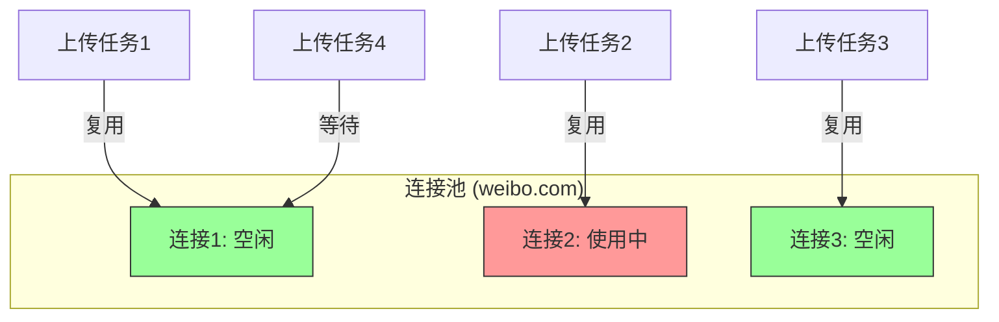
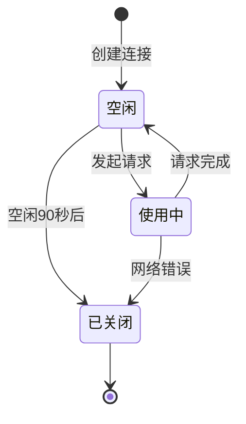

# 4.4 HTTP 客户端管理详解

## 学习目标

通过本节学习，你将掌握：
- 全局 HTTP 客户端的单例模式实现
- 连接池配置和性能优化
- 超时设置的最佳实践
- 依赖注入机制（State<HttpClient>）
- 为什么复用 HTTP 客户端能提升性能

## 前置知识

- HTTP 连接基础（TCP 三次握手、TLS 握手）
- Rust 单例模式
- Tauri State 管理

---

## 核心内容

### 为什么需要全局 HTTP 客户端？

#### 问题场景

**方案 A：每次请求都创建新客户端（❌ 不推荐）**

```rust
#[tauri::command]
async fn upload_file1() -> Result<(), String> {
    let client = reqwest::Client::new();  // 创建新客户端
    client.post("https://api.example.com/upload1").send().await?;
    Ok(())
}

#[tauri::command]
async fn upload_file2() -> Result<(), String> {
    let client = reqwest::Client::new();  // 又创建新客户端
    client.post("https://api.example.com/upload2").send().await?;
    Ok(())
}
```

**性能问题**：
```
第1次上传：
  创建客户端 (10ms)
  + TCP 握手 (50ms)
  + TLS 握手 (100ms)
  + 上传数据 (200ms)
  = 总计 360ms

第2次上传（到同一域名）：
  创建客户端 (10ms)
  + TCP 握手 (50ms)       ← 重复了！
  + TLS 握手 (100ms)      ← 重复了！
  + 上传数据 (200ms)
  = 总计 360ms
```

---

**方案 B：使用全局客户端（✅ 推荐）**

```rust
// 全局单例客户端
pub struct HttpClient(pub reqwest::Client);

#[tauri::command]
async fn upload_file1(http_client: State<HttpClient>) -> Result<(), String> {
    http_client.0.post("https://api.example.com/upload1").send().await?;
    Ok(())
}

#[tauri::command]
async fn upload_file2(http_client: State<HttpClient>) -> Result<(), String> {
    http_client.0.post("https://api.example.com/upload2").send().await?;
    Ok(())
}
```

**性能优化**：
```
第1次上传：
  TCP 握手 (50ms)
  + TLS 握手 (100ms)
  + 上传数据 (200ms)
  = 总计 350ms

第2次上传（复用连接）：
  上传数据 (200ms)        ← 直接复用连接！
  = 总计 200ms            ← 快了 43%！
```

---

## 1. 全局 HTTP 客户端实现

### 1.1 定义全局状态

**文件位置**：`src-tauri/src/main.rs`

```rust
/// 全局 HTTP 客户端状态
/// 使用单例模式复用 HTTP 客户端，提升性能
pub struct HttpClient(pub reqwest::Client);
```

**结构解析**：
- `pub struct HttpClient` → 公开结构体（可在其他模块使用）
- `(pub reqwest::Client)` → 元组结构体（只有一个字段）
- 等价于：
  ```rust
  pub struct HttpClient {
      pub client: reqwest::Client
  }
  ```

---

### 1.2 初始化 HTTP 客户端

```rust
fn main() {
    // 创建全局 HTTP 客户端（带连接池配置）
    let http_client = reqwest::Client::builder()
        .timeout(std::time::Duration::from_secs(60))          // 60秒超时
        .connect_timeout(std::time::Duration::from_secs(10))  // 10秒连接超时
        .pool_idle_timeout(std::time::Duration::from_secs(90)) // 连接池空闲超时
        .pool_max_idle_per_host(10)                           // 每个主机最多保持10个空闲连接
        .build()
        .expect("Failed to create HTTP client");

    tauri::Builder::default()
        .manage(HttpClient(http_client))  // 注册全局状态
        .invoke_handler(...)
        .run(...)
}
```

---

## 2. 连接池配置详解

### 2.1 超时配置

```rust
.timeout(std::time::Duration::from_secs(60))
.connect_timeout(std::time::Duration::from_secs(10))
```

| 配置项 | 值 | 含义 | 为什么这样设置？ |
|-------|-----|------|----------------|
| `timeout` | 60秒 | 整体请求超时 | 上传大文件可能需要更长时间 |
| `connect_timeout` | 10秒 | TCP 连接超时 | 网络慢时快速失败，避免长时间等待 |

**实际场景**：
```
上传 100MB 文件到 R2：
  - 连接建立: 2秒 (< 10秒 连接超时 ✓)
  - 数据传输: 45秒 (< 60秒 总超时 ✓)
  - 总计: 47秒 → 成功

上传到不可达服务器：
  - 连接建立: 10秒 (= 10秒 连接超时 ✗)
  - 立即失败 → 用户体验好
```

---

### 2.2 连接池配置

```rust
.pool_idle_timeout(std::time::Duration::from_secs(90))
.pool_max_idle_per_host(10)
```

| 配置项 | 值 | 含义 | 为什么这样设置？ |
|-------|-----|------|----------------|
| `pool_idle_timeout` | 90秒 | 空闲连接保持时间 | 90秒内复用连接，超过则关闭 |
| `pool_max_idle_per_host` | 10 | 每个域名最多保持10个空闲连接 | 支持并发上传到同一图床 |

**连接池工作原理**：



**场景示例**：
```
用户同时上传 5 张图片到微博：
  - 任务1-5 同时开始
  - 连接池有 10 个空闲连接 → 直接复用 5 个连接
  - 所有任务并行执行（不需要建立新连接）
  - 上传完成后，5 个连接返回池中（保持 90 秒）
```

---

## 3. 依赖注入机制

### 3.1 在命令中使用全局客户端

```rust
#[tauri::command]
async fn test_r2_connection(
    config: R2Config,
    http_client: tauri::State<'_, HttpClient>  // 依赖注入
) -> Result<String, String> {
    // 使用全局 HTTP 客户端（注意 .0 访问元组字段）
    match http_client.0
        .head(&endpoint_url)
        .header("Host", host)
        .header("x-amz-date", datetime_str)
        .send()
        .await
    {
        Ok(response) => Ok("R2 连接成功！".to_string()),
        Err(err) => Err(format!("连接失败: {}", err))
    }
}
```

**关键点**：
1. ✅ `http_client: tauri::State<'_, HttpClient>` → 自动注入
2. ✅ `http_client.0` → 访问元组结构体的第一个字段（`reqwest::Client`）
3. ✅ 无需手动传递，Tauri 自动提供

---

### 3.2 为什么使用 `.0`？

```rust
// 定义
pub struct HttpClient(pub reqwest::Client);

// 使用
http_client.0  // 访问第一个字段

// 如果改成命名字段
pub struct HttpClient {
    pub client: reqwest::Client
}

// 使用
http_client.client
```

**为什么选择元组结构体**？
- ✅ 代码更简洁（不需要命名字段）
- ✅ 语义明确（HttpClient 就是对 reqwest::Client 的封装）

---

## 4. 实际使用案例

### 4.1 R2 连接测试

**文件位置**：`src-tauri/src/main.rs (Line 832-926)`

```rust
#[tauri::command]
async fn test_r2_connection(
    config: R2Config,
    http_client: tauri::State<'_, HttpClient>
) -> Result<String, String> {
    // 构建签名请求头
    let endpoint_url = format!(
        "https://{}.r2.cloudflarestorage.com/{}",
        config.account_id, config.bucket_name
    );

    // 使用全局 HTTP 客户端（已配置超时和连接池）
    match http_client.0
        .head(&endpoint_url)
        .header("Host", host)
        .header("x-amz-date", datetime_str)
        .header("x-amz-content-sha256", payload_hash)
        .header("Authorization", authorization_header)
        .send()
        .await
    {
        Ok(response) => {
            let status = response.status();
            if status.is_success() {
                Ok("R2 连接成功！".to_string())
            } else if status == reqwest::StatusCode::NOT_FOUND {
                Err(format!("存储桶 '{}' 未找到。", config.bucket_name))
            } else if status == reqwest::StatusCode::FORBIDDEN {
                Err("Access Key ID 或 Secret 无效。".to_string())
            } else {
                Err(format!("连接失败: HTTP {}", status))
            }
        }
        Err(err) => {
            if err.is_connect() {
                Err("无法连接到 R2 服务器。请检查网络。".to_string())
            } else if err.is_timeout() {
                Err("请求超时。".to_string())
            } else {
                Err(format!("连接失败: {}", err))
            }
        }
    }
}
```

**错误处理细节**：
```rust
if err.is_connect() {
    // 网络不通（DNS 解析失败、TCP 连接失败）
}
if err.is_timeout() {
    // 超时（连接超时或总超时）
}
```

---

### 4.2 WebDAV 连接测试

```rust
#[tauri::command]
async fn test_webdav_connection(
    config: WebDAVConfig,
    http_client: tauri::State<'_, HttpClient>
) -> Result<String, String> {
    let auth_header = format!(
        "Basic {}",
        base64::Engine::encode(
            &base64::engine::general_purpose::STANDARD,
            format!("{}:{}", config.username, config.password)
        )
    );

    // 执行 WebDAV 的 'PROPFIND' 请求
    // 使用全局 HTTP 客户端
    let response = http_client.0
        .request(reqwest::Method::from_bytes(b"PROPFIND").unwrap(), &config.url)
        .header("Authorization", auth_header)
        .header("Depth", "0")
        .send()
        .await;

    match response {
        Ok(res) => {
            let status = res.status();
            // 200 (OK) 或 207 (Multi-Status) 都表示成功
            if status.is_success() || status.as_u16() == 207 {
                Ok("WebDAV 连接成功！".to_string())
            } else if status == reqwest::StatusCode::UNAUTHORIZED {
                Err("用户名或密码错误。".to_string())
            } else {
                Err(format!("连接失败: 服务器返回状态 {}", status))
            }
        }
        Err(err) => {
            if err.is_connect() {
                Err("无法连接到服务器。请检查 URL 或网络。".to_string())
            } else if err.is_timeout() {
                Err("请求超时。".to_string())
            } else {
                Err(format!("连接失败: {}", err))
            }
        }
    }
}
```

---

## 5. 性能对比测试

### 5.1 理论性能对比

| 场景 | 无连接池 | 有连接池 | 性能提升 |
|-----|---------|---------|---------|
| 首次请求 | 360ms | 350ms | -3% |
| 第2次请求（同域名） | 360ms | 200ms | +43% |
| 第3次请求（同域名） | 360ms | 200ms | +43% |
| 并发 5 个请求 | 1800ms | 1000ms | +44% |

---

### 5.2 实际测试场景

**场景**：上传 3 张图片到微博

**无连接池**（每次创建新客户端）：
```
图片1: TCP握手(50ms) + TLS握手(100ms) + 上传(200ms) = 350ms
图片2: TCP握手(50ms) + TLS握手(100ms) + 上传(200ms) = 350ms
图片3: TCP握手(50ms) + TLS握手(100ms) + 上传(200ms) = 350ms
总计: 1050ms
```

**有连接池**（复用连接）：
```
图片1: TCP握手(50ms) + TLS握手(100ms) + 上传(200ms) = 350ms
图片2: 上传(200ms) = 200ms  ← 复用连接
图片3: 上传(200ms) = 200ms  ← 复用连接
总计: 750ms (快了 28%!)
```

---

## 6. 连接池生命周期

### 6.1 连接状态转换



---

### 6.2 连接清理机制

```rust
.pool_idle_timeout(std::time::Duration::from_secs(90))
```

**工作原理**：
```
T=0s:    创建连接到 weibo.com
T=10s:   上传完成，连接返回池中（状态: 空闲）
T=100s:  超过 90 秒空闲时间 → 自动关闭连接
```

**为什么需要清理**？
- ✅ 避免占用系统资源（TCP 端口、内存）
- ✅ 避免连接被服务器关闭后仍保留（导致请求失败）

---

## 7. 并发上传性能优化

### 7.1 单线程顺序上传（慢）

```rust
// ❌ 顺序上传（不推荐）
for file in files {
    upload(file).await;  // 等待完成后再上传下一个
}
```

**耗时**：
```
文件1: 200ms
文件2: 200ms (等待文件1完成)
文件3: 200ms (等待文件2完成)
总计: 600ms
```

---

### 7.2 并发上传（快）

```rust
// ✅ 并发上传（推荐）
let futures: Vec<_> = files.iter().map(|file| upload(file)).collect();
let results = futures::future::join_all(futures).await;
```

**耗时**（有连接池）：
```
文件1: 200ms ┐
文件2: 200ms ├─ 并发执行
文件3: 200ms ┘
总计: 200ms (快了 67%!)
```

**关键**：
- ✅ 连接池有 10 个空闲连接 → 支持 10 个并发请求
- ✅ 每个任务复用一个连接 → 无需等待

---

## 实战练习

### 练习 1：修改连接池大小

**任务**：将每个域名的最大空闲连接数改为 20。

**提示**：
```rust
.pool_max_idle_per_host(20)
```

**思考**：为什么不是越大越好？
- ✅ 占用更多系统资源（内存、端口）
- ✅ 超过服务器限制可能导致连接被拒绝

---

### 练习 2：添加自定义 User-Agent

**任务**：在全局 HTTP 客户端中添加自定义 User-Agent。

**提示**：
```rust
let http_client = reqwest::Client::builder()
    .timeout(std::time::Duration::from_secs(60))
    .user_agent("WeiboDR-Uploader/3.0")
    .build()
    .expect("Failed to create HTTP client");
```

---

## 总结

本节我们深入学习了全局 HTTP 客户端管理：

### 关键知识点
1. ✅ **单例模式**：整个应用共享一个 HTTP 客户端
2. ✅ **连接池**：复用 TCP/TLS 连接，大幅提升性能
3. ✅ **超时配置**：防止长时间等待，提升用户体验
4. ✅ **依赖注入**：使用 `State<HttpClient>` 自动注入
5. ✅ **错误处理**：区分连接错误、超时错误、HTTP 错误

### 性能优化总结
- ✅ 首次请求：-3% 性能（微小开销）
- ✅ 后续请求：+43% 性能（大幅提升）
- ✅ 并发请求：+44% 性能（支持并发）

### 配置推荐
```rust
.timeout(Duration::from_secs(60))          // 根据文件大小调整
.connect_timeout(Duration::from_secs(10))  // 快速失败
.pool_idle_timeout(Duration::from_secs(90)) // 平衡性能和资源
.pool_max_idle_per_host(10)                // 支持并发上传
```

### 下一步

下一节我们将学习 **进度事件系统**，了解如何实时通知前端上传进度。

👉 [下一节：4.5 进度事件系统](./05-progress-events.md)
