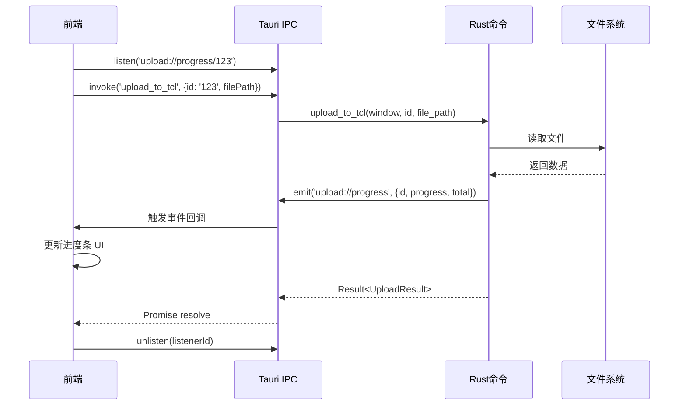
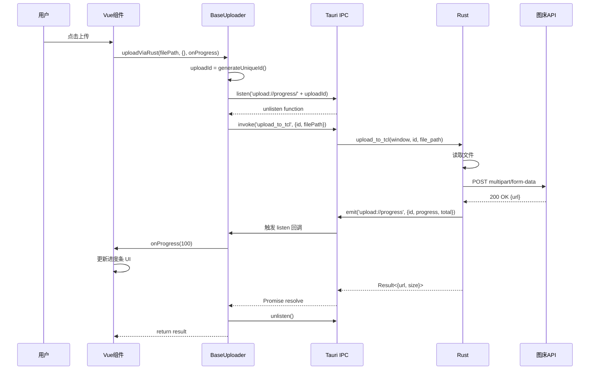

# 4.5 进度事件系统详解

## 学习目标

通过本节学习，你将掌握：
- Tauri 事件系统的工作原理
- 如何在 Rust 端发送进度事件（`emit`）
- 如何在前端监听进度事件（`listen`）
- 进度事件的负载结构设计
- 事件监听器的生命周期管理
- 实时进度更新的最佳实践

## 前置知识

- Tauri IPC 通信机制
- JavaScript Promise 和事件监听
- Rust 异步编程（async/await）

---

## 核心内容

### 为什么需要进度事件？

**场景**：上传 100MB 文件到图床

**方案 A：无进度反馈（❌ 糟糕体验）**
```
用户点击上传 → ... (沉默) ... → 30秒后显示成功
```
- ❌ 用户不知道是否正在上传
- ❌ 用户不知道还需要等多久
- ❌ 可能误以为程序卡死

**方案 B：有进度反馈（✅ 良好体验）**
```
用户点击上传
  → "上传中 10%"  (3秒)
  → "上传中 30%"  (9秒)
  → "上传中 60%"  (18秒)
  → "上传中 90%"  (27秒)
  → "上传成功"    (30秒)
```
- ✅ 用户知道正在上传
- ✅ 用户知道进度
- ✅ 用户可以预估剩余时间

---

## 1. 事件系统架构

### 1.1 Tauri 事件流向



---

### 1.2 事件命名约定

**项目中的事件命名**：
| 事件名 | 用途 | 负载结构 |
|-------|------|---------|
| `upload://progress` | 上传进度更新 | `{id, progress, total}` |
| `cookie-updated` | Cookie 更新 | `{serviceId, cookie}` |
| `navigate-to` | 路由导航 | `string (page name)` |

**命名规范**：
- ✅ 使用 `://` 分隔命名空间（如 `upload://progress`）
- ✅ 使用小写字母和连字符（如 `cookie-updated`）
- ✅ 语义清晰（一看就知道用途）

---

## 2. Rust 端发送事件

### 2.1 基本用法

```rust
#[tauri::command]
async fn upload_to_tcl(
    window: Window,    // 窗口句柄（必须）
    id: String,
    file_path: String,
) -> Result<TCLUploadResult, String> {
    // ... 上传逻辑 ...

    // 发送进度完成事件
    let _ = window.emit("upload://progress", serde_json::json!({
        "id": id,
        "progress": file_size,
        "total": file_size
    }));

    Ok(TCLUploadResult { url, size: file_size })
}
```

**关键点**：
1. ✅ `window: Window` → 必须在命令参数中声明（依赖注入）
2. ✅ `window.emit(事件名, 负载)` → 发送事件
3. ✅ `serde_json::json!()` → 构建 JSON 负载
4. ✅ `let _ = ` → 忽略发送结果（即使失败也不影响上传）

---

### 2.2 事件负载结构设计

**TCL 上传进度事件**：
```rust
window.emit("upload://progress", serde_json::json!({
    "id": id,              // 上传任务 ID（用于匹配）
    "progress": file_size, // 当前进度（字节）
    "total": file_size     // 总大小（字节）
}));
```

**对应的 TypeScript 接口**：
```typescript
interface ProgressEvent {
  id: string;       // 上传任务 ID
  progress: number; // 当前进度（字节）
  total: number;    // 总大小（字节）
}
```

**为什么需要 `id` 字段**？
```
同时上传 3 个文件：
  - 文件1 (id: "upload-001"): 进度 50%
  - 文件2 (id: "upload-002"): 进度 80%
  - 文件3 (id: "upload-003"): 进度 30%

前端根据 id 更新对应的进度条：
  listen('upload://progress/upload-001', ...) → 更新文件1进度
  listen('upload://progress/upload-002', ...) → 更新文件2进度
  listen('upload://progress/upload-003', ...) → 更新文件3进度
```

---

### 2.3 分段发送进度事件

**当前实现**（TCL 上传）：
```rust
// 只在上传完成时发送一次事件
let _ = window.emit("upload://progress", serde_json::json!({
    "id": id,
    "progress": file_size,
    "total": file_size
}));
```

**改进方案**（实时进度）：
```rust
// 使用流式上传 + 进度回调
use tokio_util::codec::{BytesCodec, FramedRead};
use futures::stream::StreamExt;

let file = File::open(&file_path).await?;
let total_size = file.metadata().await?.len();
let mut bytes_sent = 0u64;

let stream = FramedRead::new(file, BytesCodec::new())
    .inspect(|chunk| {
        if let Ok(data) = chunk {
            bytes_sent += data.len() as u64;

            // 每发送一块数据，发送进度事件
            let _ = window.emit("upload://progress", serde_json::json!({
                "id": id,
                "progress": bytes_sent,
                "total": total_size
            }));
        }
    });

let body = Body::wrap_stream(stream);
```

**效果**：
```
用户上传 10MB 文件：
  → 发送 1MB → emit({progress: 1MB, total: 10MB})   (10%)
  → 发送 2MB → emit({progress: 3MB, total: 10MB})   (30%)
  → 发送 3MB → emit({progress: 6MB, total: 10MB})   (60%)
  → 发送 4MB → emit({progress: 10MB, total: 10MB}) (100%)
```

---

## 3. 前端监听事件

### 3.1 基本监听方式

**文件位置**：`src/uploaders/base/BaseUploader.ts (Line 82-106)`

```typescript
import { listen, UnlistenFn } from '@tauri-apps/api/event';

async uploadViaRust(
  filePath: string,
  additionalParams: Record<string, any>,
  onProgress?: ProgressCallback
): Promise<any> {
  // 1. 生成唯一 uploadId
  const uploadId = this.generateUniqueId();

  // 2. 设置进度监听器（在调用 Rust 命令前）
  let unlisten: UnlistenFn | null = null;
  if (onProgress) {
    unlisten = await listen(`upload://progress/${uploadId}`, (event) => {
      const { progress, total } = event.payload as { progress: number; total: number };
      const percent = Math.round((progress / total) * 100);
      onProgress(percent);
    });
  }

  try {
    // 3. 调用 Rust 命令
    const result = await invoke(this.getRustCommand(), {
      id: uploadId,
      filePath,
      ...additionalParams
    });

    return result;
  } finally {
    // 4. 清理监听器（防止内存泄漏）
    if (unlisten) {
      unlisten();
    }
  }
}
```

---

### 3.2 代码逐步解析

#### 步骤 1：生成唯一 ID

```typescript
const uploadId = this.generateUniqueId();
// 示例输出: "upload-1704110400000-abc123"
```

**为什么需要唯一 ID**？
- ✅ 区分不同的上传任务
- ✅ 每个任务有独立的进度监听器

---

#### 步骤 2：设置进度监听器

```typescript
unlisten = await listen(`upload://progress/${uploadId}`, (event) => {
  const { progress, total } = event.payload as { progress: number; total: number };
  const percent = Math.round((progress / total) * 100);
  onProgress(percent);
});
```

**事件监听流程**：
```
1. listen() 返回 → UnlistenFn (清理函数)
2. Rust 发送事件 → 触发回调
3. 提取 payload → {progress, total}
4. 计算百分比 → Math.round((progress / total) * 100)
5. 调用回调 → onProgress(percent)
6. 更新 UI → 进度条显示 percent%
```

---

#### 步骤 3：调用 Rust 命令

```typescript
const result = await invoke(this.getRustCommand(), {
  id: uploadId,          // 传递 uploadId 给 Rust
  filePath,
  ...additionalParams
});
```

**参数映射**：
```typescript
前端:
{
  id: "upload-1704110400000-abc123",
  filePath: "C:\\Users\\xxx\\image.jpg"
}

Rust:
fn upload_to_tcl(
    window: Window,
    id: String,              // "upload-1704110400000-abc123"
    file_path: String,       // "C:\\Users\\xxx\\image.jpg"
)
```

---

#### 步骤 4：清理监听器

```typescript
finally {
  if (unlisten) {
    unlisten();  // 调用清理函数，移除事件监听器
  }
}
```

**为什么必须清理**？
- ❌ 不清理 → 每次上传都注册新监听器 → 内存泄漏
- ✅ 清理后 → 监听器被移除 → 释放内存

**示例**：
```
上传文件1 → 注册监听器1 → 上传完成 → 清理监听器1 ✓
上传文件2 → 注册监听器2 → 上传完成 → 清理监听器2 ✓

如果不清理：
上传文件1 → 注册监听器1 → 上传完成 → 监听器1仍存在 ✗
上传文件2 → 注册监听器2 → 上传完成 → 监听器1+2仍存在 ✗
上传文件100 → 100个监听器都存在 → 内存泄漏 ✗
```

---

## 4. 完整时序图



---

## 5. Cookie 更新事件案例

### 5.1 Rust 端发送 Cookie 事件

**文件位置**：`src-tauri/src/main.rs (Line 244-287)`

```rust
/// Cookie 更新事件的 payload 结构
#[derive(Clone, serde::Serialize)]
struct CookieUpdatedPayload {
    #[serde(rename = "serviceId")]
    service_id: String,
    cookie: String,
}

#[tauri::command]
async fn save_cookie_from_login(
    cookie: String,
    service_id: Option<String>,
    app: tauri::AppHandle
) -> Result<(), String> {
    let service = service_id.unwrap_or_else(|| "weibo".to_string());

    // 发送事件到主窗口（包含服务标识）
    if let Some(main_window) = app.get_window("main") {
        let payload = CookieUpdatedPayload {
            service_id: service.clone(),
            cookie: cookie.clone(),
        };

        match main_window.emit("cookie-updated", payload) {
            Ok(_) => {
                eprintln!("[保存Cookie] ✓ 已发送 {} Cookie到主窗口", service);

                // 成功后，异步关闭登录窗口
                if let Some(login_window) = app.get_window("login-webview") {
                    let _ = login_window.close();
                }

                Ok(())
            }
            Err(e) => {
                Err(format!("发送Cookie事件失败: {}", e))
            }
        }
    } else {
        Err("找不到主窗口".to_string())
    }
}
```

**关键点**：
1. ✅ 定义专门的 Payload 结构体（`CookieUpdatedPayload`）
2. ✅ 使用 `#[serde(rename = "serviceId")]` 转换字段名（Rust: `service_id` → JSON: `serviceId`）
3. ✅ `app.get_window("main")` → 获取主窗口句柄
4. ✅ `main_window.emit()` → 发送事件到主窗口

---

### 5.2 前端监听 Cookie 事件

```typescript
import { listen } from '@tauri-apps/api/event';

// 监听 Cookie 更新事件
const unlisten = await listen('cookie-updated', (event) => {
  const { serviceId, cookie } = event.payload as {
    serviceId: string;
    cookie: string;
  };

  console.log(`收到 ${serviceId} 的 Cookie`);

  // 更新配置
  updateConfig(serviceId, { cookie });

  // 显示成功提示
  showSuccessMessage(`${serviceId} 登录成功！`);
});
```

---

## 6. 导航事件案例

### 6.1 Rust 端发送导航事件

**文件位置**：`src-tauri/src/main.rs (Line 196-207)`

```rust
.on_menu_event(|event| {
    let app = event.window().app_handle();

    match event.menu_item_id() {
        "preferences" => {
            if let Some(main_window) = app.get_window("main") {
                let _ = main_window.emit("navigate-to", "settings");
            }
        }
        "history" => {
            if let Some(main_window) = app.get_window("main") {
                let _ = main_window.emit("navigate-to", "history");
            }
        }
        _ => {}
    }
})
```

---

### 6.2 前端监听导航事件

```typescript
import { listen } from '@tauri-apps/api/event';
import { useRouter } from 'vue-router';

const router = useRouter();

// 监听导航事件
const unlisten = await listen('navigate-to', (event) => {
  const pageName = event.payload as string;
  router.push({ name: pageName });
});
```

---

## 实战练习

### 练习 1：添加取消上传事件

**任务**：实现一个 `upload://cancelled` 事件，用户点击取消时通知 Rust 端。

**前端**：
```typescript
import { emit } from '@tauri-apps/api/event';

function cancelUpload(uploadId: string) {
  emit('upload://cancelled', { id: uploadId });
}
```

**Rust**：
```rust
// 在 main.rs 中添加全局事件监听
app.listen_global("upload://cancelled", |event| {
    if let Some(payload) = event.payload() {
        let id: String = serde_json::from_str(payload).unwrap();
        eprintln!("[取消上传] 任务 {} 已取消", id);
        // TODO: 实现取消逻辑
    }
});
```

---

### 练习 2：添加实时上传速度显示

**任务**：发送事件时附带上传速度（KB/s）。

**Rust**：
```rust
let start_time = std::time::Instant::now();
let mut last_progress = 0u64;
let mut last_time = start_time;

// 每次发送进度
let elapsed = last_time.elapsed().as_secs_f64();
let speed = if elapsed > 0.0 {
    ((bytes_sent - last_progress) as f64 / elapsed / 1024.0) as u64
} else {
    0
};

window.emit("upload://progress", serde_json::json!({
    "id": id,
    "progress": bytes_sent,
    "total": total_size,
    "speed": speed  // KB/s
}));

last_progress = bytes_sent;
last_time = std::time::Instant::now();
```

---

## 总结

本节我们深入学习了 Tauri 进度事件系统：

### 关键知识点
1. ✅ **Rust 端发送事件**：`window.emit(事件名, 负载)`
2. ✅ **前端监听事件**：`listen(事件名, 回调函数)`
3. ✅ **事件负载设计**：使用 JSON 结构（`serde_json::json!`）
4. ✅ **监听器清理**：使用 `finally` 块调用 `unlisten()`
5. ✅ **唯一 ID 匹配**：通过 ID 区分不同上传任务

### 事件流向
```
Rust emit → Tauri IPC → 前端 listen → 触发回调 → 更新 UI → unlisten 清理
```

### 最佳实践
- ✅ 在调用 Rust 命令**前**注册监听器
- ✅ 使用 `finally` 确保监听器一定被清理
- ✅ 使用唯一 ID 匹配事件
- ✅ 定义明确的 Payload 结构体（TypeScript interface + Rust struct）

### 下一步

下一节我们将学习 **密钥管理系统**，了解如何安全地存储敏感数据。

👉 [下一节：4.6 密钥管理系统](./06-secure-key-management.md)
