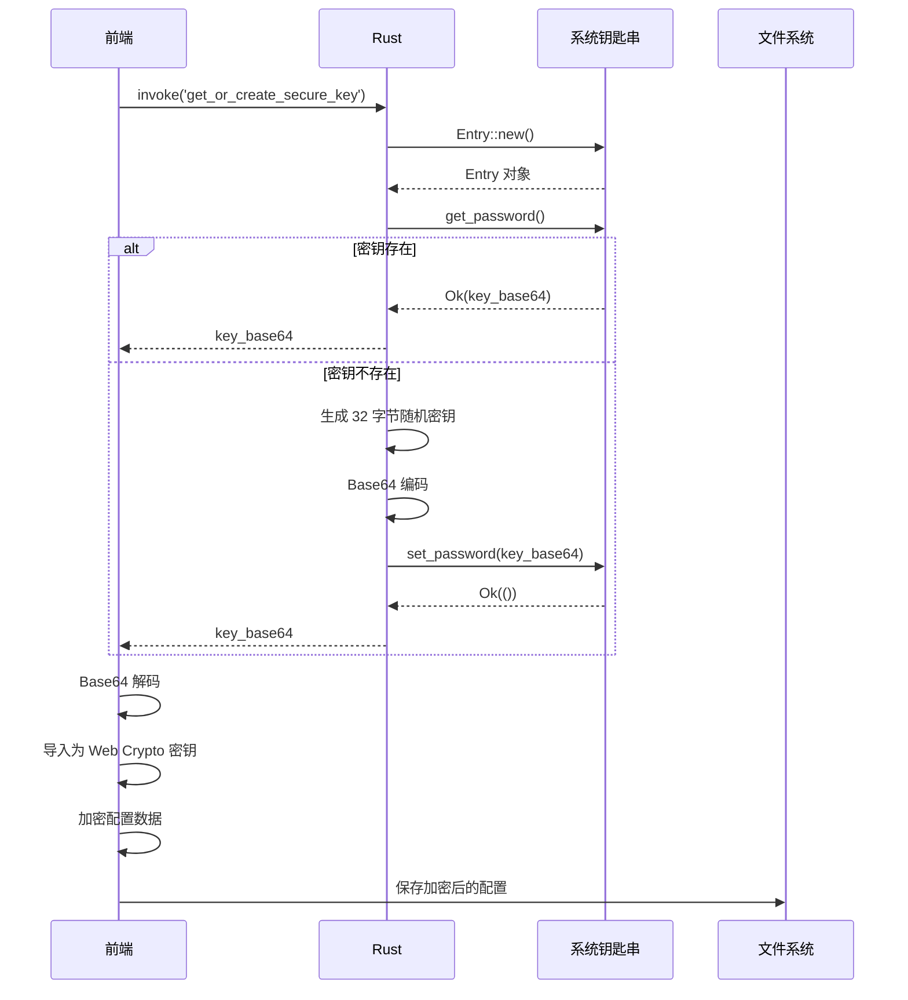

# 4.6 安全密钥管理系统详解

## 学习目标

通过本节学习，你将掌握：
- 系统钥匙串（Keyring）的工作原理
- 如何使用 `keyring` crate 存储敏感数据
- 密钥生成和存储的最佳实践
- 跨平台密钥存储位置
- 为什么不应该将密钥存储在代码或配置文件中
- Base64 编码在密钥管理中的应用

## 前置知识

- 加密基础知识（AES-GCM、密钥长度）
- Rust 错误处理（Result 类型）
- 操作系统安全存储概念

---

## 核心内容

### 为什么需要安全密钥管理？

#### 问题场景

**方案 A：密钥硬编码在代码中（❌ 极度不安全）**

```rust
// ❌ 永远不要这样做！
const ENCRYPTION_KEY: &str = "super_secret_key_12345";

fn encrypt(data: &str) -> String {
    // 使用硬编码的密钥加密
    aes_encrypt(data, ENCRYPTION_KEY)
}
```

**安全问题**：
- ❌ 源代码泄露 → 密钥泄露
- ❌ Git 历史记录永久保存密钥
- ❌ 任何能访问代码的人都能看到密钥

---

**方案 B：密钥存储在配置文件中（❌ 不安全）**

```json
{
  "encryptionKey": "super_secret_key_12345"
}
```

**安全问题**：
- ❌ 配置文件可被其他程序读取
- ❌ 用户备份配置文件时密钥也被备份
- ❌ 没有操作系统级保护

---

**方案 C：使用系统钥匙串（✅ 安全）**

```rust
use keyring::Entry;

// 从系统钥匙串读取密钥
let entry = Entry::new("com.weibodr.uploader", "encryption_key")?;
let key = entry.get_password()?;
```

**安全优势**：
- ✅ 操作系统级加密保护
- ✅ 只有当前用户可访问
- ✅ 需要用户认证（Windows: 指纹/PIN，macOS: 密码/TouchID）
- ✅ 自动同步（macOS iCloud Keychain）

---

## 1. 系统钥匙串工作原理

### 1.1 跨平台实现

| 操作系统 | 存储位置 | 保护机制 |
|---------|---------|---------|
| **Windows** | Credential Manager（凭据管理器） | DPAPI 加密 |
| **macOS** | Keychain（钥匙串） | 硬件加密（T2/Secure Enclave） |
| **Linux** | Secret Service API | GNOME Keyring / KWallet |

---

### 1.2 Windows Credential Manager

**存储路径**：
```
控制面板 → 用户账户 → 凭据管理器 → Windows 凭据
```

**查看存储的密钥**：
```
应用程序: com.weibodr.uploader.secure
用户名:   config_encryption_key
密码:     [Base64 编码的密钥]
```

**保护机制（DPAPI）**：
- ✅ 使用用户登录密码派生密钥
- ✅ 只有当前用户可解密
- ✅ 其他用户无法访问

---

### 1.3 macOS Keychain

**存储路径**：
```
应用程序 → 实用工具 → 钥匙串访问 → 登录钥匙串
```

**查看存储的密钥**：
```
名称:   config_encryption_key
种类:   应用程序密码
账户:   config_encryption_key
位置:   com.weibodr.uploader.secure
```

**保护机制**：
- ✅ T2 芯片 / Secure Enclave 硬件加密
- ✅ 支持 TouchID / FaceID 认证
- ✅ iCloud 同步（可选）

---

### 1.4 Linux Secret Service

**实现**：
- GNOME Keyring（GNOME 桌面）
- KWallet（KDE 桌面）

**保护机制**：
- ✅ 使用用户登录密码加密
- ✅ D-Bus API 访问控制

---

## 2. 项目实现

### 2.1 依赖配置

**文件位置**：`src-tauri/Cargo.toml`

```toml
[dependencies]
keyring = "2"
rand = "0.8"
base64 = "0.21"
```

**crate 说明**：
- `keyring` → 跨平台钥匙串访问
- `rand` → 生成随机密钥
- `base64` → 密钥编码（二进制 → 文本）

---

### 2.2 服务名和密钥名定义

**文件位置**：`src-tauri/src/main.rs (Line 36-38)`

```rust
// 定义服务名，防止与其他应用冲突
const SERVICE_NAME: &str = "com.weibodr.uploader.secure";
const KEY_NAME: &str = "config_encryption_key";
```

**为什么使用反向域名格式**？
- ✅ 防止命名冲突（如其他应用也叫 `uploader`）
- ✅ 符合行业惯例（类似 iOS Bundle ID、Android Package Name）

**示例**：
```
com.weibodr.uploader.secure  → WeiboDR-Uploader 应用
com.example.myapp            → 其他应用
```

---

## 3. 获取或创建密钥命令

### 3.1 完整实现

**文件位置**：`src-tauri/src/main.rs (Line 1343-1375)`

```rust
/// 获取或创建加密密钥
///
/// 从系统钥匙串中获取加密密钥，如果不存在则生成一个新的 32 字节 (256 位) 随机密钥
///
/// # 返回
/// 返回 `Result<String, String>`，成功时返回 Base64 编码的密钥，失败时返回错误信息
#[tauri::command]
fn get_or_create_secure_key() -> Result<String, String> {
    let entry = Entry::new(SERVICE_NAME, KEY_NAME).map_err(|e| {
        format!("无法访问系统钥匙串: {}", e)
    })?;

    match entry.get_password() {
        Ok(key) => {
            eprintln!("[密钥管理] 从钥匙串读取现有密钥");
            Ok(key)
        },
        Err(_) => {
            // 如果不存在，生成一个新的 32 字节 (256 位) 随机密钥
            eprintln!("[密钥管理] 生成新的加密密钥");
            let mut key_bytes = [0u8; 32];
            rand::thread_rng().fill(&mut key_bytes);
            let new_key = general_purpose::STANDARD.encode(key_bytes);

            // 存入系统钥匙串
            entry.set_password(&new_key).map_err(|e| {
                format!("无法保存密钥到系统钥匙串: {}", e)
            })?;

            eprintln!("[密钥管理] ✓ 新密钥已保存到系统钥匙串");
            Ok(new_key)
        }
    }
}
```

---

### 3.2 逐步代码解析

#### 步骤 1：创建钥匙串条目

```rust
let entry = Entry::new(SERVICE_NAME, KEY_NAME).map_err(|e| {
    format!("无法访问系统钥匙串: {}", e)
})?;
```

**Entry::new 参数**：
- `SERVICE_NAME` → 服务标识（`"com.weibodr.uploader.secure"`）
- `KEY_NAME` → 密钥标识（`"config_encryption_key"`）

**等价于**：
```
Windows: 在 Credential Manager 中查找
  Target: com.weibodr.uploader.secure
  User:   config_encryption_key

macOS: 在 Keychain 中查找
  Where:  com.weibodr.uploader.secure
  Name:   config_encryption_key
```

---

#### 步骤 2：尝试读取现有密钥

```rust
match entry.get_password() {
    Ok(key) => {
        eprintln!("[密钥管理] 从钥匙串读取现有密钥");
        Ok(key)
    },
    Err(_) => {
        // 密钥不存在，创建新密钥
    }
}
```

**场景**：
```
首次运行应用:
  get_password() → Err (密钥不存在)
  → 生成新密钥

第二次运行应用:
  get_password() → Ok(key)
  → 返回现有密钥
```

---

#### 步骤 3：生成随机密钥

```rust
let mut key_bytes = [0u8; 32];
rand::thread_rng().fill(&mut key_bytes);
```

**代码解析**：
- `[0u8; 32]` → 创建 32 字节（256 位）数组
- `rand::thread_rng()` → 获取线程本地随机数生成器
- `.fill(&mut key_bytes)` → 用随机字节填充数组

**为什么是 32 字节**？
- ✅ AES-256 要求 256 位（32 字节）密钥
- ✅ 更安全（2^256 种可能性）

---

#### 步骤 4：Base64 编码

```rust
let new_key = general_purpose::STANDARD.encode(key_bytes);
```

**为什么需要 Base64 编码**？
- ✅ 密钥是二进制数据（不可打印字符）
- ✅ 系统钥匙串存储字符串（不是二进制）
- ✅ Base64 → 二进制转文本（可安全存储）

**示例**：
```rust
// 原始密钥（32 字节二进制）
[0xAB, 0xCD, 0xEF, ..., 0x12]

// Base64 编码后（44 字符文本）
"q83v...Eg=="
```

---

#### 步骤 5：存储到钥匙串

```rust
entry.set_password(&new_key).map_err(|e| {
    format!("无法保存密钥到系统钥匙串: {}", e)
})?;
```

**存储流程**：
```
Windows:
  new_key → DPAPI 加密 → Credential Manager

macOS:
  new_key → Secure Enclave 加密 → Keychain

Linux:
  new_key → 用户密码加密 → GNOME Keyring
```

---

## 4. 前端调用流程

### 4.1 前端代码

**文件位置**：`src/crypto.ts (Line 18-27)`

```typescript
import { invoke } from '@tauri-apps/api/tauri';

export class SecureStorage {
  private key: CryptoKey | null = null;

  async init(): Promise<void> {
    // 1. 从 Rust 后端获取密钥
    const keyBase64 = await invoke<string>('get_or_create_secure_key');

    // 2. Base64 解码
    const keyData = base64ToBytes(keyBase64);

    // 3. 导入为 Web Crypto API 密钥
    this.key = await window.crypto.subtle.importKey(
      'raw',
      keyData,
      { name: 'AES-GCM', length: 256 },
      false,
      ['encrypt', 'decrypt']
    );
  }
}
```

---

### 4.2 完整流程图



---

## 5. 安全性分析

### 5.1 攻击场景分析

#### 场景 1：攻击者获取配置文件

**配置文件内容**（加密后）：
```json
{
  "encrypted": "AQ5pv3...base64编码的密文..."
}
```

**攻击者能做什么**？
- ❌ 无法解密（没有密钥）
- ❌ 无法从密文推导密钥（AES-GCM 安全性）
- ✅ 数据安全

---

#### 场景 2：攻击者获取源代码

**源代码内容**：
```rust
const SERVICE_NAME: &str = "com.weibodr.uploader.secure";
const KEY_NAME: &str = "config_encryption_key";
```

**攻击者能做什么**？
- ❌ 只有服务名和密钥名（不是实际密钥）
- ❌ 无法从系统钥匙串读取密钥（需要用户认证）
- ✅ 数据安全

---

#### 场景 3：攻击者获取内存转储

**内存内容**：
```
密钥的 Base64 编码: "q83v...Eg=="
```

**攻击者能做什么**？
- ✅ 可以解密配置文件
- ❌ 但需要物理访问正在运行的应用

**缓解措施**：
- ✅ 应用关闭时密钥从内存清除
- ✅ 使用操作系统内存保护（不可被其他进程读取）

---

### 5.2 安全性总结

| 攻击场景 | 是否安全 | 原因 |
|---------|---------|------|
| 配置文件泄露 | ✅ 安全 | 密文无法解密 |
| 源代码泄露 | ✅ 安全 | 无实际密钥 |
| 系统钥匙串泄露 | ✅ 安全 | 需要用户认证 |
| 内存转储 | ⚠️ 较安全 | 需要物理访问 |
| 跨用户访问 | ✅ 安全 | 钥匙串隔离 |

---

## 6. 最佳实践

### 6.1 密钥长度

```rust
// ✅ 推荐：256 位（32 字节）
let mut key_bytes = [0u8; 32];

// ⚠️ 可接受：128 位（16 字节）
let mut key_bytes = [0u8; 16];

// ❌ 不推荐：64 位（8 字节）
let mut key_bytes = [0u8; 8];  // 太短，不安全
```

**安全性对比**：
| 密钥长度 | 可能性数量 | 暴力破解时间（假设每秒尝试 10^12 次） |
|---------|-----------|--------------------------------|
| 64 位 | 2^64 | 约 584 年 |
| 128 位 | 2^128 | 约 10^22 年 |
| 256 位 | 2^256 | 约 10^61 年 ✅ |

---

### 6.2 随机数生成

```rust
// ✅ 推荐：使用操作系统随机数生成器
use rand::Rng;
let mut key_bytes = [0u8; 32];
rand::thread_rng().fill(&mut key_bytes);

// ❌ 不推荐：伪随机数生成器
use rand::SeedableRng;
let mut rng = rand::rngs::StdRng::seed_from_u64(12345);  // 可预测！
```

---

### 6.3 错误处理

```rust
// ✅ 推荐：详细的错误信息
entry.set_password(&new_key).map_err(|e| {
    format!("无法保存密钥到系统钥匙串: {}", e)
})?;

// ❌ 不推荐：泛泛的错误信息
entry.set_password(&new_key).map_err(|_| {
    "Error".to_string()
})?;
```

---

## 实战练习

### 练习 1：查看存储的密钥

**Windows**：
1. 打开"控制面板" → "用户账户" → "凭据管理器"
2. 找到"Windows 凭据"
3. 查找"com.weibodr.uploader.secure"
4. 点击"显示"查看密钥

**macOS**：
1. 打开"钥匙串访问"应用
2. 搜索"config_encryption_key"
3. 双击查看详情
4. 点击"显示密码"（需要输入系统密码）

---

### 练习 2：删除密钥并重新生成

**步骤**：
1. 删除系统钥匙串中的密钥
2. 重启应用
3. 观察日志输出：`[密钥管理] 生成新的加密密钥`
4. 确认新密钥已保存

---

### 练习 3：添加密钥轮换功能

**任务**：实现一个命令，定期轮换加密密钥（提升安全性）。

**提示**：
```rust
#[tauri::command]
fn rotate_encryption_key() -> Result<String, String> {
    let entry = Entry::new(SERVICE_NAME, KEY_NAME)?;

    // 1. 生成新密钥
    let mut new_key_bytes = [0u8; 32];
    rand::thread_rng().fill(&mut new_key_bytes);
    let new_key = general_purpose::STANDARD.encode(new_key_bytes);

    // 2. 保存到钥匙串（覆盖旧密钥）
    entry.set_password(&new_key)
        .map_err(|e| format!("无法保存新密钥: {}", e))?;

    eprintln!("[密钥管理] ✓ 密钥已轮换");
    Ok(new_key)
}
```

**注意**：
- ⚠️ 轮换密钥后，旧的加密数据需要重新加密
- ⚠️ 需要先解密旧数据 → 用新密钥加密 → 保存

---

## 总结

本节我们深入学习了安全密钥管理系统：

### 关键知识点
1. ✅ **系统钥匙串**：操作系统级加密存储
2. ✅ **跨平台支持**：Windows Credential Manager、macOS Keychain、Linux Secret Service
3. ✅ **密钥生成**：256 位随机密钥（`rand::thread_rng()`）
4. ✅ **Base64 编码**：二进制密钥 → 文本（便于存储）
5. ✅ **安全性**：只有当前用户可访问，需要操作系统认证

### 安全优势
| 存储方式 | 安全性 | 缺点 |
|---------|-------|------|
| 硬编码 | ❌ 极低 | 源代码泄露 = 密钥泄露 |
| 配置文件 | ❌ 低 | 可被其他程序读取 |
| 系统钥匙串 | ✅ 高 | 操作系统级保护 |

### 实现流程
```
首次运行: 生成密钥 → Base64 编码 → 存入钥匙串
后续运行: 从钥匙串读取 → Base64 解码 → 使用
```

### 下一步

恭喜！你已经完成了第4章的学习。下一章我们将学习 **前后端通信机制**，深入理解 Tauri IPC 系统。

👉 [下一章：第5章 前后端通信](../../05-communication/01-tauri-ipc.md)
