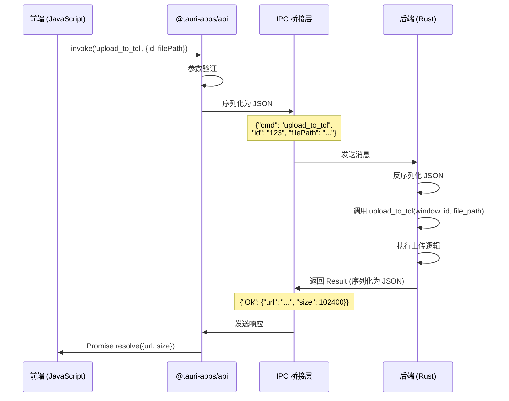

# 5.1 Tauri IPC 机制详解

## 学习目标

通过本节学习，你将掌握：
- Tauri IPC（进程间通信）的工作原理
- JSON 序列化和反序列化机制
- IPC 的性能特征和限制
- 前后端数据类型映射
- 为什么使用 IPC 而不是直接调用

## 前置知识

- JavaScript Promise 概念
- Rust 序列化（serde）
- JSON 数据格式

---

## 核心内容

### 什么是 IPC？

**IPC（Inter-Process Communication）= 进程间通信**

Tauri 应用包含两个进程：
1. **前端进程**：运行 WebView（HTML/CSS/JavaScript）
2. **后端进程**：运行 Rust 代码

**为什么需要 IPC**？
- ❌ 前端和后端在不同进程中，**无法直接调用函数**
- ✅ 使用 IPC → 前端发送消息 → 后端处理 → 返回结果

---

## 1. Tauri IPC 架构

### 1.1 整体架构图

```mermaid
graph TB
    subgraph "前端进程 (WebView)"
        A[JavaScript/TypeScript]
        B[Tauri API]
        C[@tauri-apps/api]
    end

    subgraph "IPC 桥接层"
        D[JSON 序列化]
        E[消息传递]
        F[JSON 反序列化]
    end

    subgraph "后端进程 (Rust)"
        G[Command Handler]
        H[Tauri Commands]
        I[业务逻辑]
    end

    A --> B
    B --> C
    C -->|invoke| D
    D --> E
    E --> F
    F --> G
    G --> H
    H --> I
    I -->|Result| G
    G -->|JSON| E
    E -->|JSON| B
    B -->|Promise| A

    style E fill:#f9f,stroke:#333
    style G fill:#bbf,stroke:#333
```

---

### 1.2 通信流向



---

## 2. JSON 序列化机制

### 2.1 前端到后端（invoke）

**前端代码**：
```typescript
const result = await invoke('upload_to_tcl', {
  id: 'upload-123',
  filePath: 'C:\\Users\\Jiawei\\image.jpg'
});
```

**序列化为 JSON**（IPC 层）：
```json
{
  "cmd": "upload_to_tcl",
  "id": "upload-123",
  "filePath": "C:\\Users\\Jiawei\\image.jpg"
}
```

**Rust 端接收**：
```rust
#[tauri::command]
fn upload_to_tcl(
    window: Window,
    id: String,              // "upload-123"
    file_path: String,       // "C:\\Users\\Jiawei\\image.jpg"
) -> Result<TCLUploadResult, String>
```

---

### 2.2 后端到前端（返回值）

**Rust 端返回**：
```rust
Ok(TCLUploadResult {
    url: "https://img.tcl.com/image.jpg".to_string(),
    size: 102400
})
```

**序列化为 JSON**（IPC 层）：
```json
{
  "Ok": {
    "url": "https://img.tcl.com/image.jpg",
    "size": 102400
  }
}
```

**前端接收**：
```typescript
const result = await invoke('upload_to_tcl', ...);
// result = {url: "https://img.tcl.com/image.jpg", size: 102400}
```

---

## 3. 数据类型映射

### 3.1 基本类型映射

| TypeScript | JSON | Rust |
|-----------|------|------|
| `string` | `"hello"` | `String` |
| `number` | `42` | `i32`, `u32`, `f64` |
| `boolean` | `true` | `bool` |
| `null` | `null` | `Option::None` |
| `undefined` | (不传递) | `Option::None` |

**示例**：
```typescript
// 前端
invoke('test', {
  name: "Alice",     // String
  age: 25,           // number
  active: true,      // boolean
  extra: null        // null
});
```

```rust
// Rust
#[tauri::command]
fn test(
    name: String,            // "Alice"
    age: u32,                // 25
    active: bool,            // true
    extra: Option<String>    // None
) -> Result<(), String>
```

---

### 3.2 复杂类型映射

#### 数组 / Vec

```typescript
// 前端
invoke('process_tags', {
  tags: ["rust", "tauri", "typescript"]
});
```

```rust
// Rust
#[tauri::command]
fn process_tags(tags: Vec<String>) -> Result<(), String> {
    for tag in tags {
        println!("Tag: {}", tag);
    }
    Ok(())
}
```

---

#### 对象 / 结构体

```typescript
// 前端
interface R2Config {
  accountId: string;
  accessKeyId: string;
  secretAccessKey: string;
  bucketName: string;
}

invoke('test_r2_connection', {
  config: {
    accountId: "abc123",
    accessKeyId: "key123",
    secretAccessKey: "secret456",
    bucketName: "my-bucket"
  }
});
```

```rust
// Rust
#[derive(serde::Deserialize)]
struct R2Config {
    #[serde(rename = "accountId")]
    account_id: String,
    #[serde(rename = "accessKeyId")]
    access_key_id: String,
    #[serde(rename = "secretAccessKey")]
    secret_access_key: String,
    #[serde(rename = "bucketName")]
    bucket_name: String,
}

#[tauri::command]
fn test_r2_connection(config: R2Config) -> Result<String, String> {
    println!("Account: {}", config.account_id);
    Ok("Success".to_string())
}
```

**关键点**：
- ✅ 使用 `#[serde(rename = "...")]` 转换字段名
- ✅ TypeScript: `camelCase` → Rust: `snake_case`

---

## 4. 性能特征

### 4.1 IPC 开销

**测试场景**：调用空命令

```rust
#[tauri::command]
fn empty_command() -> Result<(), String> {
    Ok(())
}
```

```typescript
const start = performance.now();
await invoke('empty_command');
const end = performance.now();
console.log(`IPC 开销: ${end - start}ms`);
```

**测试结果**（典型值）：
- ✅ 本地调用（Windows）：**0.1-0.5ms**
- ✅ 序列化/反序列化：**0.01-0.1ms**

**结论**：
- ✅ IPC 开销很小（亚毫秒级）
- ✅ 适合高频调用（如进度更新）

---

### 4.2 数据传输限制

**JSON 序列化限制**：
- ✅ 小数据（< 1MB）：非常快（< 1ms）
- ⚠️ 中等数据（1-10MB）：较快（< 10ms）
- ❌ 大数据（> 10MB）：慢（> 100ms）

**最佳实践**：
```rust
// ❌ 不推荐：传递大文件内容
#[tauri::command]
fn upload_file(file_content: Vec<u8>) -> Result<(), String> {
    // file_content 可能很大（100MB+）
    // JSON 序列化会很慢！
}

// ✅ 推荐：传递文件路径
#[tauri::command]
fn upload_file(file_path: String) -> Result<(), String> {
    // Rust 端直接读取文件（避免 IPC 传输）
    let content = std::fs::read(file_path)?;
    Ok(())
}
```

---

## 5. 错误传递

### 5.1 Result 类型映射

**Rust 端**：
```rust
#[tauri::command]
fn divide(a: f64, b: f64) -> Result<f64, String> {
    if b == 0.0 {
        Err("Division by zero!".to_string())
    } else {
        Ok(a / b)
    }
}
```

**序列化为 JSON**：

成功：
```json
{"Ok": 5.0}
```

失败：
```json
{"Err": "Division by zero!"}
```

**前端接收**：
```typescript
try {
  const result = await invoke('divide', { a: 10.0, b: 2.0 });
  console.log(result); // 5.0
} catch (error) {
  console.error(error); // "Division by zero!"
}
```

---

### 5.2 错误类型转换

**Rust 端多种错误类型**：
```rust
use std::io::Error as IoError;
use serde_json::Error as JsonError;

#[tauri::command]
fn complex_operation(path: String) -> Result<String, String> {
    // 文件 I/O 错误
    let content = std::fs::read_to_string(&path)
        .map_err(|e: IoError| format!("无法读取文件: {}", e))?;

    // JSON 解析错误
    let data: serde_json::Value = serde_json::from_str(&content)
        .map_err(|e: JsonError| format!("JSON 解析失败: {}", e))?;

    Ok(data.to_string())
}
```

**关键技巧**：
- ✅ 使用 `.map_err()` 将所有错误转换为 `String`
- ✅ 提供友好的错误信息

---

## 6. IPC vs 其他通信方式

### 6.1 IPC vs HTTP

| 特性 | IPC | HTTP |
|-----|-----|------|
| 速度 | ✅ 极快（< 1ms） | ⚠️ 较慢（> 10ms） |
| 安全性 | ✅ 进程隔离 | ⚠️ 网络暴露 |
| 复杂性 | ✅ 简单 | ⚠️ 需要服务器 |
| 跨机器 | ❌ 不支持 | ✅ 支持 |

**适用场景**：
- ✅ 本地桌面应用 → IPC
- ✅ 客户端-服务器架构 → HTTP

---

### 6.2 IPC vs WebAssembly

| 特性 | IPC (Tauri) | WebAssembly |
|-----|------------|-------------|
| 语言 | Rust | Rust (编译为 WASM) |
| 文件访问 | ✅ 完全访问 | ❌ 受限 |
| 系统调用 | ✅ 支持 | ❌ 不支持 |
| 性能 | ✅ 原生性能 | ⚠️ 接近原生 |
| 安全性 | ✅ 进程隔离 | ✅ 沙箱隔离 |

**适用场景**：
- ✅ 需要系统访问（文件、网络、钥匙串）→ IPC (Tauri)
- ✅ 纯计算任务（图像处理、加密）→ WebAssembly

---

## 7. 调试 IPC 通信

### 7.1 前端调试

**查看 invoke 调用**：
```typescript
import { invoke } from '@tauri-apps/api/tauri';

console.log('[IPC] 调用命令:', 'upload_to_tcl');
console.log('[IPC] 参数:', { id, filePath });

const result = await invoke('upload_to_tcl', { id, filePath });

console.log('[IPC] 结果:', result);
```

---

### 7.2 Rust 端调试

**打印接收的参数**：
```rust
#[tauri::command]
fn upload_to_tcl(
    window: Window,
    id: String,
    file_path: String,
) -> Result<TCLUploadResult, String> {
    eprintln!("[IPC] 收到命令: upload_to_tcl");
    eprintln!("[IPC] 参数: id={}, file_path={}", id, file_path);

    // ...业务逻辑...

    eprintln!("[IPC] 返回结果: url={}", url);
    Ok(TCLUploadResult { url, size })
}
```

---

## 实战练习

### 练习 1：传递复杂对象

**任务**：创建一个命令，接收用户信息对象并返回问候语。

**提示**：
```typescript
// 前端
interface User {
  name: string;
  age: number;
  email: string;
}

const greeting = await invoke('greet_user', {
  user: { name: 'Alice', age: 25, email: 'alice@example.com' }
});
```

```rust
// Rust
#[derive(serde::Deserialize)]
struct User {
    name: String,
    age: u32,
    email: String,
}

#[tauri::command]
fn greet_user(user: User) -> Result<String, String> {
    Ok(format!("Hello {}, you are {} years old!", user.name, user.age))
}
```

---

### 练习 2：测量 IPC 性能

**任务**：测量不同数据大小的 IPC 性能。

**提示**：
```typescript
async function benchmarkIPC() {
  const sizes = [1, 10, 100, 1000, 10000];

  for (const size of sizes) {
    const data = 'a'.repeat(size);

    const start = performance.now();
    await invoke('echo', { data });
    const end = performance.now();

    console.log(`大小: ${size} 字节, 耗时: ${end - start}ms`);
  }
}
```

```rust
#[tauri::command]
fn echo(data: String) -> Result<String, String> {
    Ok(data)
}
```

---

## 总结

本节我们深入学习了 Tauri IPC 机制：

### 关键知识点
1. ✅ **IPC 架构**：前端进程 ↔ JSON 序列化 ↔ 后端进程
2. ✅ **数据映射**：TypeScript 类型 → JSON → Rust 类型
3. ✅ **性能特征**：亚毫秒级开销，适合高频调用
4. ✅ **错误传递**：Result<T, E> → Promise resolve/reject
5. ✅ **最佳实践**：传递路径而非大数据、使用 map_err 转换错误

### 核心流程
```
invoke() → JSON 序列化 → IPC 传输 → JSON 反序列化 → 调用命令 → Result → JSON → Promise
```

### 性能建议
- ✅ 小数据（< 1MB）：直接通过 IPC 传递
- ❌ 大数据（> 10MB）：传递文件路径，Rust 端读取

### 下一步

下一节我们将学习 **invoke 调用详解**，深入理解前端如何调用 Rust 命令。

👉 [下一节：5.2 invoke 调用详解](./02-invoke-commands.md)
