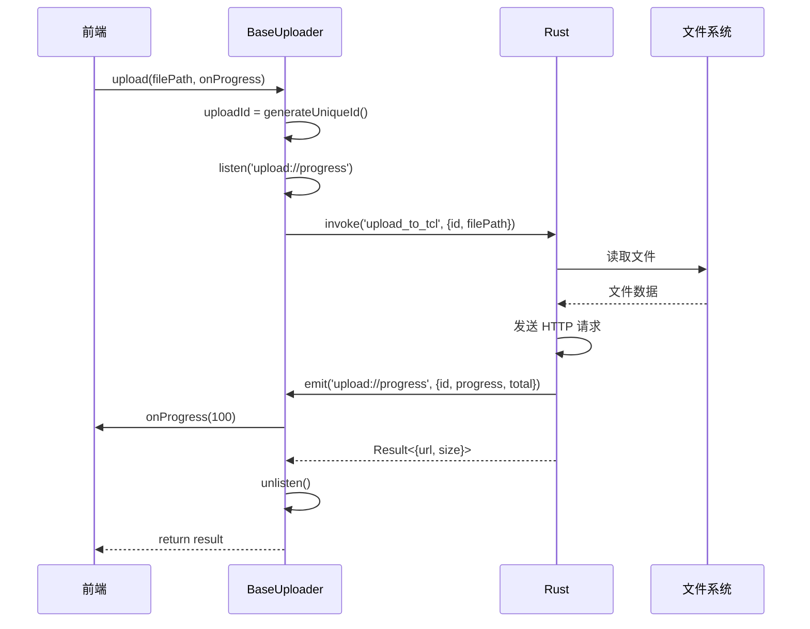

# 5.4 进度跟踪完整流程

## 学习目标

- 理解完整的进度跟踪流程
- 掌握前后端协作方式
- 学会实现实时进度更新
- 了解进度计算和UI更新

---

## 1. 完整流程图



---

## 2. 前端实现

### 2.1 BaseUploader 中的进度监听

```typescript
protected async uploadViaRust(
  filePath: string,
  params: Record<string, any>,
  onProgress?: ProgressCallback
): Promise<any> {
  // 1. 生成唯一 ID
  const uploadId = this.generateUniqueId();

  // 2. 注册进度监听器
  let unlisten: UnlistenFn | null = null;

  if (onProgress) {
    unlisten = await listen<ProgressEvent>('upload://progress', (event) => {
      if (event.payload.id === uploadId) {
        // 计算百分比
        const percent = Math.round(
          (event.payload.progress / event.payload.total) * 100
        );
        onProgress(percent);
      }
    });
  }

  try {
    // 3. 调用 Rust 命令（传递 uploadId）
    const result = await invoke(this.getRustCommand(), {
      id: uploadId,
      filePath,
      ...params
    });

    return result;
  } finally {
    // 4. 清理监听器
    if (unlisten) {
      unlisten();
    }
  }
}
```

---

## 3. Rust 端实现

### 3.1 发送进度事件

```rust
#[tauri::command]
pub async fn upload_to_tcl(
    window: Window,
    id: String,
    file_path: String,
) -> Result<TCLUploadResult, String> {
    // 1. 读取文件大小
    let file_size = tokio::fs::metadata(&file_path).await
        .map_err(|e| format!("无法获取文件大小: {}", e))?
        .len();

    // 2. 执行上传逻辑...
    let url = upload_file_logic(&file_path).await?;

    // 3. 发送完成进度
    let _ = window.emit("upload://progress", serde_json::json!({
        "id": id,
        "progress": file_size,
        "total": file_size
    }));

    Ok(TCLUploadResult {
        url,
        size: file_size,
    })
}
```

### 3.2 流式上传的进度跟踪

```rust
use tokio_util::codec::{BytesCodec, FramedRead};
use futures::StreamExt;

let file = File::open(&file_path).await?;
let total_size = file.metadata().await?.len();
let mut bytes_sent = 0u64;

// 创建流并附加进度回调
let stream = FramedRead::new(file, BytesCodec::new())
    .inspect(|chunk| {
        if let Ok(data) = chunk {
            bytes_sent += data.len() as u64;

            // 每次发送数据后更新进度
            let _ = window.emit("upload://progress", serde_json::json!({
                "id": id,
                "progress": bytes_sent,
                "total": total_size
            }));
        }
    });

// 使用流式上传
let body = Body::wrap_stream(stream);
client.post(url).body(body).send().await?;
```

---

## 4. UI 集成

### 4.1 Vue 组件中显示进度

```vue
<template>
  <div class="upload-progress">
    <div class="progress-bar" :style="{ width: `${percent}%` }"></div>
    <span>{{ percent }}%</span>
  </div>
</template>

<script setup lang="ts">
import { ref } from 'vue';

const percent = ref(0);

async function uploadFile(filePath: string) {
  const uploader = UploaderFactory.create('tcl');

  await uploader.upload(
    filePath,
    {},
    (progress) => {
      percent.value = progress;  // 更新进度条
    }
  );
}
</script>
```

---

## 5. 多图床进度跟踪

### 5.1 MultiServiceUploader 进度回调

```typescript
const services = ['tcl', 'weibo', 'r2'];
const progress = ref<Record<string, number>>({
  tcl: 0,
  weibo: 0,
  r2: 0
});

await multiUploader.uploadToMultipleServices(
  filePath,
  services,
  config,
  (serviceId, percent) => {
    progress.value[serviceId] = percent;  // 更新各图床进度
  }
);
```

---

## 6. 进度平滑处理

### 6.1 防止进度跳变

```typescript
class SmoothProgress {
  private current = 0;
  private target = 0;
  private timer: number | null = null;

  update(newProgress: number) {
    this.target = newProgress;

    if (this.timer === null) {
      this.timer = setInterval(() => {
        if (this.current < this.target) {
          this.current = Math.min(this.current + 1, this.target);
        } else {
          clearInterval(this.timer!);
          this.timer = null;
        }
      }, 10);
    }
  }

  get value() {
    return this.current;
  }
}

const progress = new SmoothProgress();

uploader.upload(path, {}, (percent) => {
  progress.update(percent);  // 平滑过渡
});
```

---

## 7. 常见问题

### 7.1 进度不更新

**原因**：监听器注册失败或事件名不匹配

**解决**：
```typescript
// 检查监听器是否成功注册
const unlisten = await listen('upload://progress', (event) => {
  console.log('收到进度事件:', event);  // 添加日志
  onProgress(event.payload.percent);
});

console.log('监听器已注册:', unlisten !== null);
```

### 7.2 进度卡在 99%

**原因**：最后的进度事件未发送

**解决**：
```rust
// 确保上传完成后发送 100% 进度
let _ = window.emit("upload://progress", serde_json::json!({
    "id": id,
    "progress": file_size,
    "total": file_size  // 确保 progress === total
}));
```

---

## 总结

- ✅ 使用唯一 ID 匹配进度事件
- ✅ 在 `uploadViaRust()` 中统一处理进度监听
- ✅ Rust 端发送 `{id, progress, total}` 格式
- ✅ 前端计算百分比并更新 UI
- ✅ 使用 `finally` 确保清理监听器
- ✅ 流式上传时实时发送进度

👉 [下一节：5.5 错误传递机制](./05-error-propagation.md)
