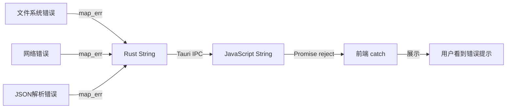

# 5.5 错误传递机制详解

## 学习目标

- 理解错误在前后端之间的传递
- 掌握 Rust Result 到 JavaScript Error 的转换
- 学会提供用户友好的错误提示
- 了解错误处理最佳实践

---

## 1. 错误传递流程



---

## 2. Rust 端错误处理

### 2.1 使用 Result 类型

```rust
#[tauri::command]
async fn upload_file(file_path: String) -> Result<UploadResult, String> {
    // 文件不存在
    if !std::path::Path::new(&file_path).exists() {
        return Err("文件不存在".to_string());
    }

    // 文件过大
    let metadata = std::fs::metadata(&file_path)
        .map_err(|e| format!("无法读取文件信息: {}", e))?;

    if metadata.len() > 10 * 1024 * 1024 {
        return Err("文件大小超过 10MB 限制".to_string());
    }

    // 上传成功
    Ok(UploadResult {
        url: "https://example.com/image.jpg".to_string(),
        size: metadata.len(),
    })
}
```

### 2.2 错误转换（map_err）

```rust
use std::io::Error as IoError;
use reqwest::Error as NetworkError;

#[tauri::command]
async fn complex_upload(file_path: String) -> Result<String, String> {
    // I/O 错误 → String
    let content = tokio::fs::read(&file_path).await
        .map_err(|e: IoError| format!("读取文件失败: {}", e))?;

    // 网络错误 → String
    let response = reqwest::Client::new()
        .post("https://api.example.com/upload")
        .body(content)
        .send()
        .await
        .map_err(|e: NetworkError| format!("上传失败: {}", e))?;

    // JSON 解析错误 → String
    let result: ApiResponse = response.json().await
        .map_err(|e| format!("解析响应失败: {}", e))?;

    Ok(result.url)
}
```

---

## 3. 前端错误捕获

### 3.1 try-catch 模式

```typescript
async function uploadFile(filePath: string) {
  try {
    const result = await invoke<UploadResult>('upload_file', {
      filePath
    });

    console.log('上传成功:', result.url);
    return result;
  } catch (error) {
    console.error('上传失败:', error);

    // 显示用户友好的错误
    if (typeof error === 'string') {
      showNotification(error, 'error');
    } else {
      showNotification('上传失败，请重试', 'error');
    }

    throw error;  // 重新抛出，让调用者处理
  }
}
```

### 3.2 BaseUploader 中的错误处理

```typescript
protected async uploadViaRust(...): Promise<any> {
  try {
    const result = await invoke(this.getRustCommand(), {
      id: uploadId,
      filePath,
      ...params
    });

    return result;
  } catch (error: any) {
    console.error(`[${this.serviceName}] 上传失败:`, error);

    // 转换为友好的错误消息
    const errorMessage = error.message || error.toString();
    throw new Error(`${this.serviceName}上传失败: ${errorMessage}`);
  } finally {
    // 确保清理资源
    if (unlisten) {
      unlisten();
    }
  }
}
```

---

## 4. 用户友好的错误提示

### 4.1 分类错误

```typescript
function getErrorMessage(error: unknown): string {
  const errorStr = String(error);

  // 文件相关错误
  if (errorStr.includes('文件不存在')) {
    return '找不到文件，请重新选择';
  }

  if (errorStr.includes('文件过大')) {
    return '文件大小超过限制（最大 10MB）';
  }

  // 网络相关错误
  if (errorStr.includes('网络错误') || errorStr.includes('timeout')) {
    return '网络连接失败，请检查网络后重试';
  }

  // Cookie 相关错误
  if (errorStr.includes('Cookie') || errorStr.includes('认证失败')) {
    return 'Cookie 已过期，请重新登录';
  }

  // 默认错误
  return `上传失败: ${errorStr}`;
}

// 使用
try {
  await uploadFile(path);
} catch (error) {
  const message = getErrorMessage(error);
  showNotification(message, 'error');
}
```

---

## 5. 错误重试机制

### 5.1 自动重试

```typescript
async function uploadWithRetry(
  filePath: string,
  maxRetries = 3
): Promise<UploadResult> {
  let lastError: any;

  for (let attempt = 1; attempt <= maxRetries; attempt++) {
    try {
      console.log(`尝试上传 (${attempt}/${maxRetries})...`);

      const result = await invoke<UploadResult>('upload_file', {
        filePath
      });

      console.log('上传成功！');
      return result;
    } catch (error) {
      lastError = error;
      console.warn(`第 ${attempt} 次尝试失败:`, error);

      // 最后一次失败时不等待
      if (attempt < maxRetries) {
        const delay = 1000 * attempt;  // 递增延迟：1s, 2s, 3s
        console.log(`等待 ${delay}ms 后重试...`);
        await new Promise(resolve => setTimeout(resolve, delay));
      }
    }
  }

  throw new Error(`上传失败（已重试 ${maxRetries} 次）: ${lastError}`);
}
```

---

## 6. MultiServiceUploader 错误处理

### 6.1 部分失败处理

```typescript
async uploadToMultipleServices(...): Promise<MultiUploadResult> {
  const results = await Promise.allSettled(uploadPromises);

  const uploadResults = results.map((r, index) => {
    if (r.status === 'fulfilled') {
      return r.value;  // 成功
    } else {
      // 失败
      return {
        serviceId: services[index],
        status: 'failed' as const,
        error: String(r.reason)
      };
    }
  });

  // 至少有一个成功
  const primaryResult = uploadResults.find(r => r.status === 'success');

  if (!primaryResult) {
    // 所有都失败
    const errors = uploadResults
      .map(r => `${r.serviceId}: ${r.error}`)
      .join('\n');

    throw new Error(`所有图床上传失败：\n${errors}`);
  }

  return {
    primaryService: primaryResult.serviceId,
    results: uploadResults,
    primaryUrl: primaryResult.result.url
  };
}
```

---

## 7. 调试技巧

### 7.1 详细的错误日志

```rust
#[tauri::command]
async fn upload_file(file_path: String) -> Result<UploadResult, String> {
    eprintln!("[DEBUG] 开始上传: {}", file_path);

    match do_upload(&file_path).await {
        Ok(result) => {
            eprintln!("[DEBUG] 上传成功: {}", result.url);
            Ok(result)
        }
        Err(e) => {
            eprintln!("[ERROR] 上传失败: {}", e);
            eprintln!("[ERROR] 堆栈: {:?}", e);
            Err(format!("上传失败: {}", e))
        }
    }
}
```

### 7.2 前端错误追踪

```typescript
function trackError(error: unknown, context: string) {
  console.error(`[错误追踪] ${context}:`, error);

  // 可选：发送到错误追踪服务（如 Sentry）
  // Sentry.captureException(error, { extra: { context } });
}

try {
  await uploadFile(path);
} catch (error) {
  trackError(error, '文件上传失败');
  throw error;
}
```

---

## 总结

### 关键知识点
- ✅ Rust 使用 `Result<T, String>` 返回错误
- ✅ 使用 `.map_err()` 转换不同类型的错误
- ✅ 前端使用 try-catch 捕获错误
- ✅ 提供用户友好的错误提示
- ✅ 实现自动重试机制
- ✅ 部分失败时继续执行（Promise.allSettled）

### 错误处理链
```
文件系统错误 → map_err → Rust String → IPC → JS String → catch → 用户提示
```

### 最佳实践
1. ✅ 错误信息要具体（而非"Error"）
2. ✅ 区分不同错误类型（文件、网络、认证）
3. ✅ 敏感信息不要暴露给用户
4. ✅ 记录详细日志便于调试
5. ✅ 实现重试机制提升成功率

---

**恭喜！你已完成第5章的学习。**

👉 [返回教程目录](../README.md)
